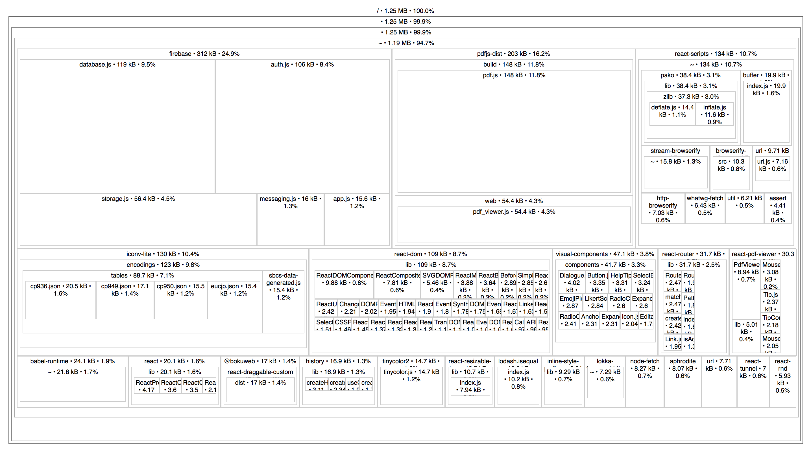

It was time to explore the optimization possibilities for the app I've been working on.

Our main bundle was 1.25 MB (515 kB gzip). `create-react-app` handles the build and produces the bundle with the source map.

All bundle visualization tools I remember looking at required webpack config tweaking. But [source-map-explorer](https://github.com/danvk/source-map-explorer) is simple to use:

```bash
source-map-explorer \
  build/static/js/main.9998a4e8.js \
  build/static/js/main.9998a4e8.js.map
```

It produces beatiful dependency hierarchy:

<a href="before_515_kB.png" style="box-shadow: none;"></a>

My first surprise was the size of Firebase with its 300 kB. I noticed `storage.js` and `messaging.js` which correspond to newer Firebase 3 features we did not use.

There should be a way to include only necessary modules. After a quick search I found an answer in the NPM readme of the `firebase` package.

Instead of

```js
import firebase from "firebase";
```

you can do

```js
import firebase from "firebase/app";
import "firebase/auth";
import "firebase/database";
```

This achieved a small win in 25 kB. Bundle size was down to 491 kB gzip.

Next, I was looking at 130 kB `iconv-lite`. I had no idea where it came from. **npm** still doesn't have a nice command to explain why the module is in `node_modules`. I had to unleash my shell skills:

```bash
npm ls | grep -B 5 iconv-lite
```

```
├─┬ lokka-transport-http@1.6.1
│ ├─┬ node-fetch@1.6.3
│ │ ├─┬ encoding@0.1.12
│ │ │ └── iconv-lite@0.4.15
```

Aha, `lokka`! This is the GraphQL client we use.

I couldn't find a way to reduce the size of `node-fetch` through webpack bundling. But it took me only about an hour to switch to a different GraphQL client (Apollo Client).

<a href="after_284_kB.png" style="box-shadow: none;"></a>

From 515 kB to 284 kB, much better. Time to get some users.
