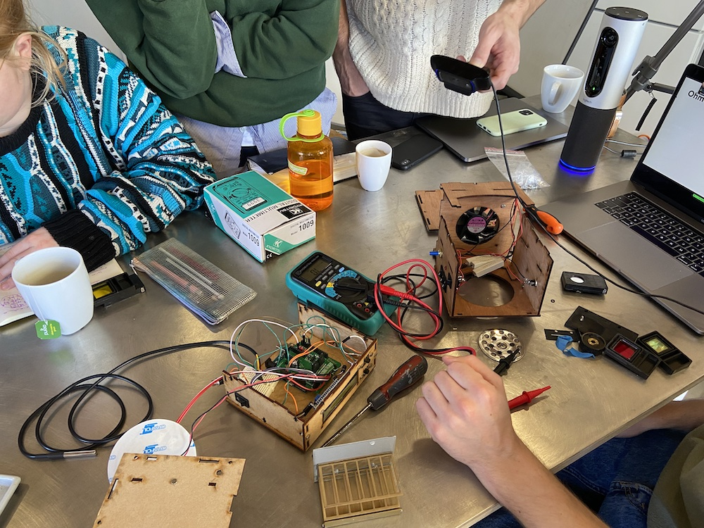

I'm participating in [BioHack Academy](http://biohackacademy.github.io) that started in February 2022.

# Week 2

## Wednesday

During our 1-on-1 meeting, I've asked Kas questions about the PCR and gel electrophoresis. I had an idea of creating a machine that calculates power function (`2^n`) using PCR.

## Tuesday

Maarten gave a lecture about electronics basics: circuits, resistors, capacitors, transistors, diodes. We took apart an old photospectrometer and tested different parts using multimeter. We also looked at the DIY mixer/heater machine.

Later in the day we've assembled a [DIY photospectrometer from Gaudi Labs](https://gaudishop.ch/index.php/product/3d-printed-fiber-spectrometer-kit/). Maarten explained the basics of 3D printing.

Paul Vanouse gave a lecture on creative misuse of technology. Most examples were about creating an arbitrary picture using DNA gel electrophoresis. He used specific enzymes to cut DNA according to specific lengths. Paul also told about his performance for the [BioARTCAMP](https://www.g-netwerk.nl/bioart-camp.html) where he did PCR on the open fire. It was interesting to learn about the [controversial](https://alumni.berkeley.edu/california-magazine/winter-2019/intolerable-genius-berkeleys-most-controversial-nobel-laureate) figure of Kary Mullis, the inventor of PCR.

## Monday

Kas explained about the lab hardware:

- Distiller
- Incubator – controls temperature or humidity
- Centrifuge – separate proteins (or uranium)
- Sterile hood (also known as laminar flow cabinet) – provides sterile environment, can be substituted by a burner
- Autoclave – used to destory bio material (alcohol, UV light, or bleach can be used as well)
- Vortex machine
- Microscope – oil can be used for the better zoom
- Gel electrophoresis machine – can be used to detect a DNA sequence of a particular length
- PCR machine – performs polymerase chain reaction that multiplies DNA/RNA
- Spectrophotometer – measures particles in a solution
- Bioreactor
- DNA sequencer – the cheapest one today is [$1000 Minion produced by Oxford Nanopore](https://nanoporetech.com/products/minion)

Maarten facilitated a discussion about the empyrical experimentation loop and the meaning of the laboratory.

# Week 1

## Wednesday

I had a chat with Kas and Maarten. Kas suggested that I should look at slime mold computers.

## Tuesday

Kas Houthuijs gave a lecture on biosafety.

Maarten talked about his project for Rijkswaterstaat where they've created a speculative design of a CRISPR kit to modify lake algae.

We gave short introductions. I was the only person without an art background. I felt a bit out of the place, but I am keeping an open mind and the week with the practical lessons should cover all my needs.

## Monday

Lucas Everts gave a lecture on biohacking and bio art with some examples:

- [DNA printer that prints pathogens](https://ars.electronica.art/outofthebox/en/blp-2000d/)
- [Doing PCR in boiling pots](https://www.youtube.com/watch?v=qDM0wxuGiEo)
- [Špela Petrič using her own estrogen to change the plant](https://www.spelapetric.org/phytoteratology)
- Creating a [fluorescent dress](https://sputniko.com/Tranceflora) by adding GFP gene to a silkworm
- [Making female sperm](https://cjarvis.com/in-posse/)
- Eduardo Kac created [Edunia](https://www.ekac.org/nat.hist.enig.html)
- CRISPR piglets

Lucas recommended to check [Unnatural Selection](<https://en.wikipedia.org/wiki/Unnatural_Selection_(TV_series)>) documentary.

Maarten Smith gave a talk about using git for documentation, open source, and licensing. We've also discussed what is good documentation, what are the differences with lab notebook.

I've learned that using CRISPR is prohibited in the Netherlands, but there is an exception for the GFP protein because it is useful for teaching.

Ionat Zurr from [SymbyoticA](https://en.wikipedia.org/wiki/Symbiotica) gave more examples of bio art and discussed differences and similarities between artists, designers, and scientists.
