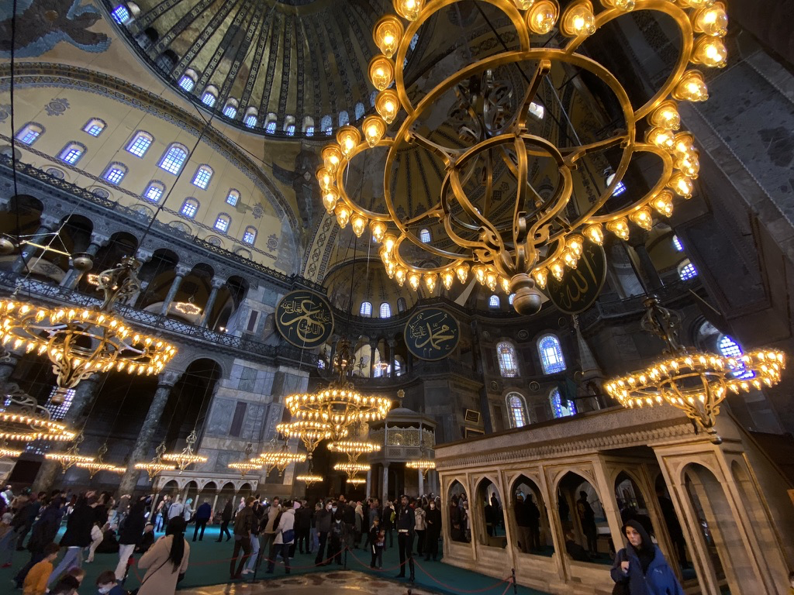
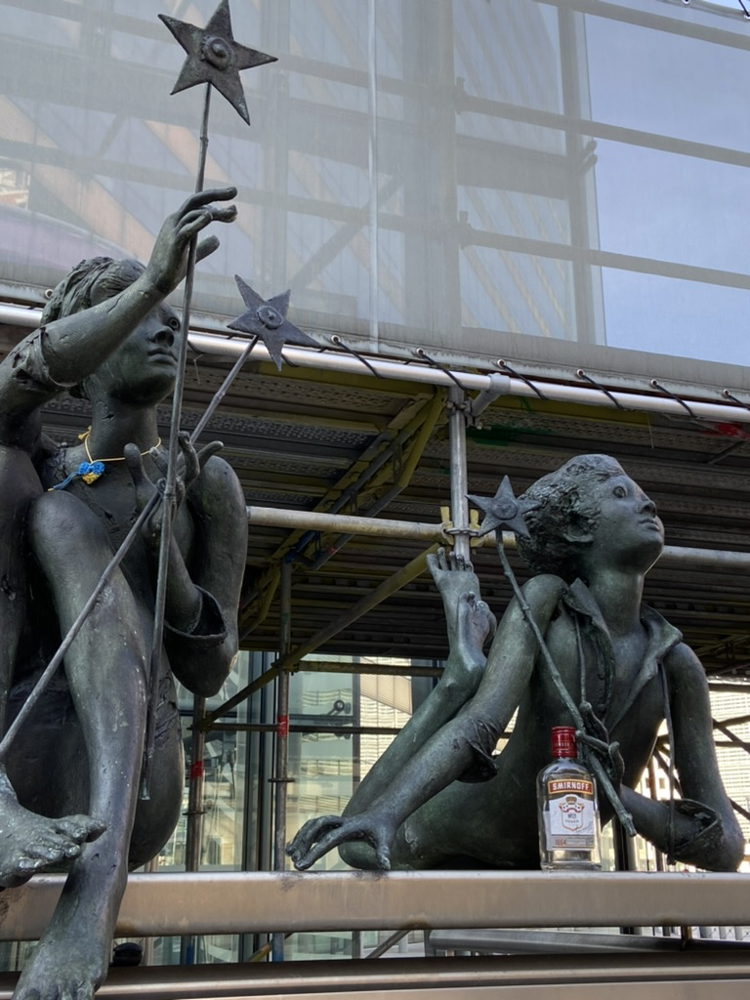
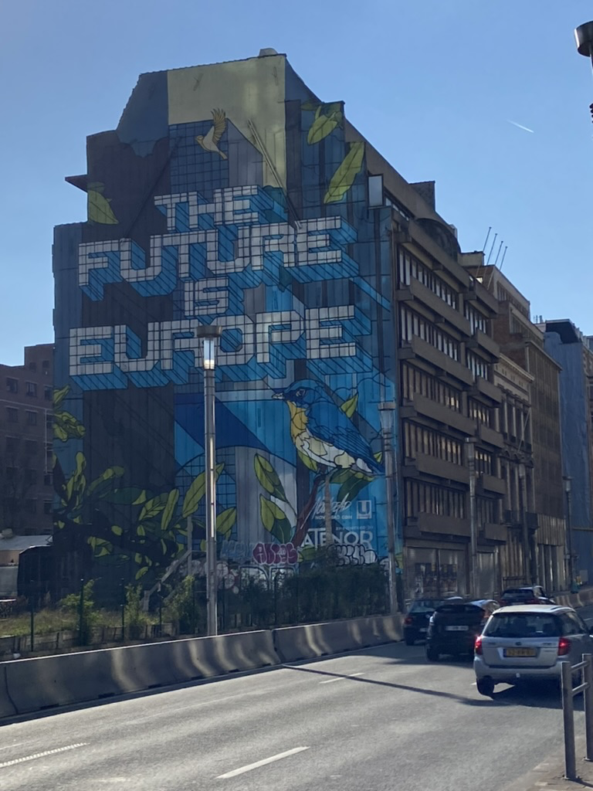
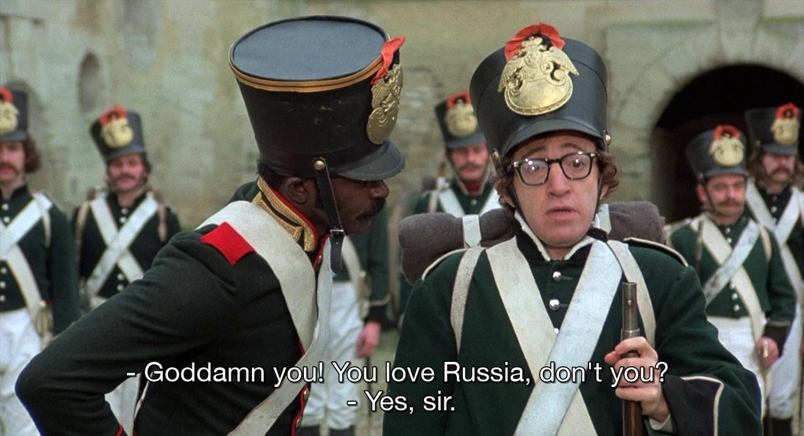

I am having breakfast on the spacious terrace with a big table of friends. Street cats are jumping to sit on our laps, there is a bit of rain outside, but the sun will come out soon. We're drinking strong Turkish tea. I'm charmed with Istanbul, where I see a mix of the best parts of Europe and Asia. There are all conveniences of the modern city and at the same time, it does not look as tidy and ordered. It is beautifully chaotic and wild. And of course, after spending 8 years in the Netherlands, I appreciate every height elevation I see.

---

Speaking of orderliness and normality, the next trip of the month was to Belgium. As it should be on a proper road trip, we ate fast food at gas stations in the middle of nowhere. Brussels presented an expected mix of Netherlands and France. Good parks and Catholics are sure better at building things than Protestants.

| | |
|---|---|
|  |  |

<table>
<tr>
<td>

</td>
<td>

</td>
</tr>
</table>

---

There is a street tennis court close to my apartment which I knew was there but never thought of using until friends mentioned it to me. Now almost every morning I am dragging Asya out of bed to play tennis with me. Some moves came back, after not playing for more than 10 years. There is also a supplementary meta game in picking the time when nobody else is using that street court.

---

I've picked up and finished my first video game about Kirby: [Kirby and the Forgotten Land](https://en.wikipedia.org/wiki/Kirby_and_the_Forgotten_Land). It is a fun arcade where you can pick up new abilities by inhaling things. As with the true Nintendo game, every ability and skill can be used in a different form later in the game.

---

Friendly city heron is begging for some pilaf (plov) that my Uzbek friends are making in the park. Somehow all food prepared outdoors is at least two times tastier.

---

The weather is great, so now if I'm feeling overwhelmed by work or something else, I immediately go out for a walk, sometimes listening to a podcast. My usual destinations are a few spots with street food, mostly city markets, like Dappermarkt (Beste Doner, the name speaks for itself) or Albert Cuypmarkt (Osaka ball, great Japanese munchies, like takoyaki and okonomiyaki).

---

Somehow during my youth Woody Allen craze I've missed his Love and Death. Has an additional layer of irony during current events.

---

Found time to code some software for macOS I'm hoping to clean up and release next month. All of those started as a way to procrastinate on some other more important tasks.

---

I've finished Crossroads by Jonathan Franzen. One of the few writers whose new book I'll buy immediately when published. Big fan of his previous work (The Corrections, Purity, Freedom).

---

Internet links:
- [The Technium: 103 Bits of Advice I Wish I Had Known](https://kk.org/thetechnium/103-bits-of-advice-i-wish-i-had-known/)
- [Войти во мрак и нащупать в нем людей Почему россияне поддерживают войну? Исследование Шуры Буртина — Meduza](https://meduza.io/feature/2022/04/24/voyti-vo-mrak-i-naschupat-v-nem-lyudey)