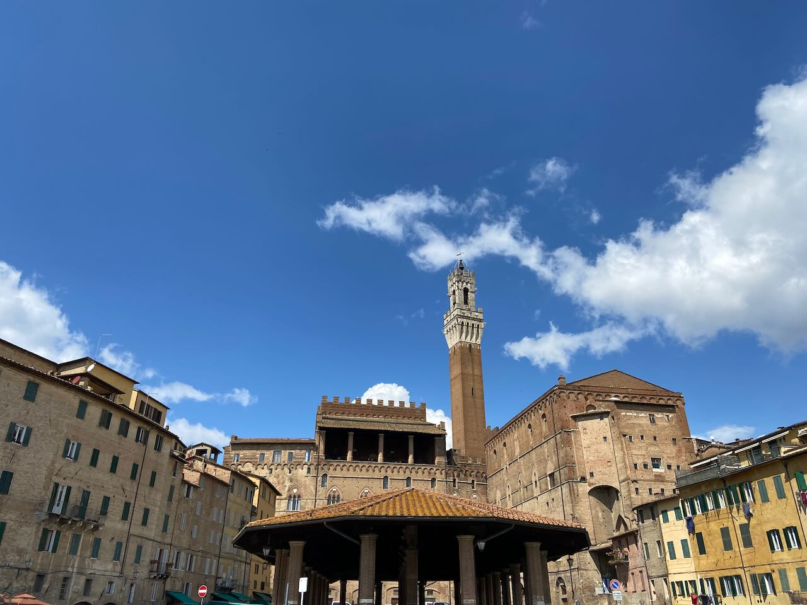
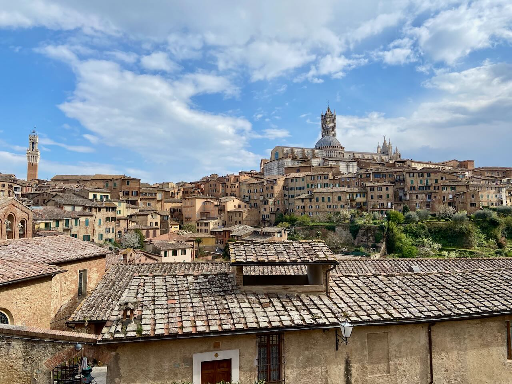
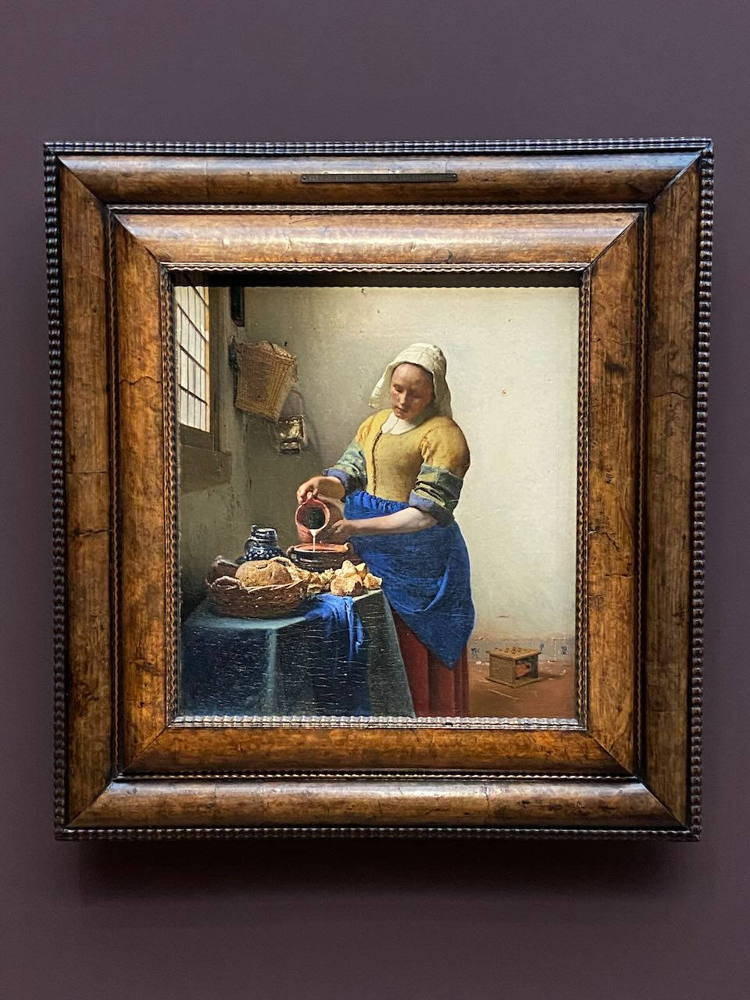
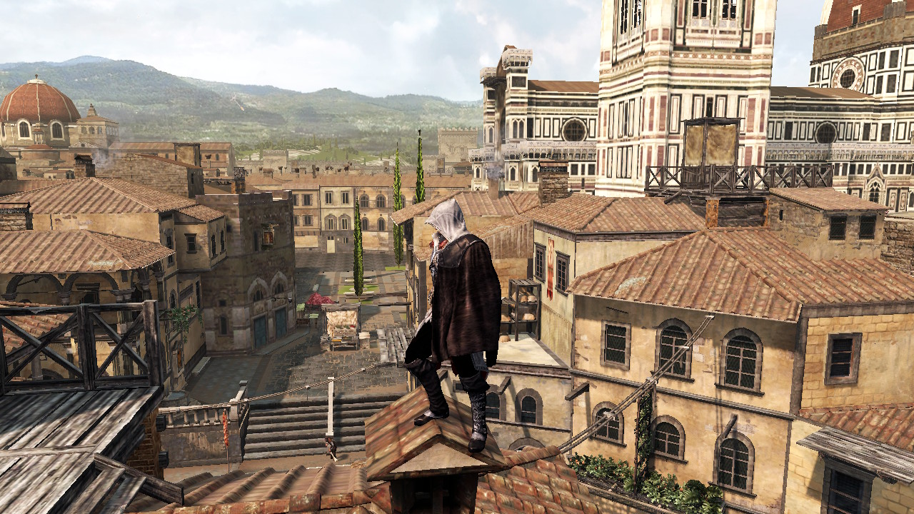

My first visit to Italy exceeded all expectations. We were in Florence, Siena, San Gimignano, Pisa, Bergamo, and Milan. The strength of the impression of Siena can be compared to my first visits to New York and Tokyo. In the 15th century, Siena was a major rival to Florence, but after the defeat in one of the battles, the Florentines forbade the city to sprawl. That's why Siena is perfectly preserved – there are no billboards and almost no cars in town, isn't that wonderful? The competitive spirit was turned inward and expressed in the form of horse races in the main square, which have been held every summer since the 15th century. Local restaurants skip the menu and simply offer two choices of great pasta. Contrary to the state of "ignorance is bliss" that I was in before visiting Italy, I am now excited about the many other places I need to visit in this magnificent country.

---

In Florence, we visited Dostoevsky's apartment at Palazzo Pitti, where he lived for about a year and finished _The Idiot_. Unlike Gogol, he did not particularly like Italy and stayed there mostly in hiding from creditors because it was cheaper to live than in St. Petersburg.

To the apartment of another honorary citizen of Florence - Andrei Tarkovsky, unfortunately, we did not have time to go. Upon returning from our trip I was fond of reading Tarkovsky's diaries. He went to Italy to shoot _Nostalgia_ and decided not to go back to the USSR, where he was not allowed to work and was humiliated in every way in his films.

---

I managed to buy extra tickets for the Vermeer exhibition at the Rijksmuseum. Fantastic work with light. No one knows how he did it, but he was friends with Antonie van Leeuwenhoek who was quite good at making lenses. Vermeer is said to have pioneered the use of optical techniques for painting. Improved lenses allowed for a more focused image in the camera obscura. The documentary [Tim's Vermeer]() provides a theory of how Vermeer used the camera obscura to accurately capture light. Rijksmuseum also made a nice [audio experience](https://www.rijksmuseum.nl/en/johannes-vermeer) about Vermeer's paintings, narrated by Stephen Fry.

---

Staying in bed with a cold after Italy, I wanted to experience more of the Renaissance and its stories, also through pop culture. I enjoyed the 15-year-old game _Assassin's Creed 2_. The action takes place in the 15th century, you have to jump on the rooftops of Florence, save the Medici family, uncover a plot against the Doge of Venice, and free Florence from the chaos of Savonarola. Part of the plot is made up, basically the kind of Dan Brown of the video game world.

---

Making progress through the fantastic [Advanced Compilers](https://www.cs.cornell.edu/courses/cs6120/2020fa/) course. It deliberately skips the frontend parts and focuses on optimizations and all shown algorithms are supplemented with Python implementations. So far I've improved my understanding of the Static Single Assignment (SSA) form – a popular method of expressing assignments in the intermediate language that simplifies many optimization passes like dead code elimination and constant propagation. I've also created a [playground page](https://agentcooper.github.io/bril-playground/) to visualize control flow and graph dominators.

---

A few recommendations for places I recently discovered in Amsterdam. For coffee go to [Monks](https://goo.gl/maps/grhpXGDQExX3rr6P6) and [FUKU](https://goo.gl/maps/eFAzF4aPz5W8caUS7). Great sushi at [Sushi Fanatics](https://goo.gl/maps/dG4fj1ajEHLsEPJ8A). And the best Italian pizza award goes to [Vagabond](https://goo.gl/maps/kuMrPwZRduYHqNNDA).

---

Internet links:

- [Ambrogio Lorenzetti, Palazzo Pubblico frescos: Allegory and effect of good and bad government - YouTube](https://www.youtube.com/watch?v=jk3wNadYA7k)
- [How Rust went from a side project to the world's most-loved programming language | MIT Technology Review](https://www.technologyreview.com/2023/02/14/1067869/rust-worlds-fastest-growing-programming-language/)
- [Муссолини. Приход к власти - YouTube](https://www.youtube.com/watch?v=N_LGoa6mCw8)
- [«НЕМЦОВ». Фильм Владимира Кара-Мурзы (мл.) - YouTube](https://www.youtube.com/watch?v=vCFykLxqBMk)
