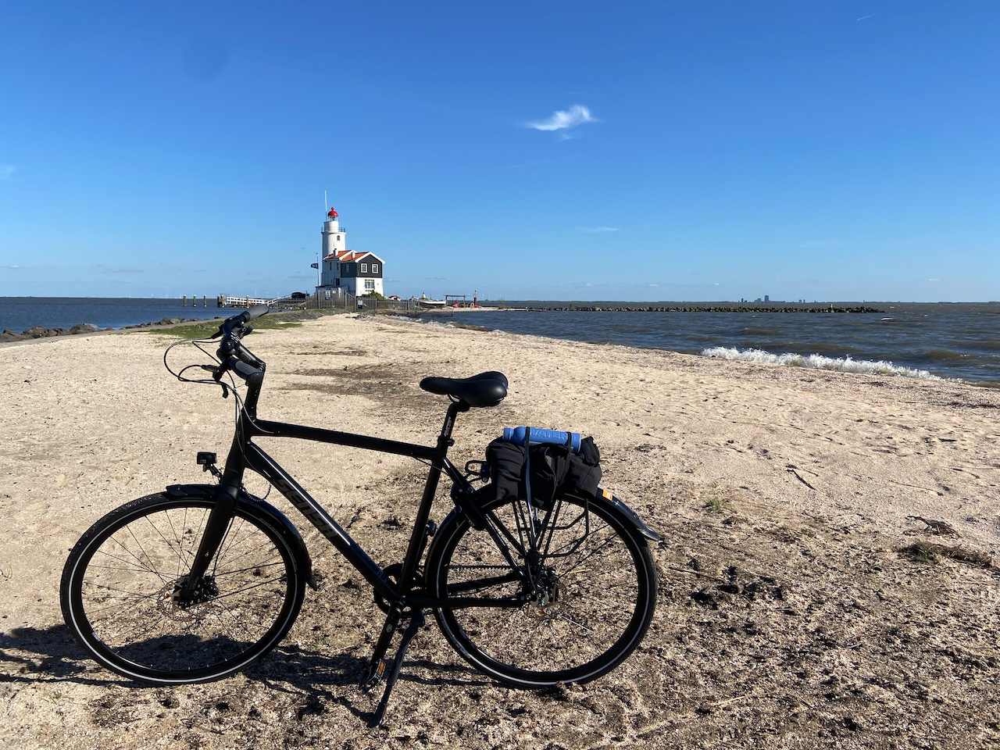

You can tell by the date of this lookback that I am busy with work again. After countless interviews, I made a rather adventurous and exciting choice. I now work at [Gitar](https://gitar.co/about-us), a small startup founded by my former colleagues from Uber. The position attracted me due to the opportunity to work on developer tools by applying compiler-based techniques, as well as the Rust programming language, which I now wrestle with every day.

---

A regular get-together with friends took place in Bulgaria this time. We wandered around Sofia and Plovdiv, admired delicious local cuisine and captions in the familiar Cyrillic alphabet, listened to live jazz, and hiked up a snowy mountain. I wrote a slightly more [extended report in Ogorod](https://ogorod.agentcooper.io/world/bulgaria/bulgaria). Gotta find time now to edit a trip video.

---

Peter took me to the YC Startup School meetup, a sort of DIY event where people present their projects. Of interest to me was a note-taking app similar to Obsidian and a code analysis tool. Sadly, the remaining projects could be used to fill out the "bullshit bingo": another language learning app, another dating app, and another AI-powered content summary app. That being said, showing anything in public is a tough task, so I admire all makers.

---

Inspired by my friend Vanya's bike trips, I impulsively decided the same day to go and buy a nice bike. After browsing about at least fifteen stores in Amsterdam I was frustrated with the poor options, so I made a trip to a huge 12GO Biking store near Gouda. I still couldn't convince myself that the low handlebars were comfortable, so I settled on the [Sensa Cintura](https://www.sensabikes.com/bikes/trekking/1291/cintura-belt-drive-gent).

So far, I've only been able to experience the smoothness of the belt drive on a journey to the Marken lighthouse. Definitely looking forward to doing more trips in the upcoming summer.

---

On an inconspicuous street near the Dam Square, there is [a distillery](https://maps.app.goo.gl/ELMX2gcKgv8xycPJ7) with fantastic liqueurs, of which I particularly recommend the lingonberry one. As we were drinking them just outside, a friendly Ossetian dude came up to us and explained that this was his street, so we had nothing to worry about.

A few more nice recently discovered places: [The Coffee Virus](https://maps.app.goo.gl/3bHBnZr4wexRkUuL6) just across the IJ and the [4850 cafe](https://maps.app.goo.gl/1rKX9sU6WUoyufsBA) in Oost with their egg sandwiches.

---

Very impressed by the refreshing take on the alien nature in the animated science fiction series [Scavengers Reign](https://en.wikipedia.org/wiki/Scavengers_Reign). I have trouble with literary sci-fi, and yet I have great respect for the visual kind. A delightful balance of awe and horror.

---

In the absence of an office, I now often hang out in different cafes or other people's offices. Asya invited me to work from her office on the west side of the IJ Bay. Across the bay, there are industrial areas full of factories. Here the water divides the white-collar and blue-collar.
