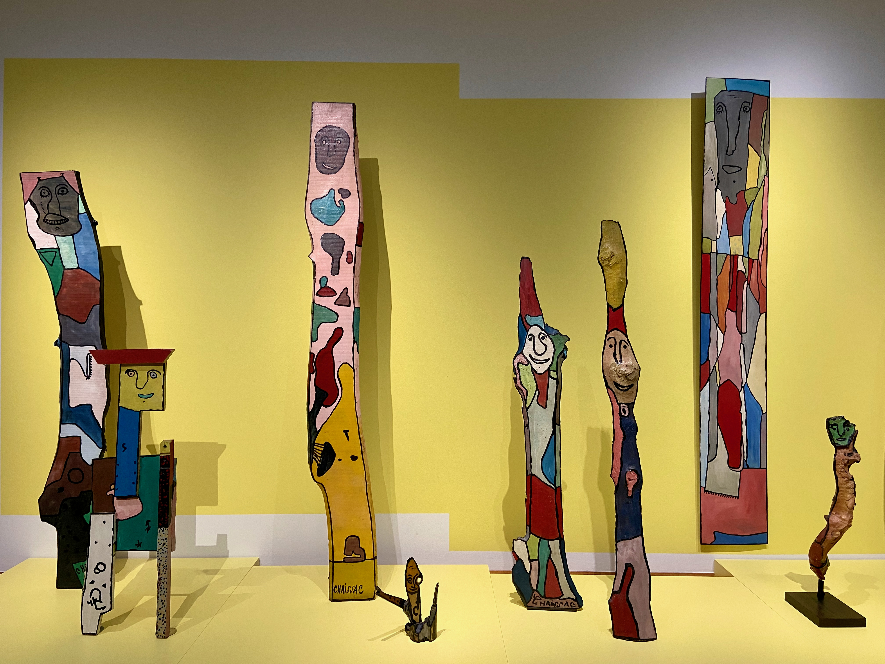

## Events

The summer is over and I have no regrets about how it went.

Had friends from Berlin over at my place. We were laughing about how all of us still have nightmares related to our university days (like not being prepared for the exam). We went to a few places around the city to get food and in most of them, you can now order with a QR code and pay right away. The idea is great, however, the implementation turned out quite buggy. I hope this catches on.

I’ve organized a small picnic to celebrate my 30th birthday. It was a long time since I've gathered more than 3-4 people at a time, so it was a bit overwhelming but also great to see everyone at the same time.

Dish of the month: [dishwasher salmon](https://en.wikipedia.org/wiki/Dishwasher_salmon). Actually made this amazing dish and it turned out alright.

Lived at my girlfriend's place in The Hague for a week. It felt great to switch locations for a bit. Compared to Amsterdam, The Hague has a proper forest close to the city center (did a run there) and you can reach the beach in 15 minutes by bike.

At last, got my EU long-term residence. As with many long-awaited achievements it felt less exciting than I thought it will be. Not much changes for me, I still need visas to most places I want to go outside of the EU and I need to pay the full price if I decide to get more education. At least now there is no stress about leaving the country if something happens to my job.

## Projects

[Save to Roam](https://apps.apple.com/nl/app/save-to-roam/id1578763303) is published in the macOS App Store. By now I've nearly stopped using Roam but pushed myself to finish this one as there is no way to use Safari extensions outside of the App Store.

My oldest GitHub project [react-pdf-highlighter](https://github.com/agentcooper/react-pdf-highlighter) reached 500 stars on GitHub. It feels good to see that some people find it useful. I did neglect this project for a while, but recently found some time to weed out bugs and solve some long-standing issues.

Did 11 runs for the total of 163 KM, the longest run is 24 KM. Even though I might no be ready for a marathon in October, I am happy with how the training is going.

## Entertainment

Didn't make progress with Guns, Germs, and Steel. As I've started it as an audiobook and I listen to it on my phone and the phone is a great source of distractions, it definitely makes it harder to pick up compared to a physical book or Kindle.

Started reading Bullshit Jobs. It is meticulous research of what it means to have a job and the concept of usefulness. The author tries to answer a question on why being bored at your job feels so draining and devastating. Or how come there is a lot of inefficiency in a system (capitalism) where it should be minimized. It feels like an important read even if you don't agree with some points.

Went to COBRA exhibitions in The Hague Art museum (great building) and Cobra Museum in Amsterdam. I've spent a week in The Hague. COBRA stands for 3 cities where this art movement started: Copenhagen, Brussels, and Amsterdam. I felt that their search for inspiration in child drawings and African totems resonates with me.

The movies I've enjoyed the most are Luca and Paddington (both 1 and 2). Both are comfortable and easy to watch. For something more thought-provoking, try Rosencrantz & Guildenstern Are Dead and Bo Burnham: Inside.

## Next month

Next month is lots of leisure time. I'm planning to disconnect from the internet as much as possible.

## Internet links

- [Netflix and Video Games](https://www.matthewball.vc/all/netflixgames)
- [Stop learning](https://www.nashvail.me/blog/stop-learning)
