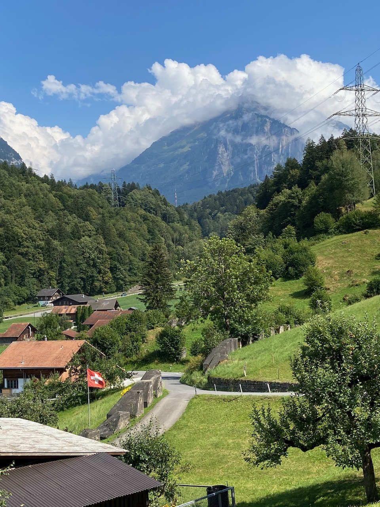
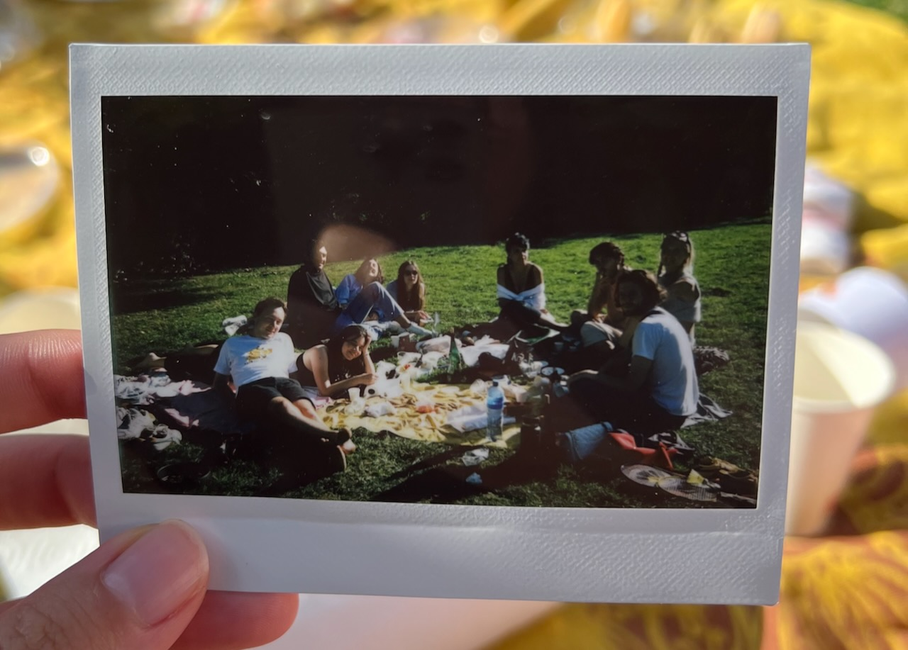

On the flight to Zurich, I inadvertently eavesdropped the conversation between two youngsters. Both of them just graduated and are now developing software for a remote startup. This allows them to live here and there for a bit, to explore new places and cultures. I moved to the Netherlands at the age of 23, but would've never dared to embark on a nomad lifestyle then. Now the world is changing, remote work is getting ubiquitous. Their conversation was full of energy and inspiration.

---

There is not much to see in Zurich for an urban traveler, it is a luxurious village, but the surrounding nature is absolutely stunning. Every day we hiked through mountains, waterfalls, canyons, and lakes. It was an intense experience.

Swiss residents have visibly higher average age, noticeable even at the Google Zurich campus where friends took me on a tour.

A few historical notes. Switzerland was not a rich country until the Second World War, it does not have many natural resources, no water access, and never had colonies. Turns out that not being involved in both wars creates flourishing conditions for the banking ecosystem, as other countries needed a safe place to store money.

Lenin lived in Zurich until he learned that the revolution is happening back home. Being at war with Russia, Germany was smart enough to let him travel from Zurich back to Russia in 1917:

> "Lenin was sent into Russia by the Germans in the same way that you might send a phial containing a culture of typhoid or cholera to be poured into the water supply of a great city, and it worked with amazing accuracy." – Churchill

---

After swimming in Swiss lakes, I used every hot day in Amsterdam to go out for a swim at the IJBurg beach or in the open pool inside Flevopark. Out of all physical activities, swimming delivers the most distinct experience afterward.

As the weather became a bit more chill, I started doing longer runs again.

---

Spent way too many hours playing [Buns](https://unikotoast.itch.io/buns-bunny-survivor) (highly addictive!). The game is made for the PICO-8 virtual console that sets strict limitations on graphics and controls. With all the complexity of the modern technology stacks, it feels like a breath of fresh air. PICO 8 uses Lua exclusively, but there is [WASM-4](https://wasm4.org) that uses WebAssembly for the same purposes. At some point, I would like to try creating a small game for that.

---

Went to a picnic with some art friends and it was fascinating to see how everyone is captivated by AI art (DALL-E, Midjourney, etc.). It does feel like a [big shift](https://www.vice.com/en/article/bvmvqm/an-ai-generated-artwork-won-first-place-at-a-state-fair-fine-arts-competition-and-artists-are-pissed) is coming for illustrations.

---

My cafe reading this month was _Stolen Focus_ where author Johann Hari quits all technology cold turkey for 3 months and then reflects on the experience by talking to some people. See [my notes](/notes/books/stolen-focus/).

Not being able to travel to Japan because of pandemic restrictions induced some nostalgia about the Tokyo trip in 2019. So I've picked up a book about Japan's recovery after the war – [Embracing Defeat](https://en.wikipedia.org/wiki/Embracing_Defeat).

---

Internet links:

- [John Carmack: Doom, Quake, VR, AGI, Programming, Video Games, and Rockets | Lex Fridman Podcast #309 - YouTube](https://www.youtube.com/watch?v=I845O57ZSy4)
- [Productivity Porn - Caleb Schoepp](https://calebschoepp.com/blog/2022/productivity-porn/)
- [Ask HN: What's the next big thing that few people are talking about?](https://news.ycombinator.com/item?id=32378695)
