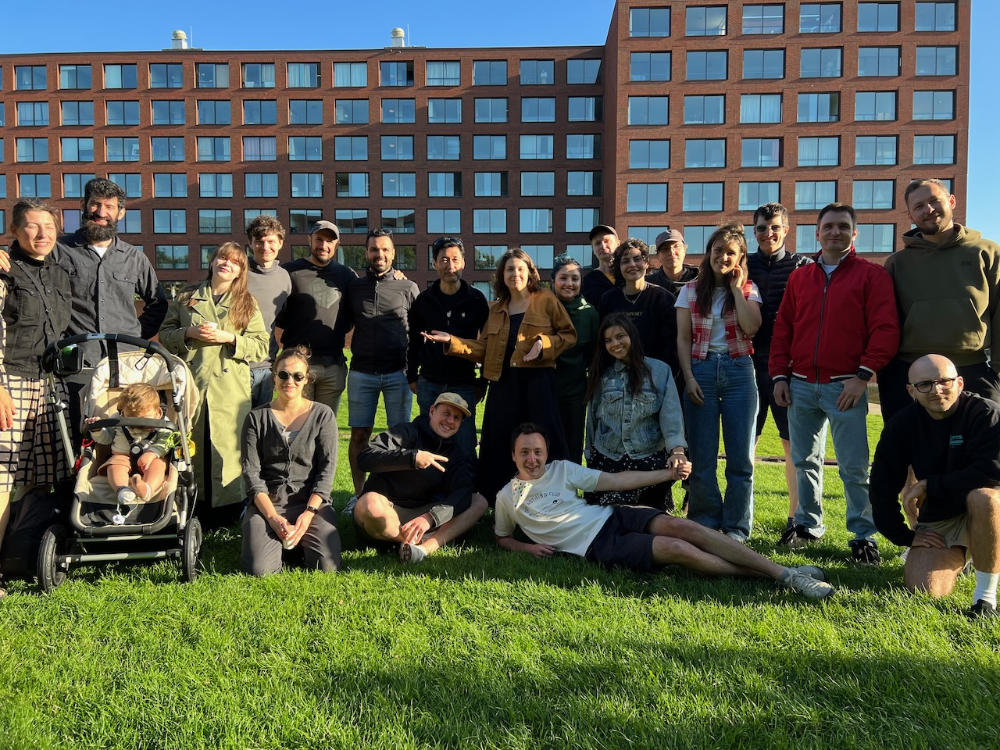
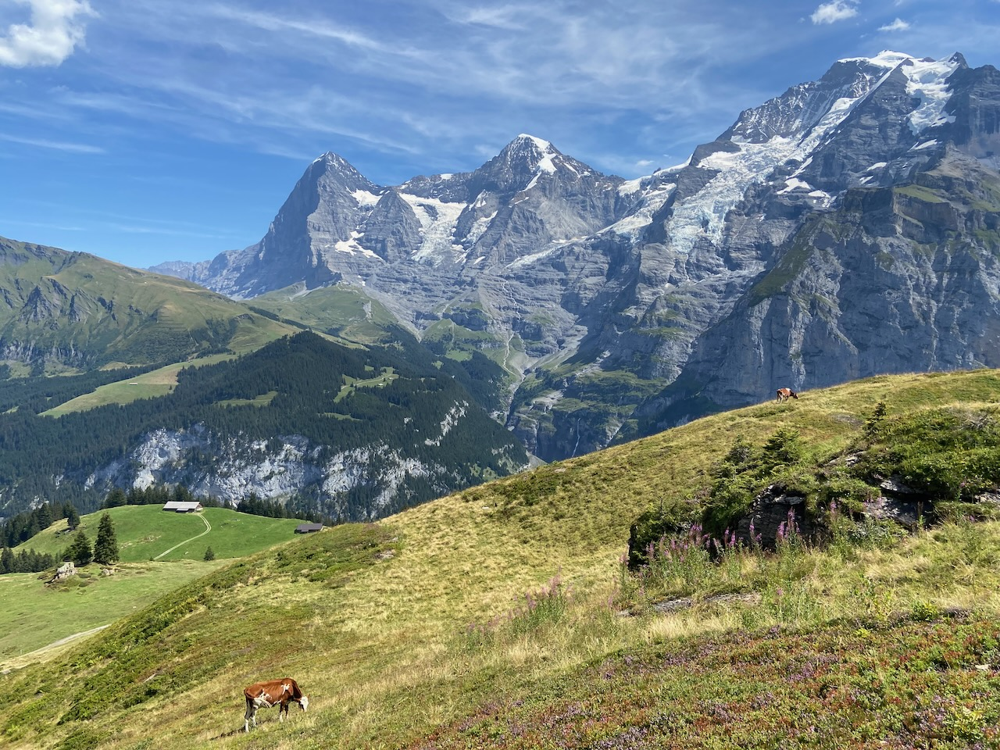
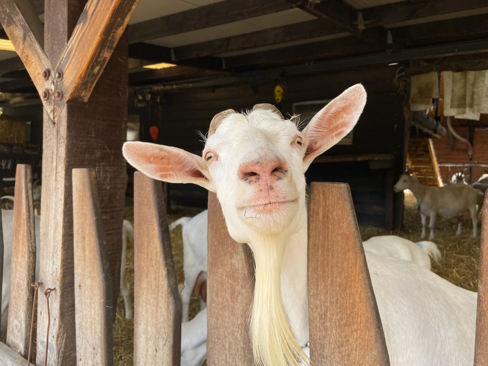

Celebrated my 32nd birthday with a wonderful group of friends. I have a hard time organizing big events, but I love being at them, especially if I know everyone there. It's a special joy to introduce friends to each other, an activity I used to find unnecessary before.

---

Artur and Lena invited us to visit them in Switzerland, and our mutual friends Aziz and Nilyu made it to the reunion from Tashkent. The wooden attic of the house in Zug where we lived, daily lake swimming, and reading books on the beach made it feel like a true country house experience. In the Interlaken area, we climbed steep forests, rode mountain trains overlooking the Jungfrau, and hiked the ridges of mountains with the appealing goal of having lunch at the top.

In Zurich, we visited the lovely botanical garden at the university and once again glanced at the excellent 19th- and 20th-century collections at the art museum: Kandinsky, Goncharova, Monet, Van Gogh, Manet. Above the plaque of the house where Lenin once lived and waited for the beginning of the revolution in his homeland, now a Ukrainian flag hangs.

---

Finally went bouldering and was very pleased with it. The process is indeed like solving a puzzle with your own body. In the span of 4 visits, I learned how to do almost all of the orange routes (first level) and some of the green ones (second level). The gym I'm going to, Monk, occasionally plays _Paranoid Android_, a nice yet non-obvious song choice for athletic activity. When the route doesn't work out, the friendly people around me are always willing to suggest a move I hadn't noticed before.

---

We were discussing with my friend Igor how cool it would be to show up at the airport, buy a random ticket at the counter, and get on a plane. Igor told me about the _r/onebag_ subreddit, and we came up with the idea of making a pre-planned trip, but where we are not allowed to bring any stuff. That is, you can only take what you can fit in your pockets. As a city for the day, we chose a city that we both hadn't been to and yet didn't seem interesting enough to regret being there for just one day. The choice was Hamburg. The freedom of traveling without stuff is hard to describe, but the feeling is fantastic. By a pleasant coincidence, our friend Tolya was also in town at this time and he took us to the roof of the opera building, which overlooks the city.

---

The great luxury of not being bound by daily work is being able to immerse myself in a book for the whole day. August was rich in reading excellent fiction. The charmingly dark _The Bell Jar_, the melancholically meditative _Klara and the Sun_, re-reading of my favorite _The Great Gatsby_. Gatsby made a huge impression on me when I first read it when I was 20 years old. An under-appreciated effect of rereading books is remembering yourself in the past through thoughts related to the book.

---

In _The Man from the Future_, a book about the legendary scientist John von Neumann, I was struck by how much the patriotism he showed toward the United States after moving there drove his work. Having seen communist Hungary, Von Neumann hated communists and the Soviet Union. It's interesting to compare this to the communist-minded Robert Oppenheimer, who studied in Europe but was back in the United States by 1927.

---

The first day of August became the obligatory Barbenheimer day for me. _Oppenheimer_ was fantastic and I'm saying this as usually being skeptical of Nolan movies. _Barbie_ was fine too, but can be skipped as well.

---

Impressed by the acting and successful blend of comedy and tragedy in the _Succession_ TV series, having watched the first season. Interesting bit of history: Rupert Murdoch, the American media mogul who owns Fox News, on which Logan Roy is based, bought the most popular social network at that time, MySpace, in 2005. The iPhone came out in 2007 and in 2008, the fast-growing Facebook overtakes MySpace in Alexa's ratings.

_Cunk on Earth_ was also entertaining, but their style of humor, more suited to short meme videos, gets somewhat boring towards the end.

---

Hike report to Amsterdamse Bos. A cheerful barefoot man I met told me about the benefits of walking without shoes. Then I fed the goats at a goat farm hidden inside the forest. I was hoping to get some pancakes at the Meerzicht Farm, but it was closed. Would be nice to try canoeing down the forest lake next time.

---

Newly discovered recommended places in Amsterdam: Chun Cafe – a Korean sandwich place with too-long lines (it's best to be there at the very opening in the morning); Olido pizza – delicious Italian oven-made pizza; Eethuis Sinbad for the legendary _kapsalon_.

---

No Internet links this month. I recommend leaving your phone at home and enjoying a good book in the park while the weather is nice.
