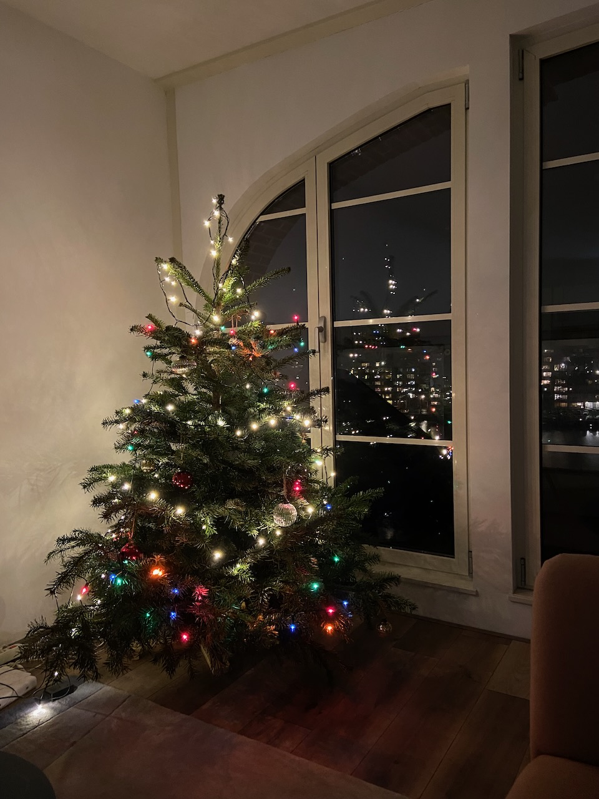

The main activity of December was city walking, as there is not much else to do outside because the country is on the hard lockdown again. Great timing for the annual Light Festival though, and I've discovered some new well-hidden areas in Amsterdam that I thought I knew already pretty well.

At home, properly decorated Christmas gave the necessary coziness. I was reminded how fun it is to play video games together on the same couch. My good friend Igor came to stay with us during the holidays, and we've played lots of Mario Kart, occasionally using it to settle a bet on who is doing the dishes. I also enjoyed the first time playing Mario Party, which is essentially a board game that you can play on a TV screen. The same vibes are there when playing Geoguessr on the couch.

After not really a Christmas dinner (as Russians celebrate only New Year), we've played [a game](https://tvtropes.org/pmwiki/pmwiki.php/WebVideo/TwoOfThesePeopleAreLying) where you need to convince a host that you know what the given Wikipedia article is about. The round on [Geostationary Banana Over Texas](https://en.wikipedia.org/wiki/Geostationary_Banana_Over_Texas) was especially fun.

On a very cold day, we've met with friends near a great blini place, Blin Queen, where friendly Belarusians served delicious blini and glühwein. The line was full of Russian-speaking people, and I saw faces familiar from the January protests.

–

Earlier in December, we've celebrated Asya's birthday by asking all guests to make their own pelmeni (Russian dumplings). Vodka was involved as well. The night ended with singing Russian karaoke songs. It is not easy to organize a party with people of different cultural backgrounds.

–

I've finished two books by Vladimir Nabokov: Laughter in the Dark (Камера Обскура) and Invitation to a Beheading (Приглашение на Казнь). It is remarkable how different those two books are, but written only 2 years apart.

[Сумма биотехнологии](https://ru.wikipedia.org/wiki/Сумма_биотехнологии) turned out a great overview tour of modern biotechnology and genetics, I've enjoyed this book a lot. It does not shy away from explaining complex topics like RNA interference, transposons, gene promoters, and repressors. The book was published in collaboration with the Evolution fund created after the previously eliminated Dynasty Foundation. It was sad to hear that [Dmitry Zimin](https://en.wikipedia.org/wiki/Dmitry_Zimin), the founder of Dynasty Foundation, passed away in December. I think he is very underappreciated in Russia.

–

I haven't been as baffled by a movie as with Don't Look Up in a long time. I was surprised to learn that some of my friends liked it, while I thought it was flat and trite, even if the authors are preaching to the choir. After the movie ended, I felt rushed to use all the harsh words about the Matrix sequel that we had seen the day before.

I had high hopes for the French Dispatch, but breaking the movie into smaller parts didn't work well for me. Unexpectedly the animated film The Mitchells vs. the Machines was a simple delight.

–

When in Moscow, I always try to buy every edition of a film journal Kinoart ("Искусство Кино") that I've missed so far. I was curious to see how well my viewing history overlaps with films they write about. So I wrote [a scraper script](https://github.com/agentcooper/kinoart-review-data) that matches the Russian title from the review with the English one to associate with my Letterboxd.

–

As an experiment, I've deleted my Twitter and Instagram accounts. Over the years, I've accumulated a few people I follow but never communicate with them in real life and even online. The act of deletion felt like a long-needed reset button. If I feel the urge, I'll start using those websites again.

–

I've enjoyed 2021, it was a social and joyful year for me.

Some numbers:

- Watched [68 movies](https://letterboxd.com/evilagentcooper/films/diary/for/2021/)
- Read [16 books](https://www.goodreads.com/review/list/4207679-artem?read_at=2021)
- Ran 782 kilometers
- Played [6 video games](<https://agentcooper.io/pages/games/#played-(2021)>)
- 2 public open-source projects, 2 private (still intending to publish at least one of those)
- Played around 20 hours of guitar in Yousician
- Just 3 trips: Berlin, Portugal, and Moscow
- Finished 0 online courses (but started 1)

–

Internet links:

- [AR Is Where the Real Metaverse Is Going to Happen](https://www.wired.com/story/john-hanke-niantic-augmented-reality-real-metaverse/)
- [Project Zero: A deep dive into an NSO zero-click iMessage exploit: Remote Code Execution](https://googleprojectzero.blogspot.com/2021/12/a-deep-dive-into-nso-zero-click.html)
- [Nobel lecture by Dmitry Muratov](https://www.nobelprize.org/prizes/peace/2021/muratov/lecture/)
