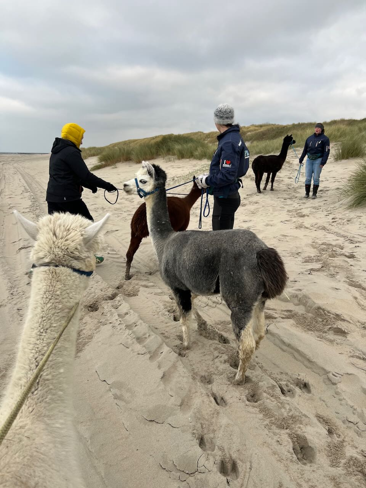
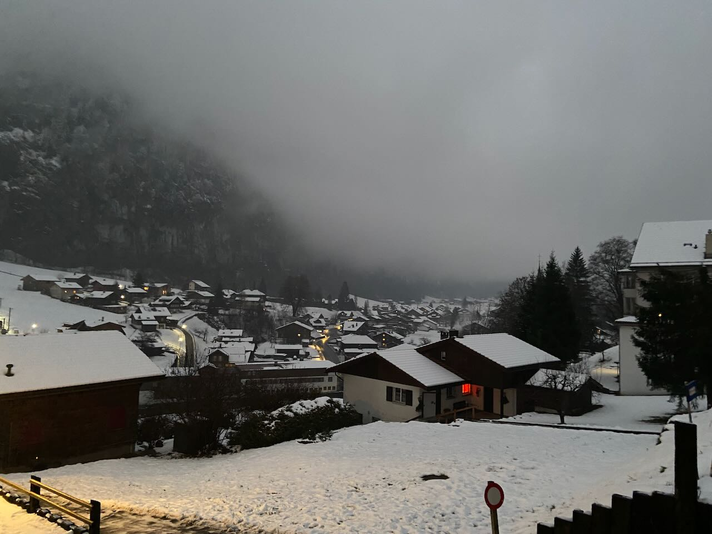

For Asya's birthday we went to Middelburg to meet alpacas. These space beasts are relatives of camels, smaller than llamas. I got an alpaca with a temper named Arena, who kept making a disgruntled sound and always wanted to go the other way. Other alpacas were quite obedient. Despite the promise of alpacas being curious, Arena didn't care about me and only craned her neck when I blocked her view. It was fun. Walking along the shore, we learned that alpacas here, just like humans, also lack sun and need to eat vitamin D.

---

Igor and Tyoma came to Amsterdam. I caught a cold walking with the alpacas, so we didn't do much outside, but we watched two great crime/gangster movies: Good Time and La Haine. Igor continued the tradition of ordering chicken korma and thus earned the nickname _Kormack_ (a tribute to the great John Carmack).

---

Before Aziz left for Tashkent, we decided to visit Artur and Lena in Switzerland. We arrived in the evening and in the morning it started snowing heavily. It was the first and only snow I'd seen this year. We celebrated Lena's birthday in the mountain village of Murren. There it was so satisfying to eat hot soup after a long walk in the cold. Although the whole trip was a fantastic winter fairy tale, Switzerland made a greater impression on me in the summer.

---

Seryozha dragged us to see Avatar 2. Technically spectacular, but ruthlessly pointless. Read that they are planning at least 2 more movies. Too bad I supported it with money.

---

A few days before New Year's Eve we went to Berlin. This time Deutsche Bahn surprised us with the punctuality of trains. Had dinner at the already favorite Georgian restaurant Tsomi for the second time this year. Last time we pestered them about the lack of a Tarhun drink, and now they have it.

Tolya's friends were very kind to invite us to their New Year party. Everyone grabbed champagne and went out on the balcony to watch the fireworks. The balcony had a view of the river. At a nightclub on the opposite bank, someone was shooting flames from a flamethrower. We played board games and parted ways around 3 a.m., the weather outside was very warm.

---

Best movies of 2022:

1. Tar
2. The Banshees of Inisherin
3. Decision to Leave
4. Everything Everywhere All at Once
5. Three Thousand Years of Longing

---

Internet links:

1. [a native internet protocol for social media | Revue](https://www.getrevue.co/profile/jackjack/issues/a-native-internet-protocol-for-social-media-1503112?via=twitter-card&client=DesktopWeb&element=issue-card)
2. [Riffusion](https://www.riffusion.com/)
3. [ЛЮБОВЬ АРКУС: про Балабанова, «Брата- 3» и «нашу» армию - YouTube](https://www.youtube.com/watch?v=Iiz3-kKfulk)
