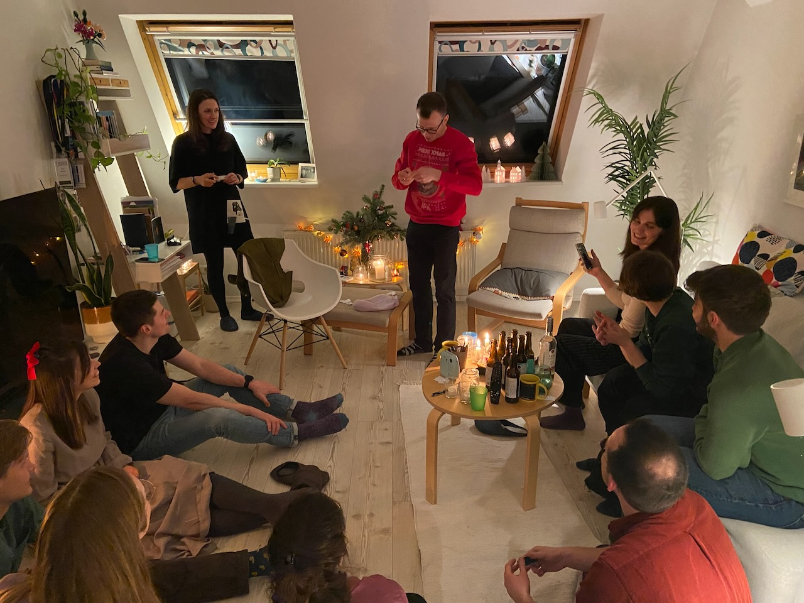
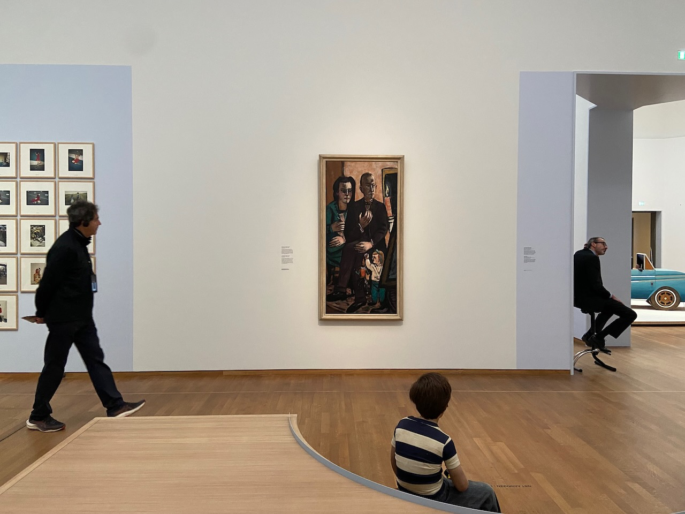

December was about searching for presents and meeting with all local friends, before departing to Berlin for the holidays. I am not that into Berlin as a city, but the amount of good friends there makes it one of the top candidate cities if I ever decide to move.

During the holidays we played Tetris, rewatched Home Alone, and visited Munch exhibition. New Year's Eve was spent eating vegan salads and singing karaoke. Turns out everyone knows only the *Wake me up before you go-go* line from that song and all other lyrics are quite hard. Kolya kicked my ass in Tetris and showed me DJ-ing and music production basics.

---

To sum up the year, I was inspired by the [40 questions to ask yourself every year](https://stephango.com/40-questions) list. It was very enjoyable to reflect on these questions and read the answers of close friends. I've posted my answers in a private place, so if we know each other and you are interested in reading those, let me know.

---

I always enjoy finding *small web* communities. People with personal, hand-crafted, weird websites are my people. As I was curious about where in the world people from [NowNowNow](https://nownownow.com) live, I built a [table](https://agentcooper.github.io/nownownow-json/) which allows you to look up people, for example by city. Now I want to meet a few of those in Amsterdam. Also, my friend Peter is building the [Events In Amsterdam app](https://eventsinamsterdam.com), check it out.

---

My Mastodon feed used to be a wasteland and recently started to feel alive and engaging. I follow mostly tech people, and because they're all so talented and smart, I occasionally experience an effect I used to attribute to Twitter - a sense of inadequacy and a sort of imposter syndrome. I guess it is human nature after all. Nevertheless, I learn a lot of fascinating things from my feed as well.

---

The Eye compiler grew a bit more and I solved a few Advent of Code puzzles using the language. Finding bugs in my implementations of closures and GC set me back, but at least I now figured out how to fix those.

---

I visited the Nan Golding photo exhibition in Stedelijk. For photo exhibitions, I like the slideshow format with a projector better than static hanging prints.

I also enjoyed the Boijmans Van Beuningen collection exhibition at Rijksmuseum which was organized in my favorite style of mixing classic and modern art.

---

To spark my friend Kolya's motivation to make a game for Playdate, I made [a game](https://github.com/agentcooper/kolya-vs-babushkas) for him, about him. In it, as a part of an inner joke, Kolya is riding his sofa and fights against grannies (*babushkas*) by throwing Nintendo Switch controllers at them. Turns out that Lua is a fun language and pixel art is very hard.

---

Dutch settlement Dejima on Nagasaki made a big impression on me during the November trip, so I decided to immerse myself in a book about it. *The Thousand Autumns of Jacob de Zoet* is a historical fiction about a Dutchman in a faraway Dejima. Corruption and political intrigue are well intertwined with a forbidden love plot. Terrific read.

---

Super Mario Bros. Wonder turned out to be more delightful than I expected. Great game for a laid-back couch co-op.

---

Didn't do any bouldering this month, but got back to running.

---

Internet links:

- [The Genius Design of Dutch Money - YouTube](https://www.youtube.com/watch?v=0jdL7R3BcnM)
- [Privacy is Priceless, but Signal is Expensive](https://signal.org/blog/signal-is-expensive/)