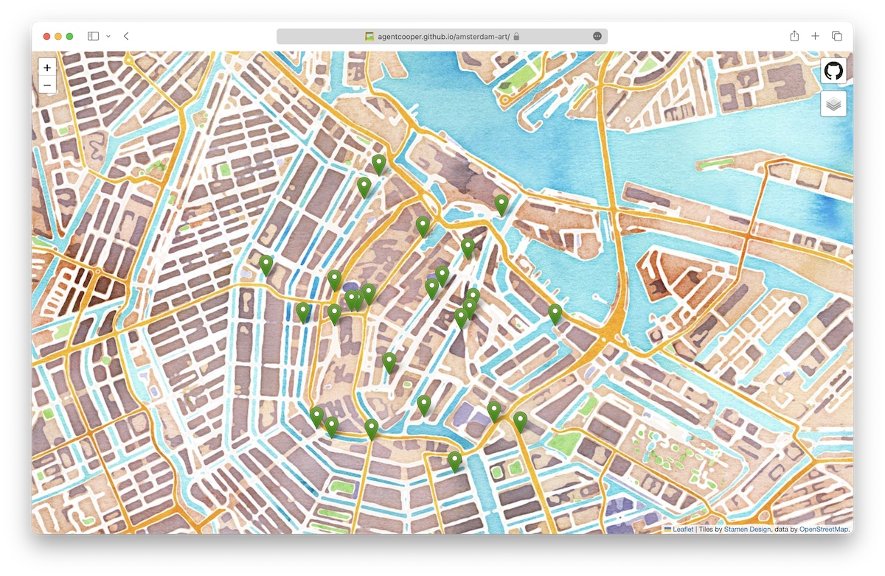
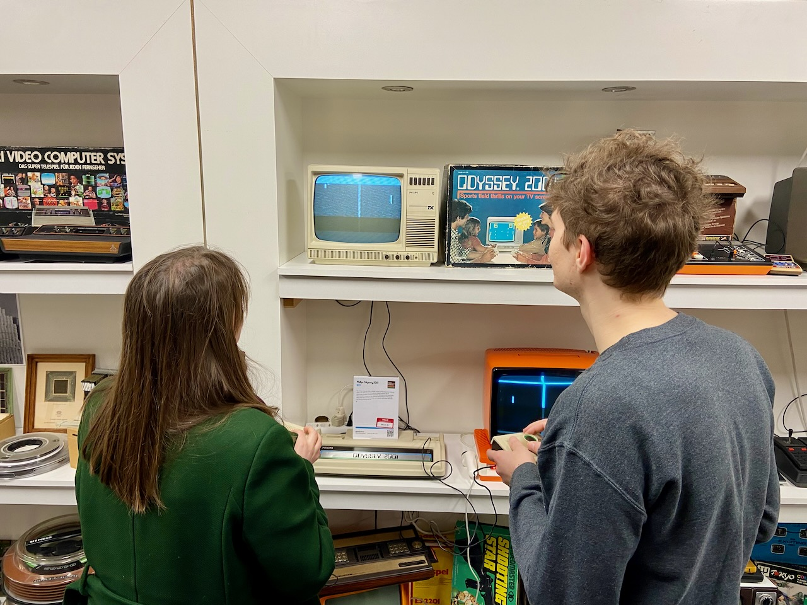
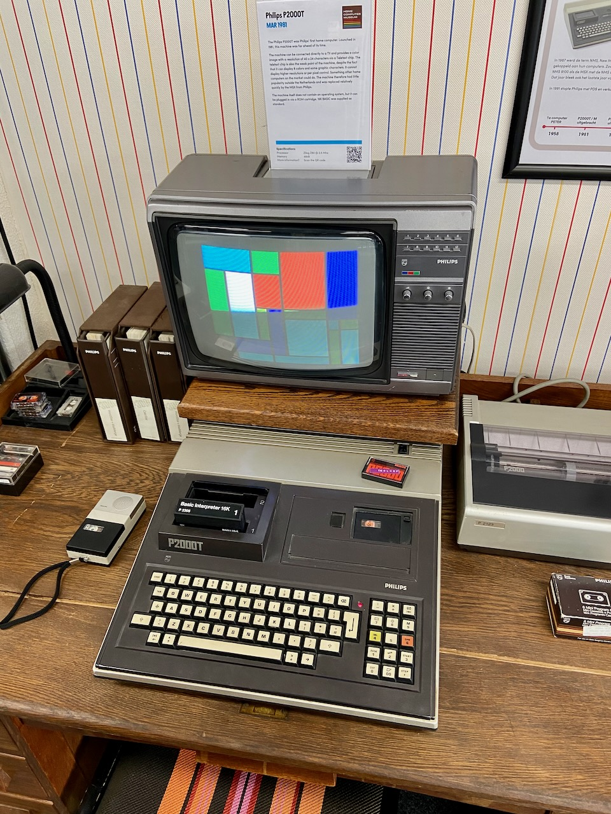

I had coffee with my friend Razvan and described my feelings about the ongoing sabbatical. He summed it up well, saying that I could now see the future in terms of the projects I have the opportunity to work on.

---

The city I live in is quite important to me. Digging into the history of the neighborhood and the city helps me take my mind off the daily routine and appreciate the world at large. I took note each time I saw a cityscape painting of Amsterdam. The collection grew, and so I created [a map](https://agentcooper.github.io/amsterdam-art/) showing all viewpoints of historic paintings of Amsterdam. With this project, I want to encourage urban dwellers to learn the history of the city by exploring the historical context of some iconic buildings. This is my small ode to Amsterdam.

---

Inspired by the fluency of Catalonian-speaking expats I've met in Barcelona last month, I've restarted learning Dutch. I am using Memrise to get back on track and plan to return to online video lessons. Can recommend a [NOS Nieuws van de Week](https://www.youtube.com/nosnieuwsvandeweek/videos) on YouTube which is a weekly newscast in simple Dutch with subtitles.

---

I've long been fascinated by the techniques that go into making a programming language, so I am now doing a deep dive into the fundamentals of compilers. I've started with the [CS143 Compilers](https://web.stanford.edu/class/cs143/) course that I'm watching on edX and reading _Engineering a Compiler_ book in parallel. In the spirit of learning by doing, I'm building a compiler for a small programming language I'm designing called Eye (homage to the IJ bay in Amsterdam). Not much to show yet, as I just finished basic code generation for MIPS architecture and the only thing it can compile so far is the Fibonacci function. I might add ARM or WebAssembly as targets as well. I am writing the compiler in C and while it was fun in the beginning, it really makes you appreciate all modern programming languages.

---

Made my first blini (crepes) to celebrate [Maslenitsa](https://en.wikipedia.org/wiki/Maslenitsa) which I learned is a European counterpart of Mardi Gras (_Fat Tuesday_). Thanks to YouTube for the detailed recipe, they turned out very tasty.

---

Took a few trains to join Nikita and Lera on a trip to the [HomeComputerMuseum](https://www.homecomputermuseum.nl/en/#intro) in Helmond. The huge collection shows how various design trends converged into the personal computers of today.

Nikita [posted](https://twitter.com/nikitavoloboev/status/1629949668296646658) many nice photos on Twitter.

---

The next Russian classic I'm reading is _Anna Karenina_. Compared to Dostoevsky, I'm finding Tolstoy's style to be more minimalistic and at the same time more expressive.

---

Kirill and Anya stayed with us for a few days and we had a lovely dinner at [D&A Hummus](https://dna-hummusbistro.com). It's especially nice to have guests when they stock the fridge with all kinds of delicious desserts.

---

A few lines about two museum visits. Teylers Museum in Haarlem is a gorgeous building with a not-so-interesting collection of rocks and fossils. Museum van Loon in Amsterdam is a canal house that belonged to a co-founder of the Dutch East India Company. Just a house of a wealthy family with heads of black people on their coat of arms, a terrible-looking now but apparently [once-popular European theme](https://en.wikipedia.org/wiki/Moor%27s_head). By the way, the primary founder of the Dutch East India Company [was beheaded](https://en.wikipedia.org/wiki/Johan_van_Oldenbarnevelt#Arrest_and_trial) by the son of the liberator of Northern Netherlands.

---

Thanks to the weather starting to treat us to warm and sunny days, I went out for a run a few times. There is something zen in accepting the fact that running skills fade away very quickly, even shortly after running a marathon. Awareness of this makes it easy to start again and appreciate the beginner's experience.

---

The zeitgeist of the moment is reflected in a new popular party discussion topic – ChatGPT and other AI chatbots. Everyone talks about them, some feel excited, and others feel scared.

---

Internet links:

1. [ChatGPT Is a Blurry JPEG of the Web | The New Yorker](https://www.newyorker.com/tech/annals-of-technology/chatgpt-is-a-blurry-jpeg-of-the-web)
2. [Don’t worry about AI breaking out of its box—worry about us breaking in | Ars Technica](https://arstechnica.com/gadgets/2023/02/dont-worry-about-ai-breaking-out-of-its-box-worry-about-us-breaking-in/)
3. [#НМДНИ 2022. ВОЙНА. И не только. И даже: песни военных лет, год первый - YouTube](https://www.youtube.com/watch?v=ykizlNjll8c)
