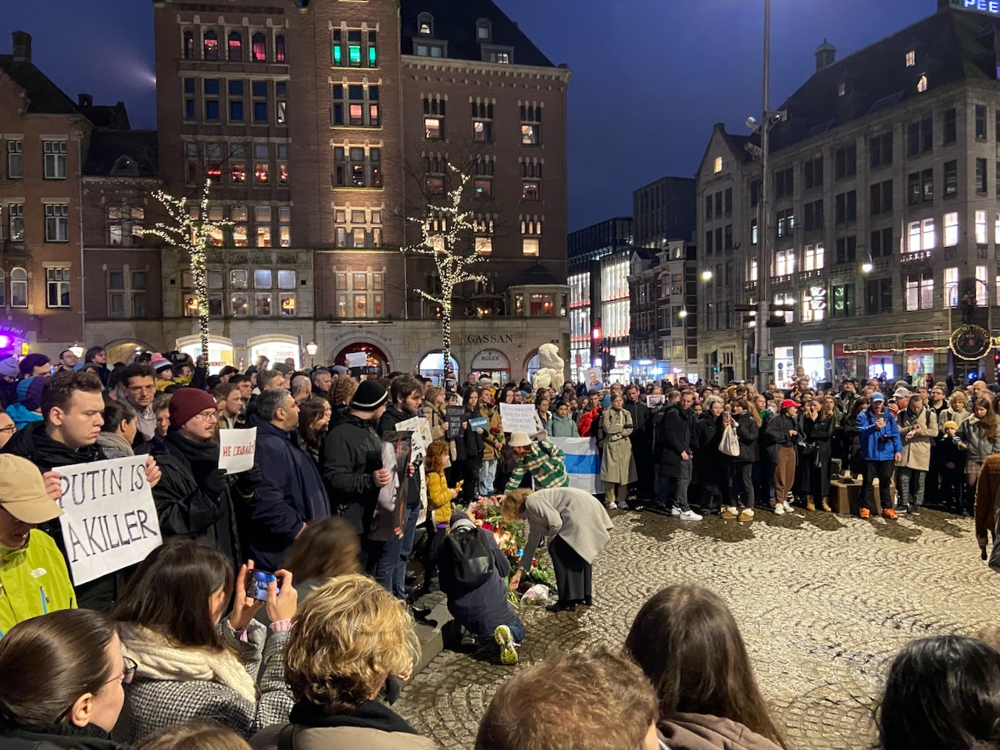

An exhausting month. After getting sick in the first few days of February, I sat with a cough for the rest of the month. The rest of the days I was either interviewing or preparing for interviews. This is also an exhausting process, which in my case fills up all my free time. Often it's not clear what exactly to prepare for, so I bounce between textbooks, various talks on YouTube, and the regular LeetCode practice.

---

Navalny's murder in prison was a shock to me. In 2012, I went to work for LiveJournal, a blogging platform that its original creator Brad Fitzpatrick (later known for Go and Tailscale) had sold to the Russian company SUP Media in 2007. I was proud to work for a service where Alexei Navalny blogged about corruption in the Russian government. I saw him several times during the protests in Moscow. After his imprisonment, when he returned to Russia, I helped organize several local rallies in his support. I didn't realize it right away, but Navalny was essentially the only person I could call the main political hero of my generation.

On the day of the news of his death, people gathered in Dam Square to honor his memory. It felt surreal and I couldn't quite believe it had actually happened. Putin is a killer.

---

Got over the mental block about contributing to large open-source compiler projects like LLVM. For a while, I didn't know where to start. But this month I scrolled through a list of "good first tasks" on GitHub, picked a few, and just started working on them. The people there were very helpful, and as a result, I was able to land [5 pull requests with 3 more in progress](https://github.com/llvm/llvm-project/pulls?q=is%3Apr+author%3Aagentcooper).

---

Nick presented an interesting task to optimize code for his Playdate game. It turned out that a 168 MHz processor could not cope with deep recursion in the case of a flood fill algorithm. It was interesting to spend a couple of days trying to squeeze some performance out of Lua. I also tried rewriting the code in C and of course, it worked much better. More details are available in [Nick's developer diary](https://grains.cc/projects/overworld/#day-17).

---

Over a couple of evenings, I read a book titled Creative Selection. Author Ken Kocienda worked at Apple from 2001 to 2017 and tells stories about starting the Safari/WebKit project, inventing the keyboard for the first iPhone, and the importance of demos in Apple's development process. The book is for a non-technical audience, so it lacked detail at times. After reading it, I came across interviews recorded by the wonderful Computer History Museum, where the author and his colleague chat about the same stories, but with more intriguing details: [part 1](https://www.youtube.com/watch?v=xImAMe32Itg) and [part 2](https://www.youtube.com/watch?v=ukTAAz5TfnY). CHM YouTube channel is a goldmine of great interviews.

---

A month ago I met up for coffee with my friend Peter. He was trying to come up with a new way of finding like-minded people on the web. I suggested the idea of a /ideas page for personal sites, similar to the /now and /about pages. In the spirit of the small web, the gist of it is that people can outline their ideas for personal projects on this page and use these pages to find collaborators. And Peter ended up implementing it. Yours truly is mentioned in the [authors](https://aboutideasnow.com/about#authors) section of the project manifesto.

---

On the last day of the month, Asya took me to a concert of the wonderful Ukrainian band _5'nizza_ in Haarlem. The music transported me back to the days of my carefree student days. I don't tend to romanticize that time, but considering that I left the country shortly after graduation, in many ways, it was a unique time.

<video width="640" controls>
  <source src="5nizza.mov" type="video/mp4" />
  [Your browser does not support the video tag.]
</video>

---

Acting on Nick's excellent recommendation, I made at least a week of [30 Days of Yoga](https://yogawithadriene.com/free-yoga-videos/30-days-of-yoga/) exercise program. Despite being reminded of how inflexible my body is, the days when I'm not lazy and exercise go better than others.

---

Saw many great films, both in theaters and at home. The most notable is without a doubt [The Zone of Interest](https://letterboxd.com/film/the-zone-of-interest/) by Jonathan Glazer – delicately crafted art about the banality of evil, masterpiece audio work as well.

[Perfect Days](https://letterboxd.com/film/perfect-days-2023/) is delightful Tokyo good vibes over Lou Reed tunes. [Theatre Camp](https://letterboxd.com/film/theater-camp-2023/) is the funniest comedy I've seen in a long time. And [May December](https://letterboxd.com/film/may-december/) grew on me and felt like there was more to it than just the controversial subject matter on the surface.

---

Got a new high score in [BlockDate](https://github.com/thacuber2a03/BlockDate). Playdate became my ultimate Tetris device.

---

Internet links:

- [Muse retrospective · Adam Wiggins](https://adamwiggins.com/muse-retrospective/)
- [French Kids Paying Tribute to Serge Gainsbourg (1988) - YouTube](https://www.youtube.com/watch?v=unYu22Ign1E)
- [Sofia Coppola Shares Her Rich Film Archival | W Magazine - YouTube](https://www.youtube.com/watch?v=u6p_PuXq9hE)
- [How to do things if you're not that smart and don't have any talent – Substack](https://adaobi.substack.com/p/how-to-do-things-if-youre-not-that)
- [Keep your phone number private with Signal usernames](https://www.signal.org/blog/phone-number-privacy-usernames/)
- [#НМДНИ-2023 - YouTube](https://www.youtube.com/watch?v=HI6fMVONBkM)

