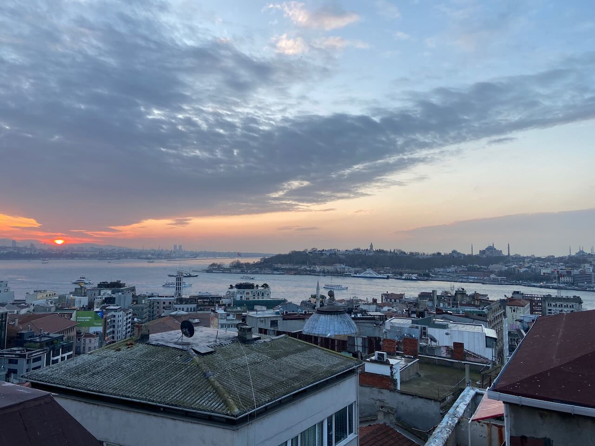
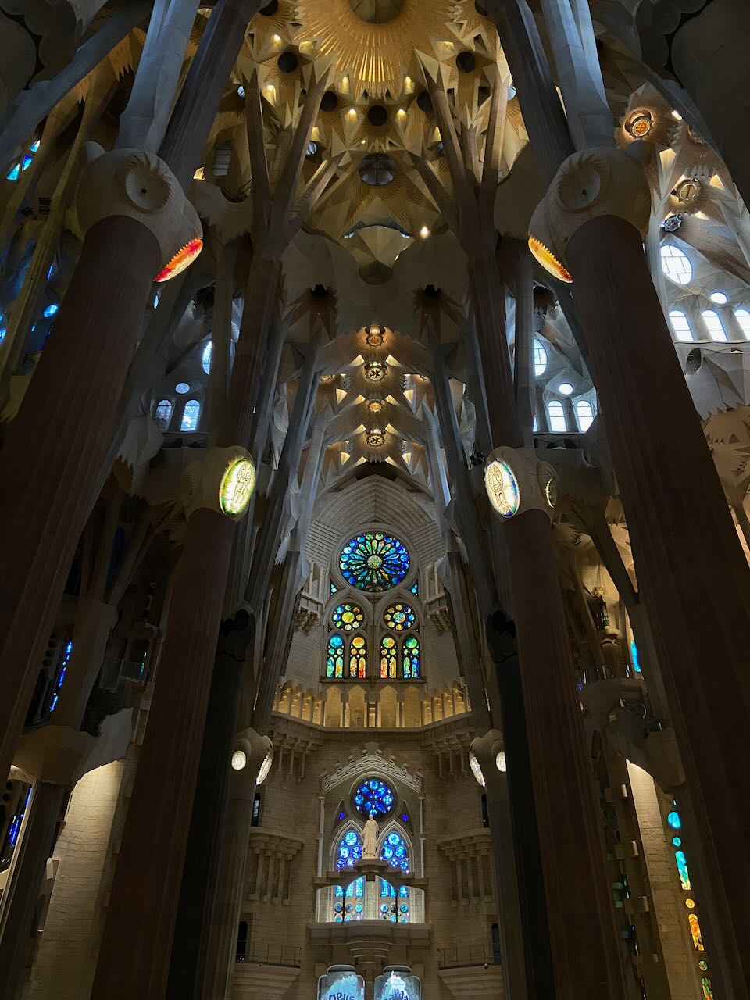
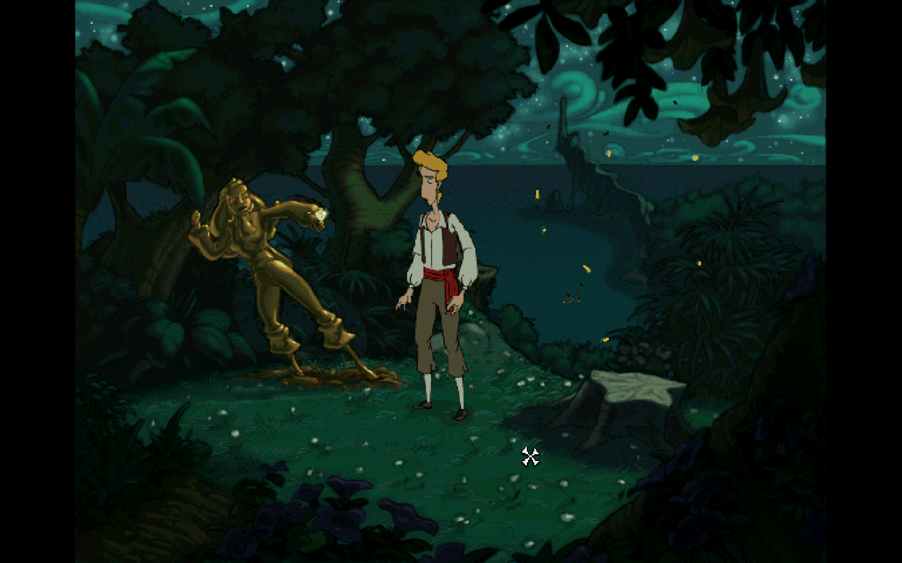

The day after my return from Berlin, I turned in my work laptop. It was my second and last visit to the Apple office during two years of remote work. I had been fantasizing about quitting and taking the sabbatical for the past three years and finally made up my mind. It wasn't an easy decision, given the high volume of layoffs and the declining economy. But the more difficult the decision seemed, the more I realized I needed to commit to it.

The main reason for leaving was the company's hostility to remote work. The most interesting projects are in California, outside of US the only major development office is in London and if you're not there it's very hard to find an interesting remote position. My project throughout my time at Apple wasn't that bad, I just wasn't doing anything new or exciting. I tried to change teams throughout the year and after successfully passing interviews I was rejected twice because of remote work. I have not regretted my decision once I submitted my resignation.

For the first time in my 10-year career, I don't have a scheduled next job. I decided to spend at least the next three months without work. I am curious to take an outside look at my thoughts in a state where I don't have to self-define myself through work. It is an exercise in controlling my anxiety about money, in reevaluating what I think is important in life, and of course about giving myself a break.

---

Spent time with my mom, first five days in Istanbul, then five more in Barcelona. It was her first time visiting both cities. Coincidentally, we ended up on a tour of the holy places: the Hagia Sophia and the Sagrada Familia. The first impresses with the many layers of history, the second is unlike anything else. Although apparently in my heart I am more Catholic than Muslim. In Istanbul we looked at street cats, ate _balık ekmek_ (street fish sandwich), and walked in the footsteps of [Tamara Eidelman's stories](https://www.youtube.com/watch?v=fNILyz3jUpc). It was also insightful to listen to [Omar Suleiman's explanation of Islam](https://www.youtube.com/watch?v=BOKCNUqbpH0).

In Barcelona, we visited all of Gaudi's buildings, strolled along Barceloneta Beach, admired the grid of Eixample neighborhoods, and talked about the Catalans Picasso and Dali. We retraced Gaudi's route when he walked from his house at Güell Park to the construction site of Sagrada and was hit by a streetcar at the end of his life. There are episodes of Pyotr Vail's [_The Genius of Place_ series](https://www.youtube.com/playlist?list=PL9xqb5OxA5CJpV_fcN4debAnw50i2G4ej) about both cities.

At this reunion I wanted to better understand what kind of person my mother was, so I made a list of questions in advance and recorded more than 10 hours of interviews with her. I asked about her childhood and adolescence, her relationship with her parents, the art that influenced her, motherhood, what she would do differently as a parent, etc. I learned a lot and am very happy with the result and can recommend everyone to do the same.

---

Working on my culinary skills. I learned how to make poached eggs in two ways: with a vortex and with a foil. After learning to prepare hollandaise sauce, now it's hard to order it without thinking about the amount of butter in it. Also learned how to make _syrniki_ (quark pancakes).

---

Without work commitments interfering with my time, I can afford the long-forgotten mode of immersing myself in a book all day.

Finished reading _The Brothers Karamazov_. Dostoevsky was arrested for participating in a group that circulated the critic Belinsky's banned letter to Gogol, in which Belinsky is displeased with Gogol's turning to religion and says that Russia needs not prayers, but an awakening of a sense of human dignity. At the last moment before his death penalty, Dostoevsky is sent to prison. He spends four years in prison reading the Bible and meets another prisoner accused of murdering his father, who is later acquitted. _The Brothers Karamazov_ is Dostoevsky's last book and he dies 2 months after completion. Although the text conveys Dostoevsky's quite concrete religious position, there are many interesting conflicts in his characters.

---

My book club is scheduled to read _Anna Karenina_ in February, so I wanted to take a break from the Russian classics and read some American prose before starting with Tolstoy. My attention was drawn to _The Idiot_ by Elif Batuman. It turned out to be about a Turkish Harvard student who goes crazy over Russian literature. The book explores the difference between communication in text and conversation and the role of both in the creation of narrative.

---

The _Monkey Island_ series is the principal and defining game of the quest/adventure genre for me. Having started with the third part (_The Curse of Monkey Island_) when I was a kid, I was amazed by the drawn graphics and music. Then it turned out that "real" players thought the third part was no good because it wasn't done by Ron Gilbert, the author of the first two parts. Years later I played the first two games. The release of _Return to Monkey Island_ in 2022 was a pleasant surprise to me. Ron received a lot of criticism online for moving away from the pixel graphics of the first two parts. I liked both the graphics and the ending of the new game. On a wave of nostalgia, I also revisited the third game.

---

Briefly about two films that impressed me. _Aftersun_ is a touching story of a daughter and father's trip to a hotel in Turkey, a strong debut. The other is _Pearl_, a stylish new wave horror film with fantastic acting by Mia Goth.

A lovely moment in the documentary about the late film director Alexei Balabanov (_Балабанов. Колокольня. Реквием_). His son received a bad grade for his essay on Kafka. Balabanov's wife asks him to interpret Kafka to their son, as Balabanov directed [_The Castle_](<https://en.wikipedia.org/wiki/The_Castle_(1994_film)>) (excellent film, by the way). Balabanov mumbles and rants that he hated most classic authors in his youth.

---

Internet links:

1. [10 Breakthrough Technologies 2023 | MIT Technology Review](https://www.technologyreview.com/2023/01/09/1066394/10-breakthrough-technologies-2023/)
2. [Постсоветская литература: что это было?](https://polka.academy/podcasts/899)
