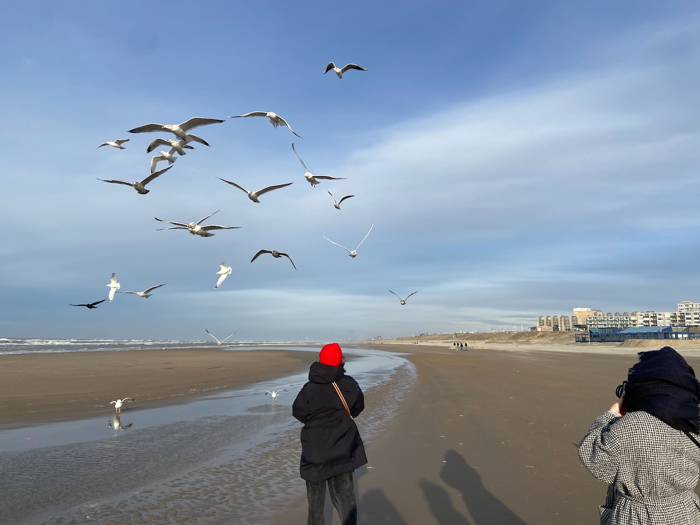
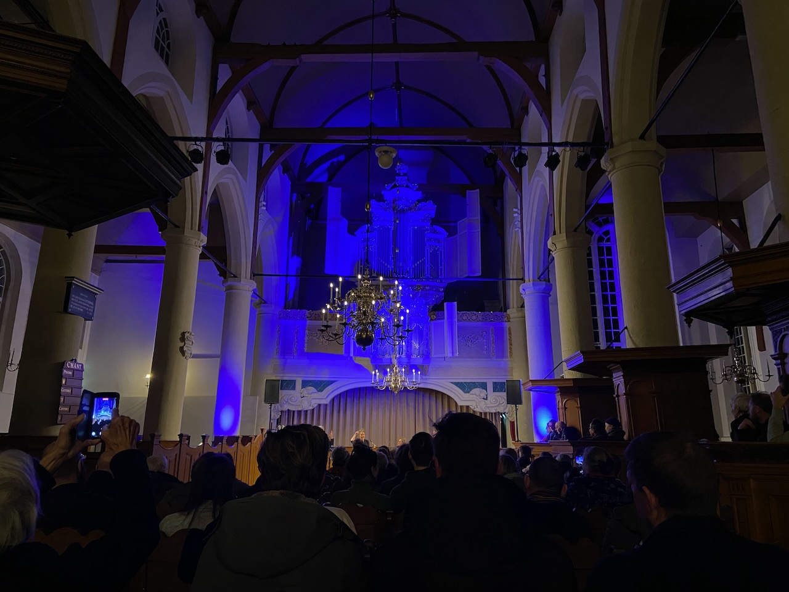
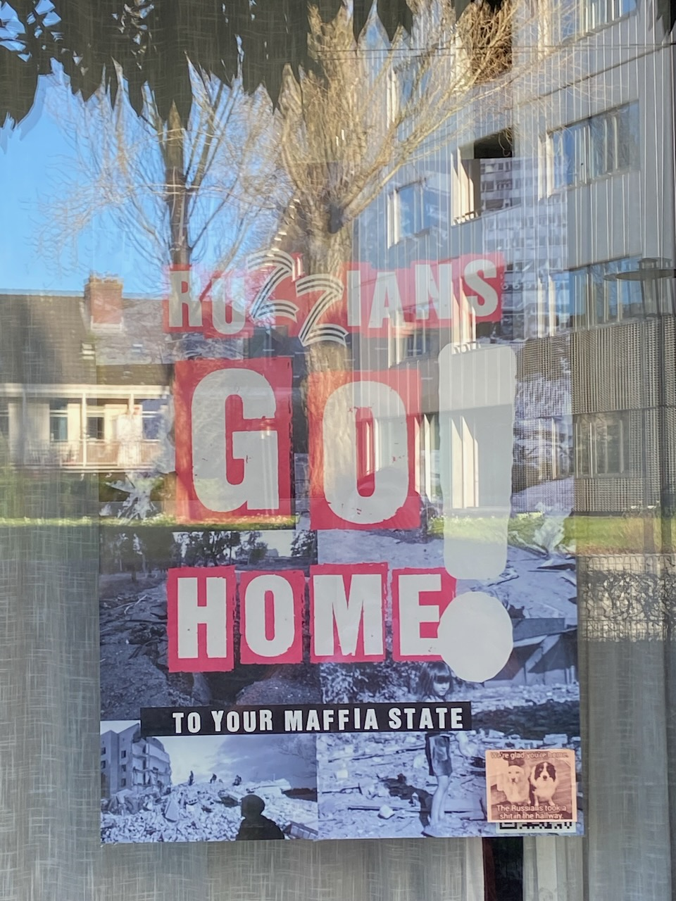

January was a very social month. In Berlin, Valera took me to a Ukrainian place with excellent borscht. Back in Amsterdam, I was happy to see former colleagues from Uber over a few beers. With Asya and friends, we went to the sea in Zandvoort to feed seagulls, wander against the sweeping wind, and then warm up with fish soup. Igor stayed with us for a couple of days – I'm still winning at Mario Kart, but it's getting harder each time. We went bouldering and the price of my irregular training schedule was a bruised rib. It was also good to see my Japanese friend Ryu, who stopped by Amsterdam on his European tour.

---

Asya took me to a [theatrical production](https://zerkalce.show) created by the *СБПЧ* band, whose concert we attended last summer. The script is based on a text by the writer and artist Pavel Pepperstein. The play itself, childlike in form and charmingly sweet, gathered a huge audience in Amstelveen, I didn't expect to see so many people there.

---

Since the beginning of January, I started looking for a job. So far, I will only note one frustrating difference from my last search before the pandemic – even with companies located in Amsterdam, all interviews are done remotely. I liked the in-person whiteboard interview process much better.

---

After being away from technical conferences for a while, it was a pleasure to visit the Dutch Functional Programming Day organized by TU Delft and experience the academic side of my trade. Despite the many dialects of the language, everyone there uses Haskell as a lingua franca. There were talks on Agda, scope graphs, Roc, and [HOAS](https://en.wikipedia.org/wiki/Higher-order_abstract_syntax).

---

Attended a jazz concert at a church. I expected more of the organ and less gospel from the music, but I was intrigued by the church building, which I had passed many times before. The Walloon church (Wallonia is southern Belgium) in Amsterdam gained popularity with the influx of French-speaking people fleeing from Belgium to the Netherlands. Van Gogh used to come to this church to hear his uncle preach.

---

The highlight of one of the evenings was a snack kit I brought from Japan for assembling "sushi" out of strange chemicals. Teamwork, incomprehensible instructions, and a curious result.

---

Almost no compiler work got done this month, although I made some progress with implementing generics. That is my last big milestone before showing the project to more people. I found articles by [Tristan Hume](https://thume.ca/2019/07/14/a-tour-of-metaprogramming-models-for-generics/) and [Varun Gandhi](https://typesanitizer.com/blog/zig-generics.html) very insightful.

---

Catching up on the recently released films, I was disappointed by the new works of my favorite directors David Fincher (*The Killer*) and Sofia Coppola (*Priscilla*), but pleasantly surprised by the little-anticipated *The Holdovers*. *Anatomy of a Fall* is formally nothing new, but it's certainly more than the sum of its parts.

---

By the age of 32, I had finally found my favorite plant-based milk. Almond, oat, or soy milk just doesn't do it for me. And at last, I discovered coconut milk, which has become a new highlight in my morning coffee.

---

An unusual poster was noticed in my neighborhood.

---

Internet links:

1. ["Better" by Merlin Mann](https://gist.github.com/merlinmann/7ddddd1ca2e0b157cae9006293c074b2)
2. [Niklaus Wirth's name anecdote – Hacker News](https://news.ycombinator.com/item?id=38858443)
3. [David Lynch Meets George Lucas - YouTube](https://www.youtube.com/watch?v=NtW_cY6Mpsg)
4. [Augmental](https://www.augmental.tech/)
5. [My 30-Year Quitting Addiction – Slate](https://slate.com/human-interest/2024/01/new-years-resolutions-intermittent-fasting-alcohol-caffeine.html)

