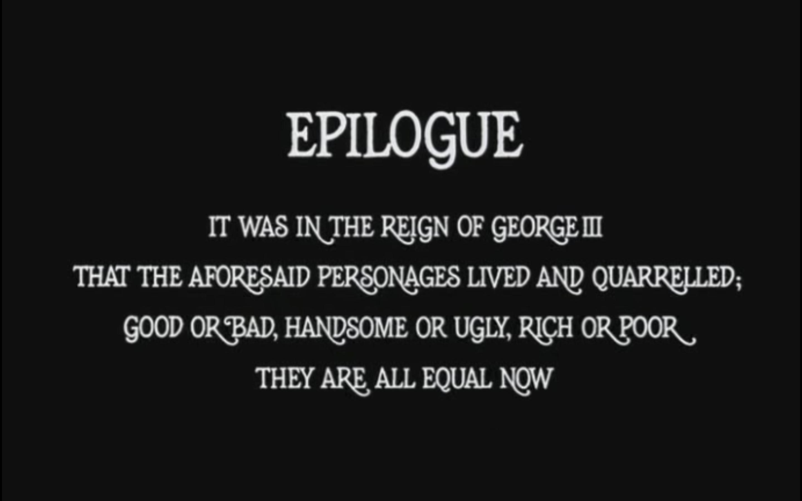

Reading a book while drinking coffee outside in a charming hidden garden was the most characterizing scene of July. That, and watching great classic cinema.

This July marks one year of writing lookbacks. I'm glad that I've picked up this habit, but occasionally I still get some internal resistance in writing those.

---

As with July last year, this month I was watching some Japanese classics. I've enjoyed Kurosawa's non-samurai movies: _High and Low_ which sets a high bar for crime movies and _Ikiru_ with the screenplay based on Tolstoy's _Death of Ivan Ilyich_.

Moving almost half a century later I've discovered the work of Takeshi Kitano: magnificent _Sonatine_ and _Hana-bi_. Both are unconventional gangster movies gorgeously scored ([1](https://www.youtube.com/watch?v=EKecG6MZEK0), [2](https://www.youtube.com/watch?v=O4Zm0EVfh8k)) by Joe Hisaishi, who is also a composer for most of Miyazaki's films.

Kubrick's exquisitely [beautiful](https://www.youtube.com/watch?v=RcLZU3_XNMo) _Barry Lyndon_ astonished me for days through the epilogue frame:

---

Had fun playing arcade games with my buddy Aziz at the [Blast Galaxy](https://blastgalaxy.nl/our-games/). The place is full of arcade machines from the 80s and 90s. Despite the variety of options, Tetris is still the most exciting game. The second best was taking turns at a cross-country truck driving game.

---

Picked up reading fiction again, first through _Homesick for Another World_ – a collection of short stories by Otessa Moshfegh, then with _Outline_ by Rachel Cusk. I've been a fan of Otessa's work, and this compilation did not disappoint. Masterful stories of dark and miserable characters that nonetheless evoke optimism and empathy. Cusk's writing is a bit more experimental, for example by avoiding direct speech for the whole book.

---

[_How to with Josh Wilson_](https://en.wikipedia.org/wiki/How_To_with_John_Wilson) and [_Nathan for You_ ](https://en.wikipedia.org/wiki/Nathan_for_You) filled the need for absurd deadpan humor in a form of reality TV. Recommended if you like _Arrested Development_.

---

Instead of finishing the goal of revamping this website, I got carried away with yet another project. This one is an experiment in sort of redoing Electron in a minimalistic way with a focus on macOS/iOS. App with the web view should not take 100 MB. Might publish it next month.

---

It is interesting to see a nascent trend in startups that challenge existing browsers. [Beam](https://beamapp.co) and [Arc](https://thebrowser.company) add a modern note-taking layer on top of classic browsing while also experimenting with the UI. And [Orion](https://browser.kagi.com) allows using Chrome and Firefox extensions on top of WebKit (the same engine that powers Safari).

---

Internet links:

- [What I Miss About Working at Stripe - Every](https://every.to/p/what-i-miss-about-working-at-stripe)
- [Rekka Bellum and Devine Lu Linvega, Hundred Rabbits - XOXO Festival (2019) - YouTube](https://www.youtube.com/watch?v=BW32yUEymvU)
- [Demis Hassabis: DeepMind - AI, Superintelligence & the Future of Humanity | Lex Fridman Podcast #299](https://www.youtube.com/watch?v=Gfr50f6ZBvo)
