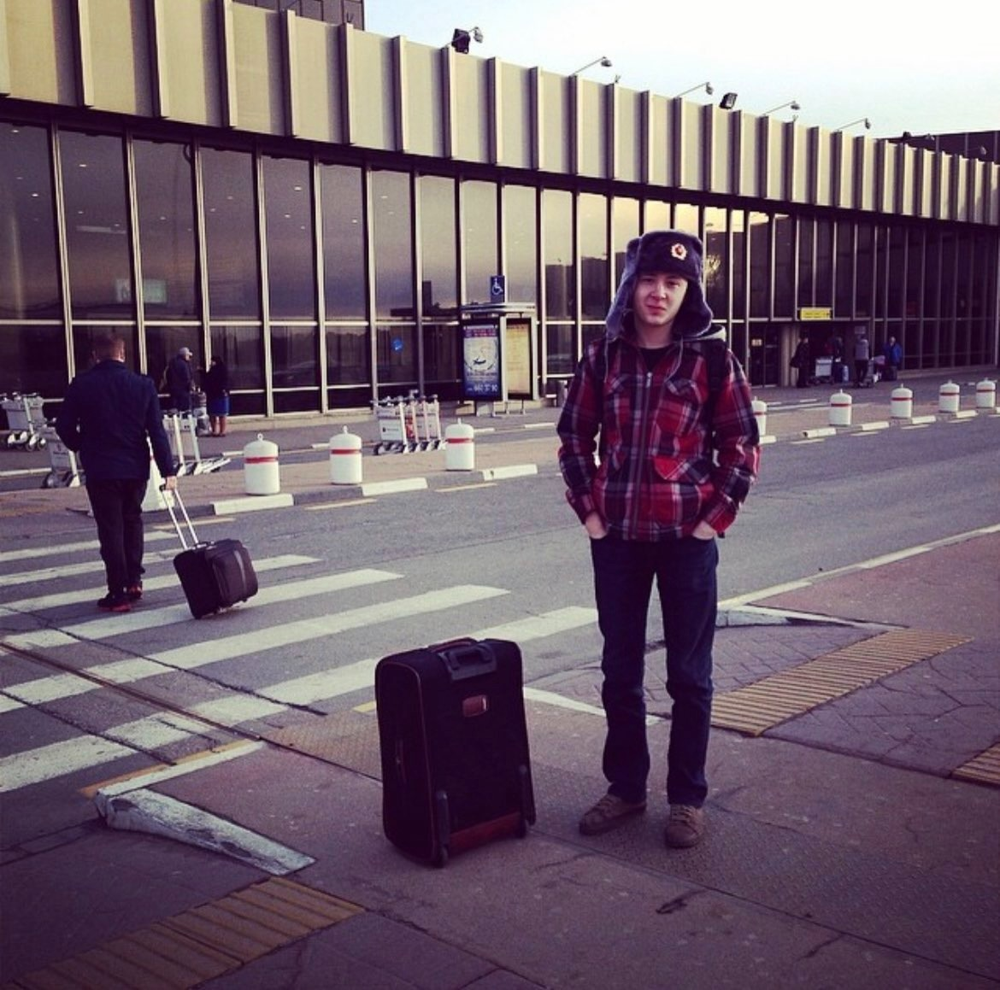
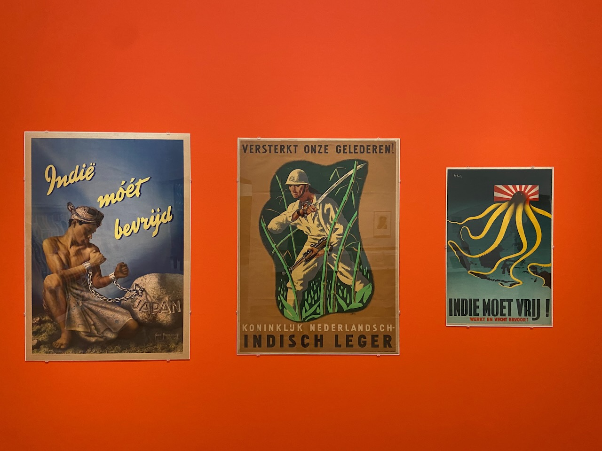
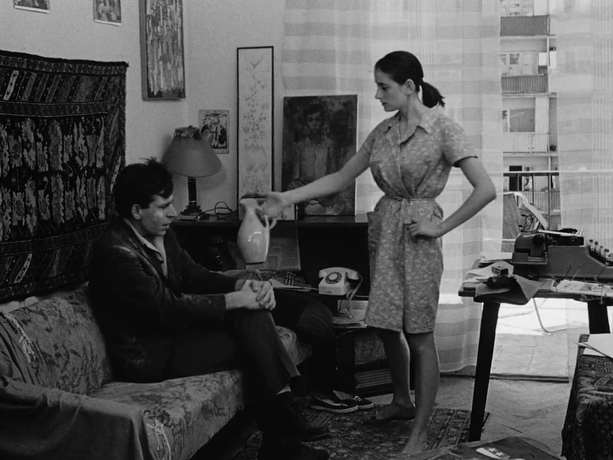

This July, my first travel-free month of the year, marks 3 years of writing these monthly lookbacks. One more way to capture fleeting time. The word _release_ means publication, but also setting free and letting go. The ritual of releasing a lookback helps me to digest, pack up, and archive the past. There are times when I have to force myself to compose this text, but after completing the work, I am satisfied with the result.

---

Another major milestone is that I received my Dutch citizenship. As the Netherlands does not allow dual citizenship, it took me a while to come to terms with giving up my Russian passport, but I made a final decision after February 2022, when Putin started his terrible war.

Nine years ago I took a flight to Amsterdam from Moscow Sheremetyevo airport in the kitsch ushanka hat. And Amsterdam has been my home for those 9 years. I met many of my good friends here, two of my big relationships happened here, with many good memories associated with them. At least twice I was quite close to moving somewhere because of a job offer, but both times I didn't because I like Amsterdam way too much.

I have plenty of disdain for the present Russian government and plenty of love for Russian culture. I don't want to put too much meaning into the pragmatic, but also undoubtedly symbolic gesture of renouncing my birthright citizenship.

---

I've noticed that all the "future" lists I keep have started to make me anxious. Things to do, movies to watch, books to read, places to explore, etc. So I did a big reset of all such lists, deleting everything. The important things will pop up in my thoughts now and again, the rest can quietly disappear. Feels good, can recommend it.

---

The Amsterdam exploration game I started more than a year ago is now in a more or less presentable state.

---

Visited a nice exhibition at Stedelijk about different movements in art that made up the Modern genre from Art Nouveau to Constructivism.

A curious artifact of the Dutch colonial past in the form of three posters made around the Second World War. The former long friendship between the two countries (Dutch gifted Japan its first steamship, [Kankō Maru](https://en.wikipedia.org/wiki/Japanese_barque_Kankō_Maru)) was tarnished by Japan's seizure of the Dutch colonial possessions in Indonesia.

---

There were a lot of standout movies this month. In Kiarostami's [_Close-up_](<https://en.wikipedia.org/wiki/Close-Up_(1990_film)>) the reality offers a plot stranger than any fiction. In Herzog's [_Fitzcarraldo_](https://en.wikipedia.org/wiki/Fitzcarraldo) reality is embedded in fiction as the major character.

And a new personal favorite, the Soviet-Georgian movie [_Once Upon a Time There Was a Singing Blackbird_](https://en.wikipedia.org/wiki/Once_Upon_a_Time_There_Was_a_Singing_Blackbird) (_Жил певчий дрозд_). A brilliant movie about time, attention, and freedom. Director Otar Iosseliani, tired of questions about the interpretation of the movie, responded at one press conference with "This is a movie about how one should live", and at the following one with "This is a movie about how one should not live".

---

With my compiler studies, this month I've focused on catching up with C++. Such an enormous and often contradicting language that keeps alive through many generations. Diving deeper allows you to appreciate various aspects of language design, for example when you see the standard library from the perspective of exception safety. It helped me to improve my understanding of topics like resource ownership, virtual table polymorphism, and iterators.

---

Telik is now published in the [Mac App Store](https://apps.apple.com/nl/app/telik/id6453161265?l=en-GB&mt=12) for small. And it even made a few sales. Of course still available for free [from GitHub](https://github.com/agentcooper/telik).

---

I rarely watch TV series, typically only when I'm lying in bed sick. During this flu, my choice was the second season of Fargo. It is done well but feels somewhat repetitive after Twin Peaks, True Detective, and Mindhunter. Oversaturation with detective fiction is a real thing, be cautious.

---

A critical mass of mentions of what seems to be the most popular book from modern China, the [_Three-Body Problem_](<https://en.wikipedia.org/wiki/The_Three-Body_Problem_(novel)>), accumulated around me, and we started a book club. For some unknown reason, I was sure that the author's screenplay was the basis for the movie Arrival, but it turned out that I had the wrong author. In the _Three-Body Problem_, I was struck by trite text and ridiculous dialogues. Of course, a remark needs to be made that I rarely read science fiction and don't know if it's a problem with the whole genre that the text exists just for the sake of moving the plot along.

---

A much more enjoyable read of the month was [_Independent People_](https://en.wikipedia.org/wiki/Independent_People) by Halldór Laxness, which I started at the start of the Iceland trip. Great Icelandic epic dealing with the dark side of the notion of freedom. Sheep farmer Bjartur, who fights capitalism by sacrificing his children, reminded me of Daniel Plainview, the protagonist of _There Will Be Blood_ by Paul Thomas Anderson. For Bjartur, sheep come first, and family second. Instead of sheep, Daniel has his oil. Tough characters Bjartur and Daniel are opposites in their economic views, but end up on their own, hurting everyone around them.

---

Internet links:

- [I’m a Luddite (and So Can You!) | The Nib](https://thenib.com/im-a-luddite/)
- [AI tools are designing entirely new proteins that could transform medicine](https://www.nature.com/articles/d41586-023-02227-y)
- [OOPSLA Conference: Growing a Language](https://youtube.com/watch?v=lw6TaiXzHAE)
