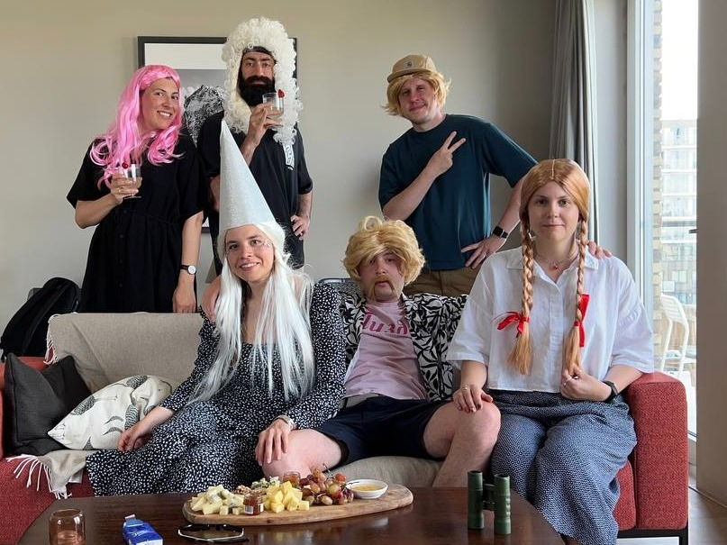

Buying tickets 8 months ago paid off, and seeing Red Hot Chili Peppers live was outstanding. It was an open-air event in Goffertpark, Nijmegen, and the first time in years since I saw such a big crowd in one place. The band played all the hits, although I was really hoping for _Under the Bridge_ which they [once performed on a boat ride through Amsterdam canals](https://www.youtube.com/watch?v=-Dv75ZEggQg). It was fascinating to see how their music attracted fans of all ages, from young children to old grandmas. Album _By the Way_ was the first CD I've ever bought! At the end of the day, we barely made it back to Amsterdam, jumping into the last available train car, exhausted and happy.

---

[Comparing an app to a home-cooked meal](https://www.robinsloan.com/notes/home-cooked-app/) resonates well with me. This month I did more work on [Telik](https://github.com/agentcooper/Telik) and published a prototype for a Telegram channel viewing app called [Aqueduct](https://github.com/agentcooper/Aqueduct). I would like to see a world where people build more software just for personal use, where it is easy to remix other apps. It brings me lots of joy when other people find these small apps useful. Next month I'll try to explore some potentially novel ideas I have around Telik and Aqueduct.

---

Met some cool folks: [Kir](https://kirshatrov.com/) who shared about his sabbatical experience and passion for woodworking, and [Nikita](https://nikiv.dev/) who is really into knowledge sharing. Good friends Kolya and Yasya visited us from Berlin.

---

Visited the Foam photography museum, a graduation show of Sandberg Institute in an underground parking lot, and a new place for the Amsterdam Museum, which now occupies a place previously taken by the Hermitage Amsterdam.

For a movie recommendation: do yourself a favor, skip the trailers and go see [Everything Everywhere All at Once](https://letterboxd.com/film/everything-everywhere-all-at-once/).

My music of the month is [Sharon van Etten](https://music.apple.com/nl/album/weve-been-going-about-this-all-wrong/1609475644?l=en).

---

Found a good rhythm with the morning routine of doing a short run to the nearest outdoor workout spot and doing some pull-ups there. Did this 10 times (out of a planned 16) and improved from 4 to 8 pull-ups at a time. Leaving the apartment without any devices (phone or watch) and not even tracking it after feels liberating. My end goal is to figure out a routine where I can do some physical activity every day.

Last month I configured my Wi-Fi router to turn off automatically at 00:00, and it was a significant improvement for my sleep schedule.

---

Attended a wig party, no further comments on this one.

---

Internet links:

- [Becoming a magician – Autotranslucence](https://autotranslucence.wordpress.com/2018/03/30/becoming-a-magician/)
- [Quit Your Job](https://palladiummag.com/2022/01/06/quit-your-job/)
- [Tools & Craft Podcast: Andy Matuschak - YouTube](https://www.youtube.com/watch?v=bcrcaTuvpBk)
- [Tony Fadell: iPhone, iPod, Nest, Steve Jobs, Design, and Engineering | Lex Fridman Podcast #294 - YouTube](https://www.youtube.com/watch?v=4oDZyOf6CW4)
- [Jonathan Haidt: The Case Against Social Media | Lex Fridman Podcast #291 - YouTube](https://www.youtube.com/watch?v=f0un-l1L8Zw&t=3s)
- [Writer Vladimir Sorokin: ‘I underestimated the power of Putin’s madness’ | Financial Times](https://archive.ph/SVsAc)
