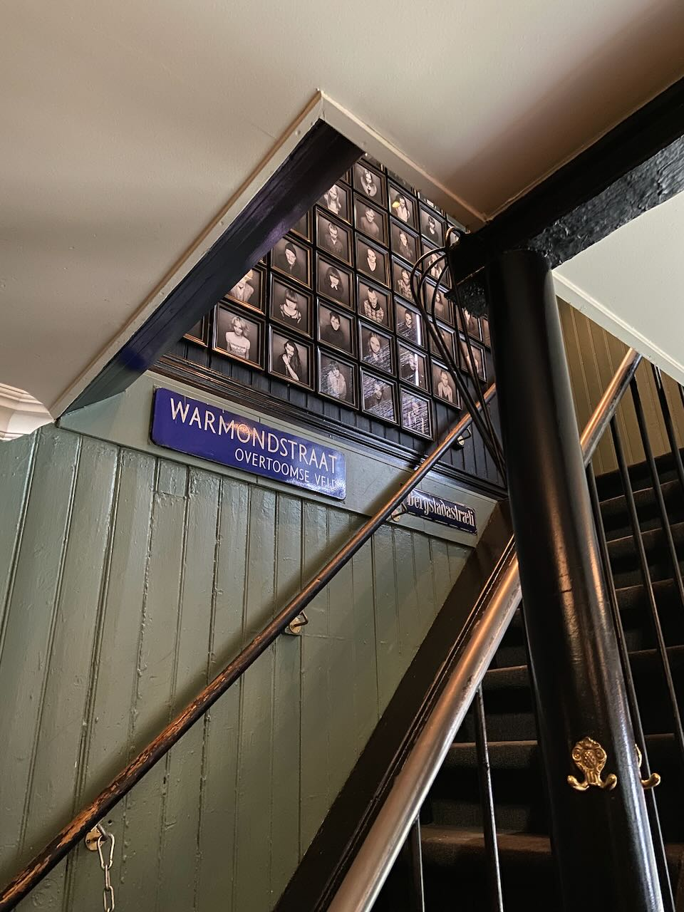
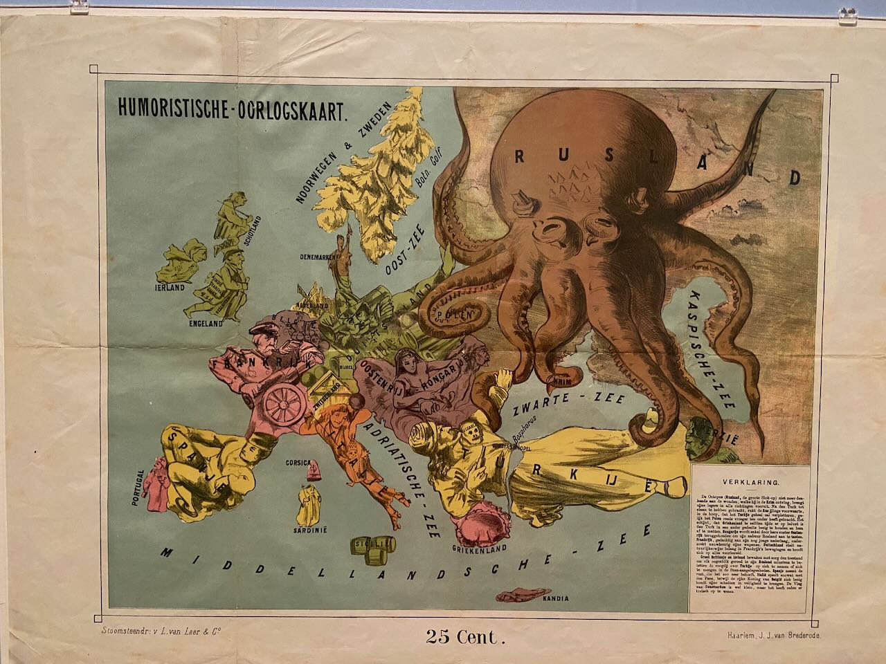
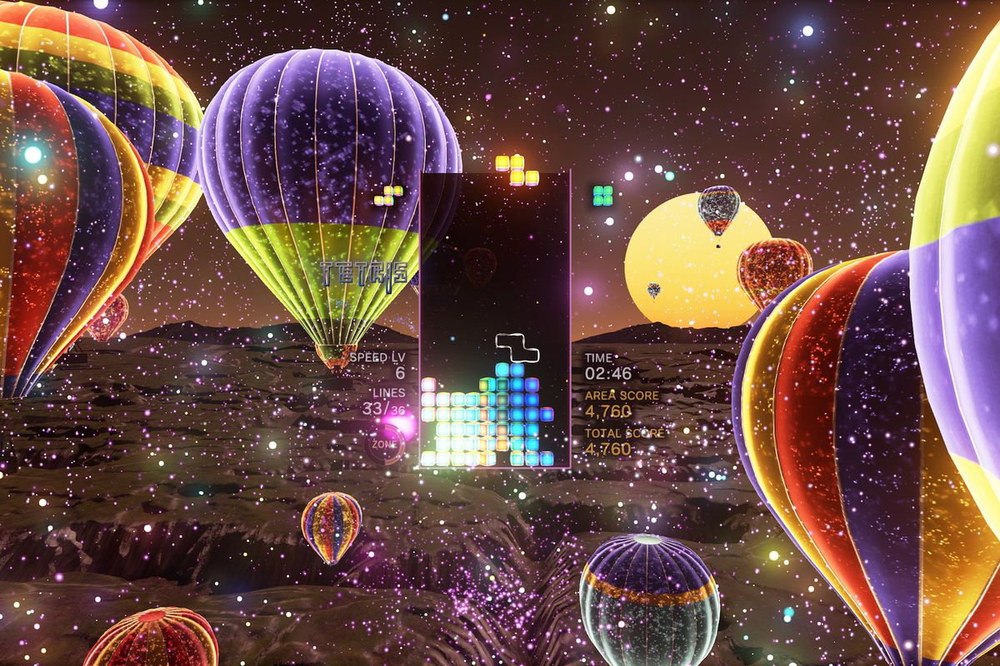

There are few places you can fly to from Amsterdam and get worse weather. One of those places is Iceland. We had 2 cars, 12 days, a 2500-kilometer drive around the island, a shared playlist of about 200 songs, and a countless number of green apples most of which were fed to the horses. At first, the scenery seems like an intriguingly gloomy version of Switzerland in summer, but pretty quickly turns into an alien wasteland unlike anything else. Waterfalls, geysers, volcanic rocks, black sand beaches, deceptively close mountains blunted from above by glaciers, the softest moss. While the rest of the world was going through the Cold War (Gorbachev and Reagan negotiated in 1986 in Reykjavik), Iceland fought a [Cod War](https://en.wikipedia.org/wiki/Cod_Wars) with Britain. The country without vegetables and trees, which was effectively a colony of Denmark until the 20th century, made an economic breakthrough after World War II thanks to tourism and cheap energy provided by geothermal springs.

I am very fortunate to have friends who planned the trip and provided wonderful company. Continuing the tradition I started last month, I made a short film about the trip:



---

Damon Albarn (of Blur and Gorillaz fame), one of my favorite musicians, dedicated his latest solo album to Iceland. It also turned out that several Blur albums were recorded there as well. Given that I already had tickets to their concert on June 27 in Amsterdam, I couldn't miss the Kaffibarinn bar in Reykjavik that Damon owned for a while. The bar, by a strange coincidence, has a street sign from Amsterdam, where many years ago the owners bought furniture for the bar.

The concert was great, I got splashed with beer a few times and spent the next day being deaf in one ear.

<video width="640" controls>
<source src="parklife.mov" type="video/mp4">
[Your browser does not support the video tag.]
</video>

---

Found a great secret café inside the Allard Pierson Museum, where I went to an exhibition about maps. In the colonial past the Dutch tobacco companies divided overseas territories among themselves and made maps about it. Great section about humorous maps during the war years. Also interesting to see the changes to central Amsterdam related to the burying of the Rokin.

---

While everyone is playing the new Zelda and Diablo, I'm catching up on Tetris Effect. The synchronization of music, background effects, and button presses add up to a very meditative process. Highly recommended.

---

A little silly story. Before the trip, I decided to find out if there was anything related to Iceland in Amsterdam. Turned out that there was an Icelandic culture festival going on precisely on those few days. Upon arriving at the address, I was told that in a couple of minutes, there would be a small performance. Before the performance, there was a short talk about the upcoming act, told in English as expected. And imagine my surprise when I realized that I was sitting in the most awkward place to get out and the play started in Dutch. As a result, I listened to 40 minutes of the show in Dutch with maximum concentration. Almost no regrets, as I understood more than I expected.

---

Internet links:

- [Chris Lattner: Future of Programming and AI | Lex Fridman Podcast #381 - YouTube](https://www.youtube.com/watch?v=pdJQ8iVTwj8)
- [Damon Albarn: Studio Tour, 'Cracker Island' & Coachella | Apple Music - YouTube](https://www.youtube.com/watch?v=EDX6l9_58RA)
- [«Никакого выхода, кроме сочувствия». Андрей Звягинцев и Антон Долин обсуждают фильм «Нелюбовь» - YouTube](https://www.youtube.com/watch?v=zASLA7ka8eE)
