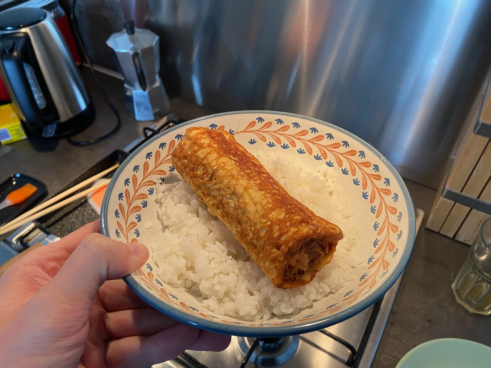

Investing in a good frying pan and kitchen knife has paid off and made cooking even more enjoyable. No steaks yet, as June was a pescatarian month. I also now possess a pan for [tamagoyaki](https://en.wikipedia.org/wiki/Tamagoyaki) and after many attempts, I'm beginning to grasp how to properly roll it up.

---

Certain albums have been with me longer than I can recall myself. Albums that shaped the way I feel the world around me. [Moon Safari](https://en.wikipedia.org/wiki/Moon_Safari) by Air is one of those. Therefore, it was absolutely incredible to hear and see the band playing this album live in Paris. The minimalistic stage reminiscent of the Solaris scene was illuminated by cosmic visualizations. It was a bit of a shame they didn't have Beth Hirsch with them for the two tracks with her lovely vocals. The two encores featured the tracks from other albums.

<video width="640" controls>
  <source src="air-paris.mov" type="video/mp4" />
 [Your browser does not support the video tag.]
</video>

---

Sometimes all you need for motivation is a question. In May I couldn't explain to Igor why I stopped running. Still failing to find a good reason, in June I managed to get back to a consistent three runs per week and as a result, I haven't felt this good in a long time. An ice-cold shower after a run on a hot day is a cornerstone of a month.

---

I didn't think I'd be so excited to be able to go to the office again and have in-person chats and walks with a colleague (only one so far). It was May 2020 when I last did this.

---

My inexplicable attraction to games involving crows that started with [A Short Hike](https://en.wikipedia.org/wiki/A_Short_Hike) and [What the Crow?!](https://play.date/games/what-the-crow/) now continues with [Crow Country](https://crowcountrygame.com/). Charming indie tribute to first-generation PlayStation classics like Silent Hill and Resident Evil that can be finished in a few evenings.

---

I'm the last among my friends to own a mechanical keyboard. Now with the [8BitDo Retro Keyboard](https://www.8bitdo.com/retro-mechanical-keyboard/), my typing is accompanied by an orchestra. One of the evenings when Nick came over we tried to play Crow Country together using this keyboard, like in the old days. Fun experience, but because of tank controls it turned out to be horribly inconvenient. After Nick showed me how easy it is to use a gamepad with Windows, I haven't used the keyboard since.

---

Internet links:

- [Air - All I Need](https://www.youtube.com/watch?v=kxWFyvTg6mc) directed by Mike Mills
- [The Real Reason Why Music Is Getting Worse](https://www.youtube.com/watch?v=1bZ0OSEViyo)
