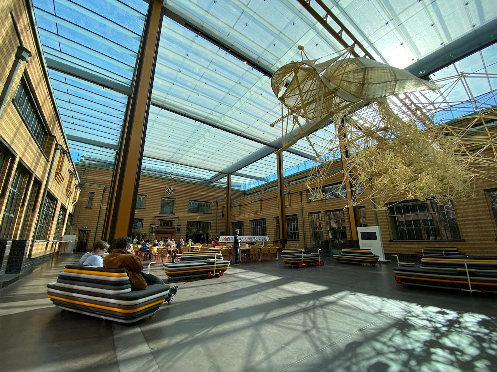

Sunny days in Amsterdam teach you to appreciate good weather. I find it beautiful how simple the action is: get some french fries and just sit in the sun during the day. Can't be sad in the sun.

Friends made amazing BBQ hamburgers while we've discussed all possible ways to convert money into crypto.

---

I'm keeping a separate [diary](/notes/biohack-academy/) on my experience at BioHack Academy. It is a 10-week program where people can learn the basics of biology: PCR, gel electrophoresis, gene editing, and other cool stuff.

---

The last time I've been to a concert was in 2019 by Ty Segall. Now we went to Nilufer Yanya at Tolhuistuin. Being packed with lots of strangers feels weird at first, but the enjoyment of live music quickly resolved that. When leaving the building, I felt united with people as we all listened to some great music today.

<video width="600" controls>
 <source src="./nilufer-yanya-at-tolhuistuin.mov" type="video/mp4">
 [Your browser does not support the video tag.]
</video>

---

To gain some mental resiliency during these dark days, I skimmed through Can't Hurt Me by David Goggins. The author is a former Navy Seal and an ultramarathon runner. It is a powerful story that invites the reeder to do some thoughtful homework to truly benefit from the book.

---

The only superhero I can tolerate is Spider-Man, so I had to watch the recent movie, Spider-Man: No Way Home. It was okay but did often remind me of the recent Matrix. Both use self-reference as a major plot device.

---

With my guitar teacher we've looked at 2 songs of my choice: Ukrainian [Океан Ельзи - Квітка](https://www.youtube.com/watch?v=v8fGSmP3D38) and Russian [Мумий Тролль – Дельфины](https://www.youtube.com/watch?v=V7iCZQgK0SQ).

---

Asya took me to Bill Brandt's photo exhibition at the Foam museum. There were black and white portraits, landscapes, and war photos. Even after living in London for a long, he was ashamed of his German roots during World War II.

I also went to Alphonse Mucha exbition at my favourite building in Kunstmuseum Den Haag. After his art nouveau style declined after World War I, the hippies in the 60s rediscovered it and bands like Led Zeppelin and Grateful Dead did their posters and album art under influence.

Museum building has a beautiful open space in the middle.

---

Internet links:
- [No News Is Good News - by Thomas J Bevan - The Commonplace](https://thomasjbevan.substack.com/p/all-news-is-bad-news)