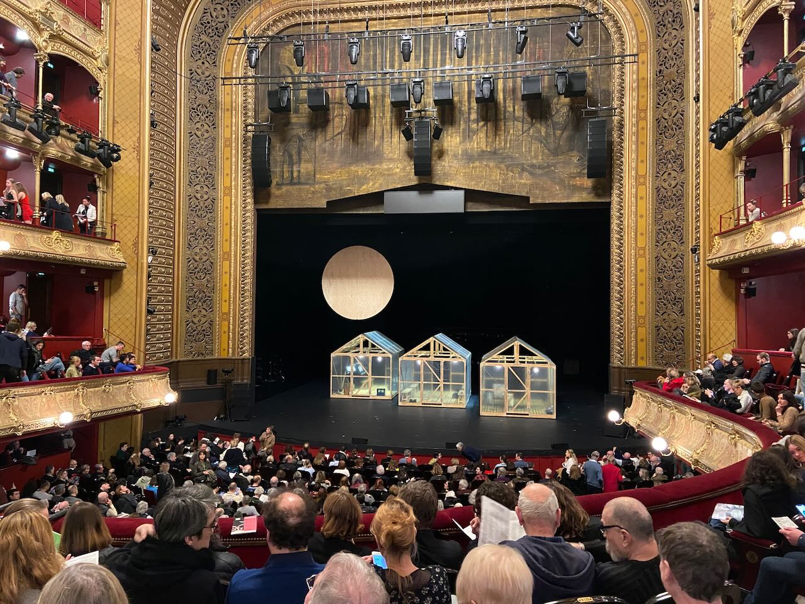
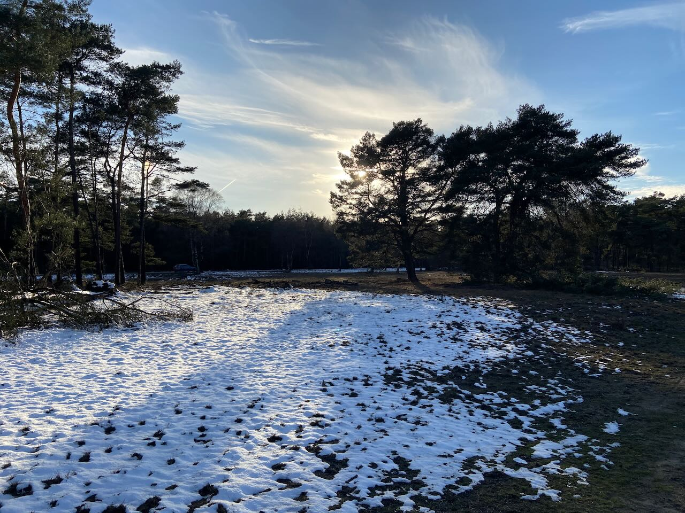
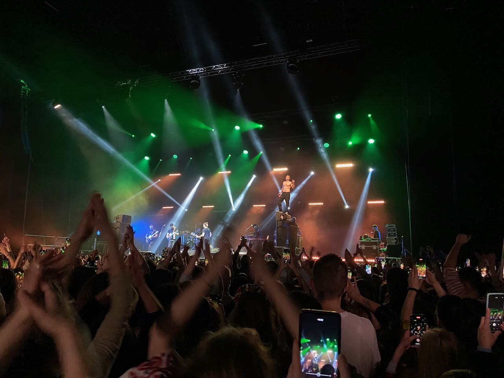
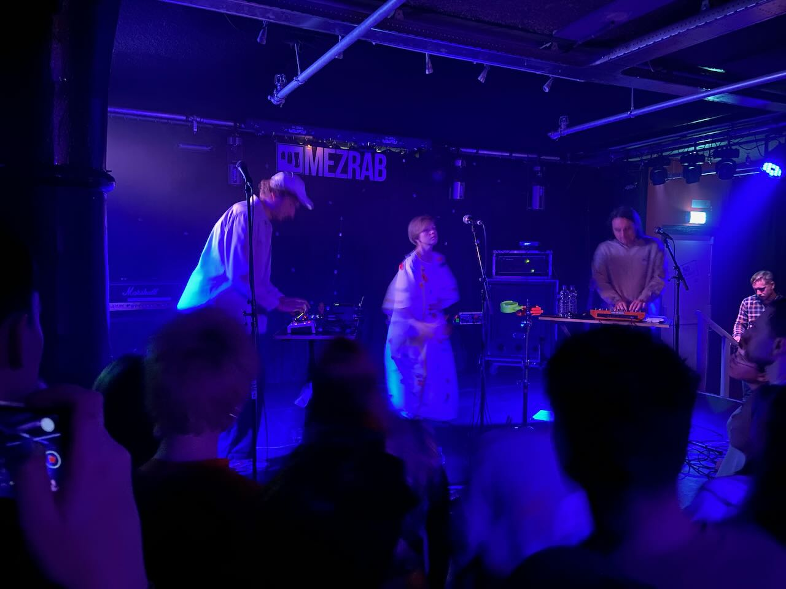
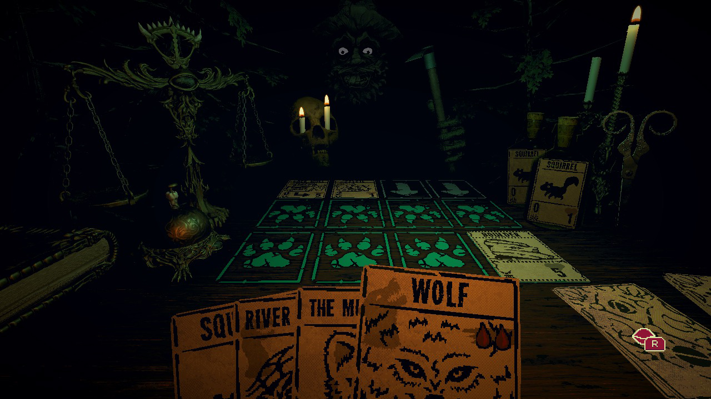

Three hours on the train fly by in the blink of an eye, and we're in Paris. Most central Parisian streets are filled with piles of garbage bags because of the ongoing strike. Behind our window is the Castle of Vincennes, where in the early 20th century the French executed Mata Hari, the famous spy of Dutch origin. Industrial scaffolding gives Notre Dame cathedral a sort of steampunk look. Parisians don't miss a chance to mock you for not knowing French. There is a long line at the entrance to the _Shakespeare and Company_ bookstore, which I try to visit whenever I'm in town. We nearly accidentally met up with our friends Tyoma and Adele and had a wonderful walk around the city.

---

In Paris, we went to Kirill Serebrennikov's play _The Black Monk_ based on Chekhov's short story. The plot revolves around a burned-out man of science going to the village where he grew up. As he marries the daughter of his older friend, he slowly descends into madness as he tries to figure out if he is genius or mediocre. Having read the original play, every time I suspected the play deviated too much from the text, I was surprised at how Serebrennikov brought it back. The actors constantly alternated four languages (German, English, Russian, and French) to convey the polyphony of voices inside the protagonist's head.

---

To achieve better focus, multiple times this month I went to the public library for studying. There is something magical about many people studying in the same place. I didn't have the opportunity to experience campus life or live in a college dorm, but I imagine those have similar vibes.

---

Had a fun car trip to the Kröller-Müller museum. It is one of the best-kept secrets of the Netherlands, located inside a national park. Helene Kröller-Müller was one of the first art collectors who recognized the genius of Van Gogh, so the museum has the second largest display of his works after the museum in Amsterdam. The building is beautiful in its own right, with massive glass walls that allow you to see the surrounding forest. On the way back, we were lucky enough to catch unmelted snow illuminated by the glorious sun.

Van Gogh collection is split between his Netherlands and French years and shows the startling difference between the two. Dutch paintings are haunting and dark, French period is joyful and vivid. A great influence on Van Gogh's success was his brother Theo's wife, Johanna. Theo died shortly after his brother and was left alone, Johanna sorted through their correspondence and asked art critics to embrace Vincent's work.

---

Went to two fantastic concerts. First was Okean Elzy. Last year, Sviatoslav Vakarchuk, the band leader, was a part of the territorial defense forces of Ukraine and sang for people inside bomb shelters and hospitals. At the concert, they radiated tremendous energy. In the end, Sviatoslav mentioned that he had a chance to visit the ongoing Vermeer exhibition and found that the famous ["milkmaid" painting](<https://en.wikipedia.org/wiki/The_Milkmaid_(Vermeer)>) clearly shows the colors of the Ukrainian flag.

The second concert was Samoe Bolshoe Prostoe Chislo, a Russian indie-pop band. It was their first time playing in Amsterdam. The band charged the whole club with good vibes and repeatedly expressed their anti-war stance.

In case you don't know these bands, the following tracks might be a good intro: [_Квiтка_](https://www.youtube.com/watch?v=v8fGSmP3D38) and [_Ничего больше нет_](https://www.youtube.com/watch?v=ZR8ivAJSV_g).

---

News headlines from Russia surpass all postmodern plotlines. Medvedev [read](https://en.thebell.io/former-president-medvedev-once-a-critic-of-stalin-now-uses-his-speeches-to-motivate-factory-directors/) Stalin's telegram to the factory directors to lift their spirits. The heartbreaking [story](https://www.bbc.com/news/world-europe-65129231) of a father's arrest over his daughter's anti-war picture.

---

Made some more progress on my compiler by changing the code generator output from MIPS to ARM64, so now I can run it natively on my macOS. I also wrote up [some notes](https://compiled.bearblog.dev/stanford-cs143-intro-to-compilers-course-notes/) after finishing CS143 course (I'll eventually move posts from that blog to this domain).

---

I watched the great new American classic _There Will Be Blood_ by one of my favorite directors Paul Thomas Anderson for the second time. Astoundingly good movie and terrific acting by Daniel Day-Lewis. I jokingly wonder if PTA had seen [_Siberiade_](https://en.wikipedia.org/wiki/Siberiade) by Konchalovsky as it also has oil drilling as a major subject.

---

Having finished reading _Anna Karenina_, I must say that I am more in the Tolstoy camp rather than in the Dostoevsky camp. More than a century later, it was easy for me to see features of myself and the people I knew in Tolstoy's characters.

---

So far I've stayed away from deck-building games, but I really enjoyed _Inscryption_. It has a charming dark folk fairytale setting, weird humor, and some meta-narrative layers.

---

I felt the complexity of democracy after participating in the [water authority elections](https://www.government.nl/topics/elections/voting-in-water-authority-elections) (_waterschapsverkiezingen_). Deciding on the right water level (one is good for biodiversity, the other helps agriculture) or what to do about muskrats that damage infrastructure is difficult because the consequences of each decision are unclear.

---

Rijksmuseum has a nice guided tour option. Our guide asked us not to read any signs in the medieval history hall, as most people could not read in those days. From the Dutch still life painting we've learned that _"**peper**duur"_ (which means "extremely expensive") stems from its origin in times when pepper and salt were hard to come by. The English language has "salty prices".

---

Internet links:

- [ELI5: How is GPS free? : explainlikeimfive](https://old.reddit.com/r/explainlikeimfive/comments/118aak0/eli5_how_is_gps_free/)
