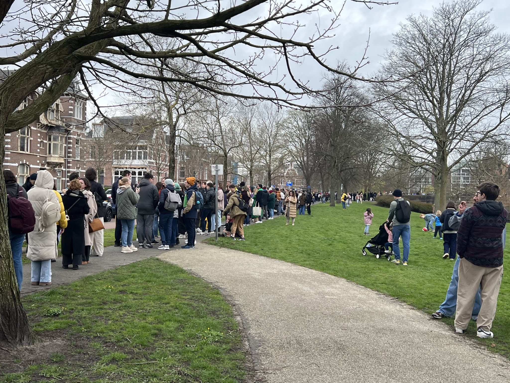
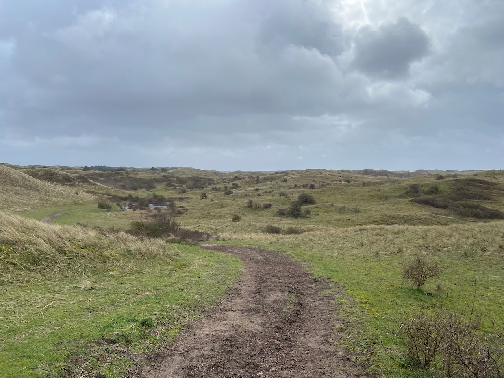
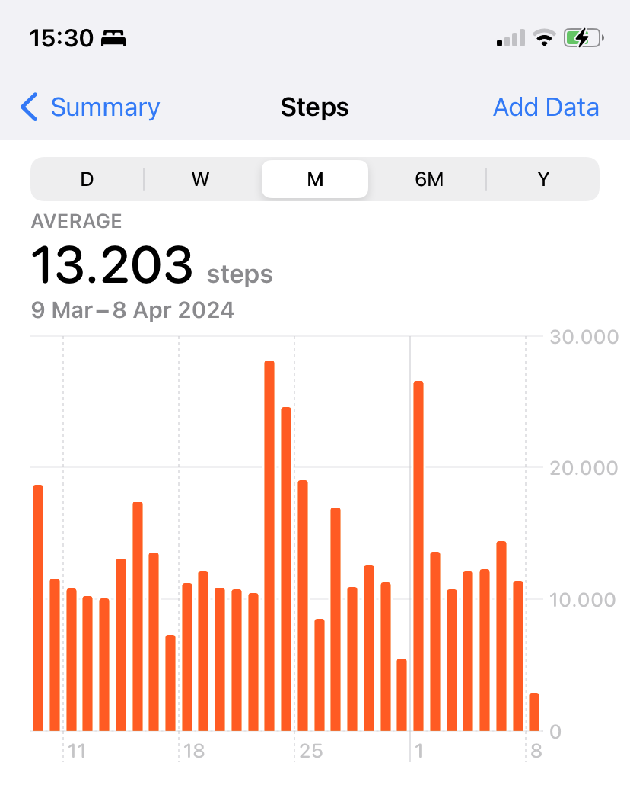

Saw living legends, Thom Yorke and Jonny Greenwood at The Smile concert in Brussels. The giant Greenwood impressed by his virtuoso switching between bass guitar, piano, harp, and bow playing on the guitar. I still didn't finish listening to their second album, but I was still delighted by the amazing sound. Now I would like to see Radiohead live at least once. Rainy Brussels didn't give me any positive impressions as a city.

<video width="640" controls>
  <source src="the-smile.mov" type="video/mp4" />
</video>

---

March 17 was exactly 10 years since I moved to the Netherlands. I symbolically spent the entire day in a queue to vote at the Russian embassy in The Hague. Despite the meaninglessness of the action, Russian people came to protest against dictator Putin and his war. After standing in line since the morning, we managed to vote just 10 minutes before closing time and went to eat pancakes at a friend's place, then left back to Amsterdam on the last train.

---

I've made both agonizing and gratifying choice for my next job, will give more details next month. It also seems important to write down a manifesto of principles and rules that I would like to follow when I start a new job.

---

An important metric of joie de vivre is the number of hours spent in the nature. One of the walks was in a nature reserve near Hertogenbosch. I climbed a tree and bungee jumped over a river.

For Serezha's birthday, we went hiking in the dunes, about 15 kilometers from Egmond aan Zee to Castricum.

After being sick all through February, my phone shamed me with a notification about the walking activity dropping to zero. So in March, I decided to make up for it by aiming to walk 10,000 steps every day.

---

I made [another prototype](https://agentcooper.github.io/hypothesis-bookmarklet/) about annotating articles on the web. I use Hypothesis to save interesting parts from the articles I read, but in contrast to desktop browsers, there is no extension for mobile Safari. So I made a bookmarklet that includes the Hypothesis API key and allows you to save highlights in one click.

---

Internet links:

- [United States v. Apple – Stratechery by Ben Thompson](https://stratechery.com/2024/united-states-v-apple/)
- [The Zone of Interest VFX Breakdown Showreel | One of Us - YouTube](https://www.youtube.com/watch?v=twTO_kfIwyo)
- [Take Ownership of Your Future Self](https://hbr.org/2020/08/take-ownership-of-your-future-self)
