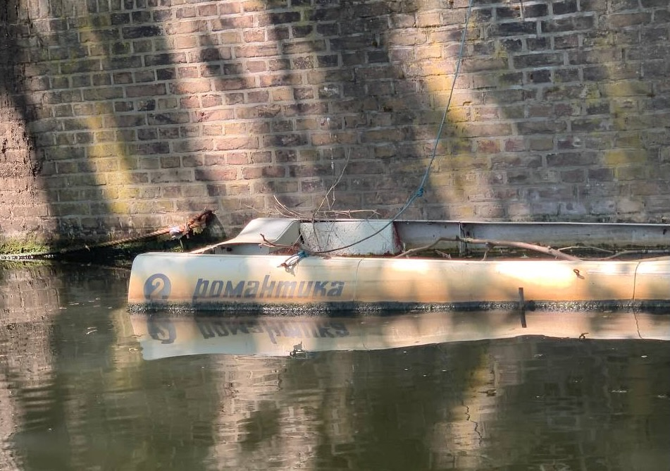
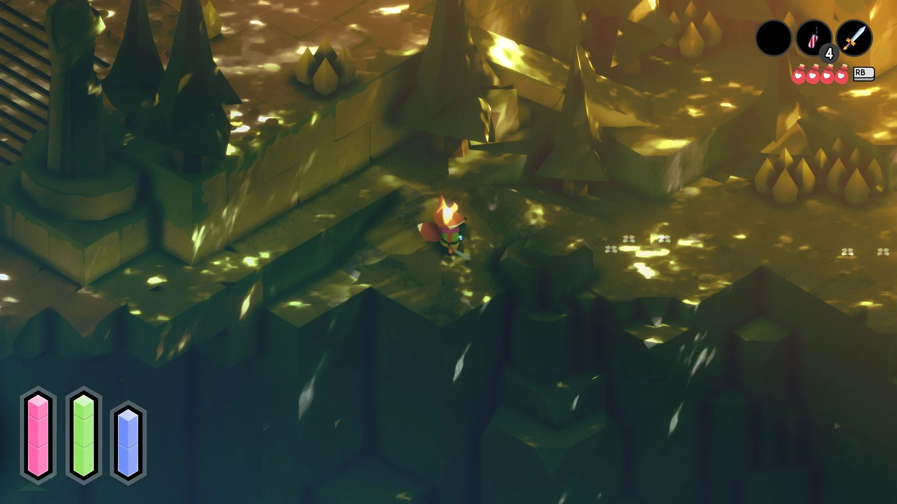
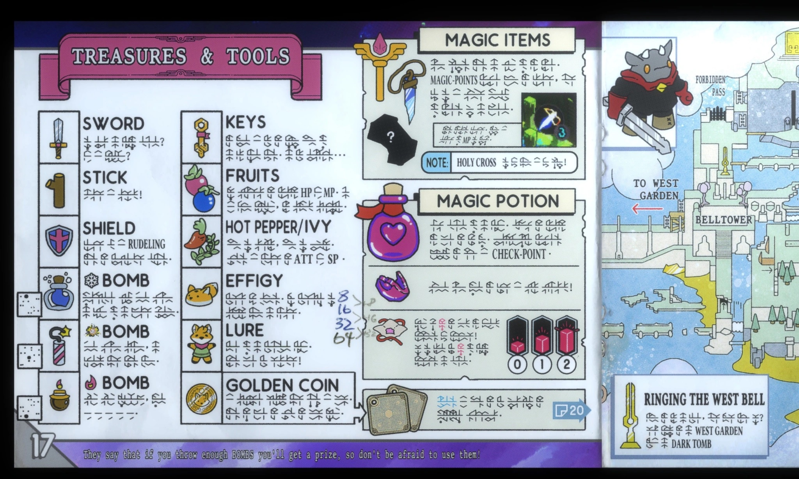

[~~Deer~~](deer-friends.jpg)Dear friends came to the city, and we did a 4-hour boat trip around the canals. I got an unbelievable achievement of catching a sunburn in Amsterdam, but it was worth it.

Exploring the city by boat adds a new layer of intimacy to it (achieve another one by doing early morning runs). Familiar buildings look quite different from a boat level.

There was a lovely sadness in this half-sunk boat with the title "Романтика" (means "romance" in Russian).

---

Living with close friends in the same city and even area is underrated. Judaism followers solved it: as they can't use any technology on a Saturday, and they need to go to the synagogue, they just have to live close to it.

---

Took a train to Berlin to see some good friends over a weekend. We drank beer in a Bavarian pub on Alexanderplatz and had a cozy khachapuri dinner at the big round table in Georgian restaurant [Tsomi](https://goo.gl/maps/vKtwMQsPdTgzT4Qq8). It was unsurprising to hear Russian-speaking people in Berlin before, now it feels like being in Moscow.

Not my first time at the Spectrum science museum, and it was always enjoyable to see [Wilson cloud chamber](https://en.wikipedia.org/wiki/Cloud_chamber) and [Foucault pendulum](https://en.wikipedia.org/wiki/Foucault_pendulum). The first one allows us to see ions flying through the universe, and the second one proves that the Earth is rotating.

Sleeping in a park on a warm summer day is an underrated activity. Having someone to watch you helps of course.

---

One morning when I was 11, my dad returned from his US trip and brought me a present. A colorful yellow device with the game about a boy and a tiny rabbit-like being following him. I had already begun studying English at that time, but most words were still new to me. It was thrilling to decipher those new words and learn their meaning from the context. The game was [Pokemon Yellow](https://en.wikipedia.org/wiki/Pokémon_Yellow).

The same feeling I got from the game I've picked up this month – [Tunic](https://en.wikipedia.org/wiki/Tunic_(video_game)). It is a Zelda-like adventure game about a tiny fox in a big, mysterious world. But the most interesting part is that the in-game manual that you need to solve many puzzles – is written in a fantasy language that you don't understand. The same goes for most of the in-game dialogue.

Most of the game is done by just one person. This inspires me a lot.

---

Went to see the Babi Yar documentary by Sergey Loznitsa at Eye Filmmuseum. Through the archive film footage, it tells the story of [Babi Yar](https://en.wikipedia.org/wiki/Babi_Yar) – the mass shooting of Jews in Ukraine, mostly done by German soldiers. It is a hard fact to face, that back then and still today, people are capable of such cruelty.

---

I've stopped persuading myself to read the book first and finally saw Dune. The cinematography is stunning, but I didn't find an emotional connection to the characters. Also, a missed opportunity to mention that Baron's name is [Vladimir](https://en.wikipedia.org/wiki/Vladimir_Harkonnen).

The fantasy movie that did excite me on many levels was Green Knight. It is a liberal retelling of a 14th-century poem set in the King Arthur lore. The film touches on the themes of time and inaction, meaningful life, and purpose. Most people will either love it or hate it.

---

YouTube is a pretty cool thing. If a meteor hits down all YouTube servers, humanity will clearly lose a lot. However, if you search the internet for "distraction-free youtube" you'll find tons of browser plugins and other ways to make it less noisy. It clearly indicates the problem. I'm not a believer in willpower, at least willpower alone is not enough for me.

I've created yet another possible solution in a form of a macOS app. It is called [Telik](https://github.com/agentcooper/Telik) and it can track channels and playlists from YouTube. Being able to stay away from algorithmic feeds and recommended videos feels liberating. Kudos to YouTube for providing public RSS feeds in 2022.

---

Took me a while, but I'm finally done with the amazing [introductory biology course from MIT](https://www.edx.org/course/introduction-to-biology-the-secret-of-life-3). Reading pop-science books is overrated, and taking undergrad online courses is underrated.

Biology was disrupted a lot when Crick and Watson discovered the structure of DNA. Classifying butterflies were out, and genetics came in. A few big leaps happened after with Human Genome Project and CRISPR. Now it is exciting to see more biotech companies with an engineering background, like [Ginkgo Bioworks](https://www.ginkgobioworks.com) and [Isomorphic Labs](https://www.isomorphiclabs.com).

I'll continue to monitor this area and maybe someday I can apply this knowledge. 

---

While being hit by the flu at the end of the month, I was puzzled by the fact that no one knows who invented paracetamol. It is a popular and useful invention that tons of people use. Turns out it was discovered, then discarded, then later rediscovered, so it is unclear who should get the fame, but [this cool guy with an eyepatch](https://en.wikipedia.org/wiki/Julius_Axelrod) was involved.

---

Internet links:

1. [Minimalism in Programming Language Design | Pointers Gone Wild](https://pointersgonewild.com/2022/05/23/minimalism-in-programming-language-design/)
2. [Спасти рядового дрозофилу: scinquisitor — LiveJournal](https://scinquisitor.livejournal.com/201769.html)
3. [«Объединяет телевизор, а не Пушкин». Интервью Александра Роднянского - YouTube](https://www.youtube.com/watch?v=vvPHcjfeIII)