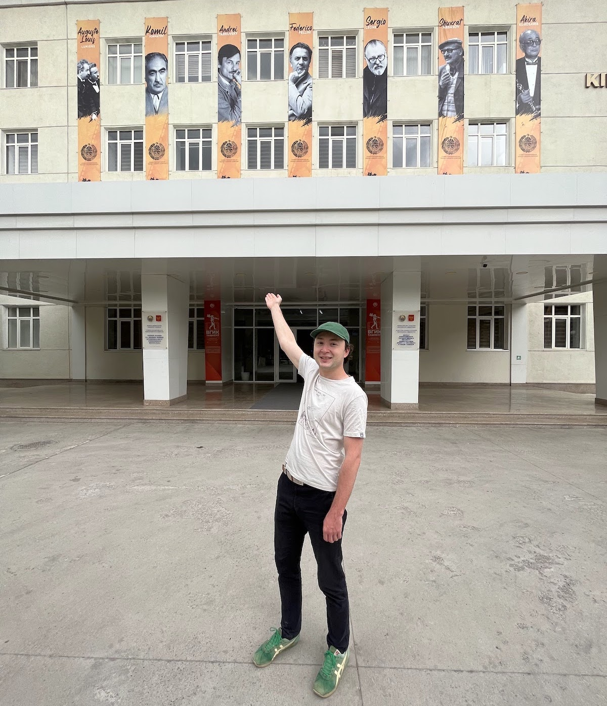
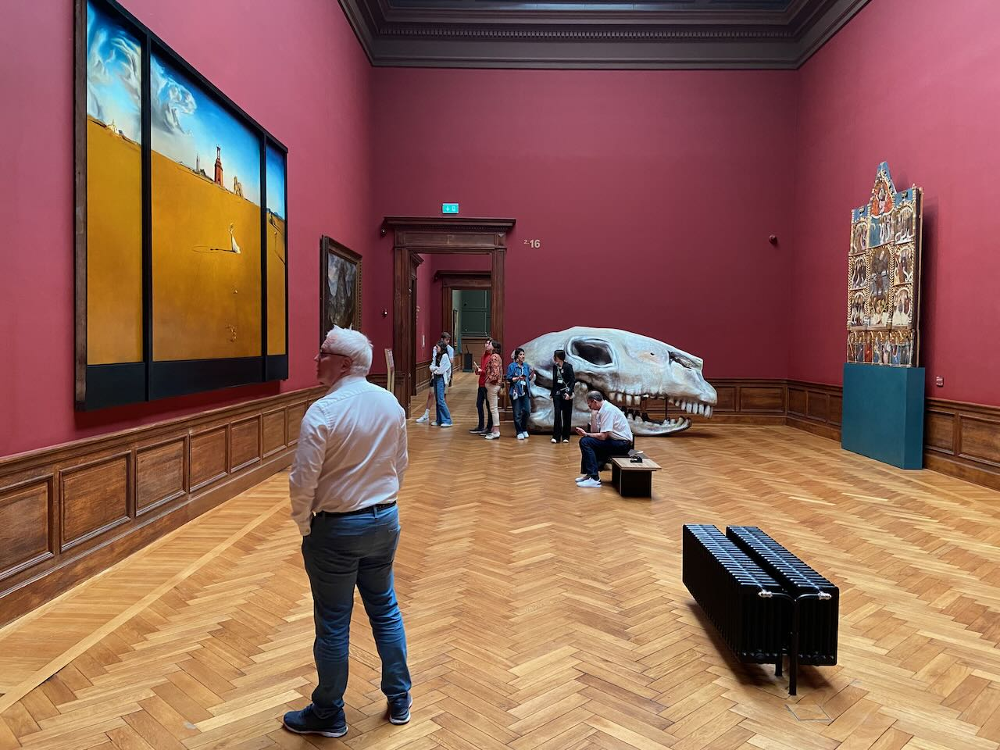
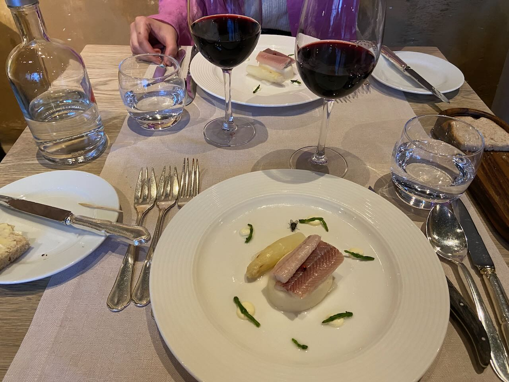
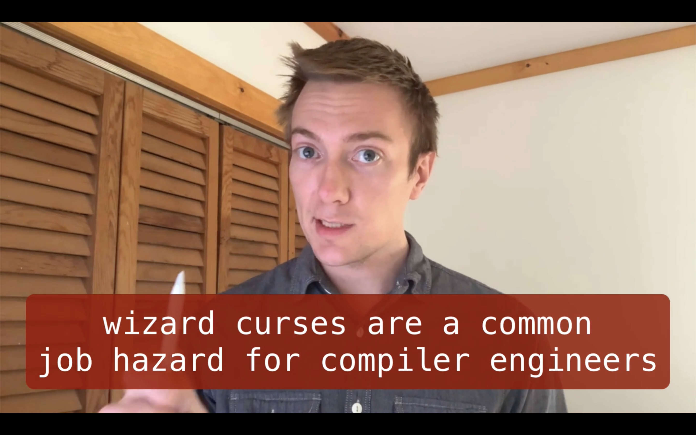

I met my good friends Aziz and Artur through mutual suffering while working at _Booking&#8203;.&#8203;com_. Our names provided the title for the _AAA club_. We often met just three of us or invited guests. Since then Artur moved to Switzerland and Aziz to Uzbekistan. This May Aziz invited us to visit and Artur and I were excited to head to Uzbekistan.

Tashkent, full of green trees, parks, fountains, and broad avenues, struck me as a very modern city. The scorching sun in Bukhara transported us back to the 12th century. Samarkand is about midway between Tashkent and Bukhara, both geographically and culturally. We ate lots of _pilaf_ (_plov_), drank tea inside the madrasah, and hiked along the ridge of the Tien Shan Mountains. Because of the constantly present Russian language, I often recalled Moscow, where I do not know the next time I will be.

I edited a short film about the trip:



---

Reading Tarkovsky's diary invites mystical coincidences. A few days before my trip to Uzbekistan, I visited Saodat Ismailova's exhibition at the Eyefilm Museum. As one of the references in the exhibition, there was a book of the Uzbek folk poem _Forty Girls_, translated into Russian by Arseny Tarkovsky, Andrei's father. Then later on the Istanbul-Tashkent flight, my seat neighbor brought out Nietzsche's _Thus Spoke Zarathustra_. And only a few pages later in Tarkovsky's diary, I see its mention. Finally, in Uzbekistan, several times I see the name _Sardor_, the title of Tarkovsky's unwritten screenplay. In the photo below I point to a photo of Andrei at the Tashkent branch of VGIK (cinema institute).

---

On the last weekend of the month, we went to Antwerp, the diamond and [cocaine](https://www.youtube.com/watch?v=CsH152NE9Ak) capital of Europe. The theme of the trip was "new and old". The city itself, like Rotterdam, was bombed by V-2 rockets, so the relatively small old center of the city is surrounded by modern and vibrant new architecture. In the wonderful KMSKA museum, where I went twice, for each of the halls of the old Flemish masters there is one modern installation. Finally, in the evening, sitting among pompous old men in a French gourmet restaurant, I was served a plate with a fly stuck in the mousse. Recommended places: KMSKA museum, Nordica 31, Fiskebar, Modemuseum Cafe, Handelsbeurs building, Zaha Hadidplein, Plantentuin, Stadpark, PAKT.

---

Completed an excellent [_Advanced Compilers_](https://www.cs.cornell.edu/courses/cs6120/2020fa/self-guided/) course. I was especially fascinated by the topic of JIT tracing, a method of dynamic compilation of hot paths inside a global control flow graph. Firefox made a big breakthrough in terms of JavaScript speed using this [technique](https://web.stanford.edu/class/cs343/resources/tracemonkey.pdf). Next up I want to work on my compiled language and also start a new one based on a virtual machine.

---

Started reading a fantastic book [_Хлопок одной ладонью_](https://ru.wikipedia.org/wiki/Хлопок_одной_ладонью). It tells a story of a journey from a single cell to a human consciousness. Excellent explanations and analogies cover topics like RNA world, the emergence of prokaryotes, the origins of photosynthesis, the Cambrian explosion, tetrapod evolution, Darwinism, superbugs, and many others.

---

There was just one other person in the hot and stuffy movie theater at the screening of the beautifully weird [_Beau is Afraid_](https://en.wikipedia.org/wiki/Beau_Is_Afraid) besides me, and he left halfway through. Spot-on commentary on American cities. [Tchaikovsky’s Wife](https://en.wikipedia.org/wiki/Tchaikovsky's_Wife) was a disapointment. [_All the Beauty and the Bloodshed_](https://en.wikipedia.org/wiki/All_the_Beauty_and_the_Bloodshed) is a great documentary about an artist taking on a rich family responsible for the opioid crisis. And last but not least, Tarkovsky's last film [_The Sacrifice_](<https://en.wikipedia.org/wiki/The_Sacrifice_(1986_film)>) about the collapse of civilization feels more relevant than ever. Fantastic final shot.

---

Some time ago I discovered that writing emails to people I don't know is a secret superpower. That way I got great answers to the questions I was interested in and met a lot of people. Recently I also started saying thanks more often online. If I like an article, an app, or something else, I try to reach out with a short message of gratitude.

If you're reading this and we don't have an ongoing chat, I would be happy to get any kind of message from you.

---

Internet links:

- [Derek Sivers — Finding Paths Less Traveled, Taking Giant Leaps, and Picking the Right “Game of Life” - YouTube](https://www.youtube.com/watch?v=0BaDQCjqUHU)
- [We can piss on the street in Amsterdam - YouTube](https://www.youtube.com/watch?v=qTMBlOyNlqc)
- [«Все закончится финальными титрами». Андрей Звягинцев - YouTube](https://www.youtube.com/watch?v=mcNPy6YvD5A)
