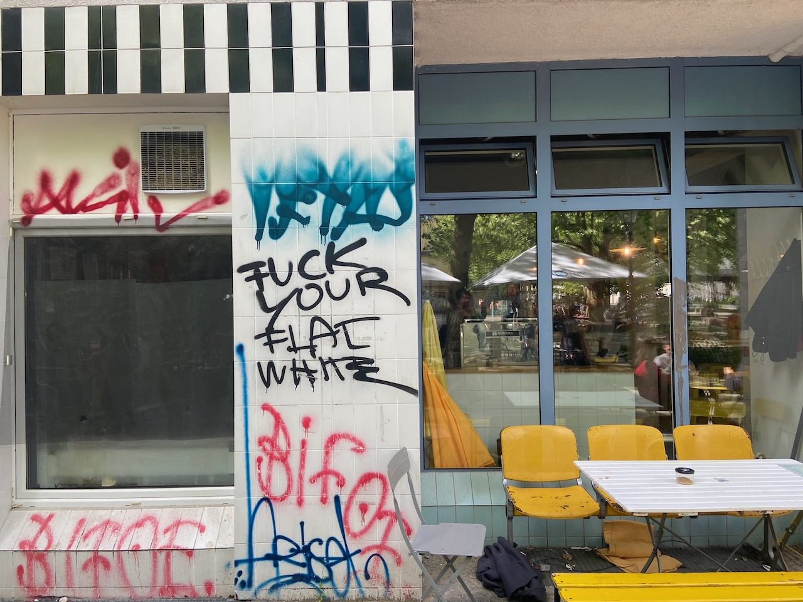
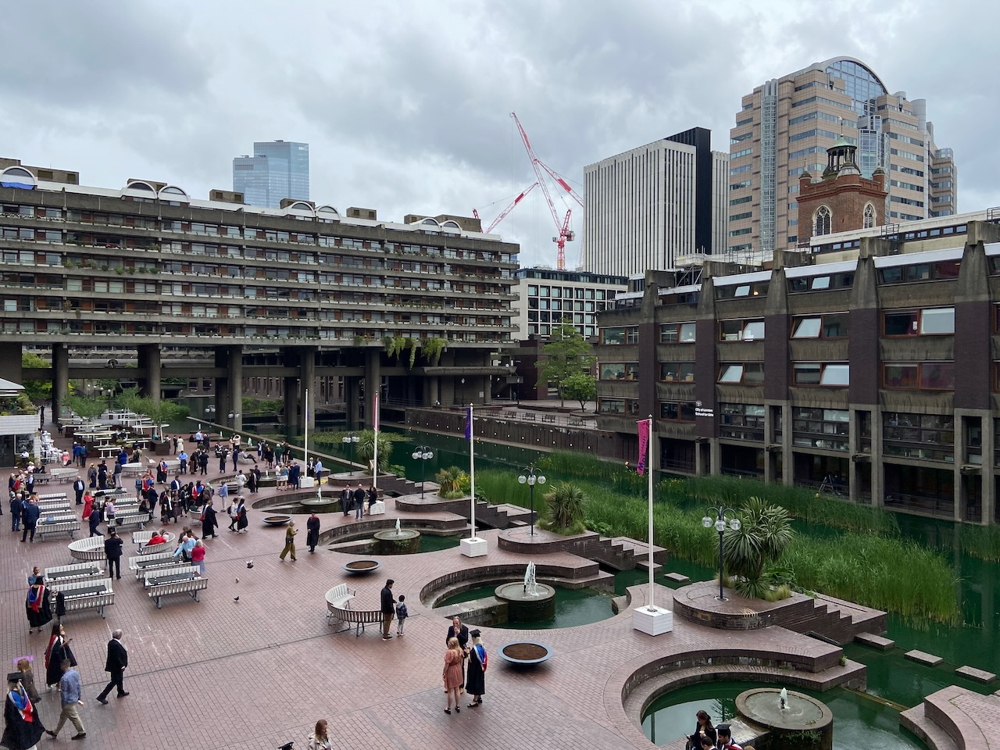
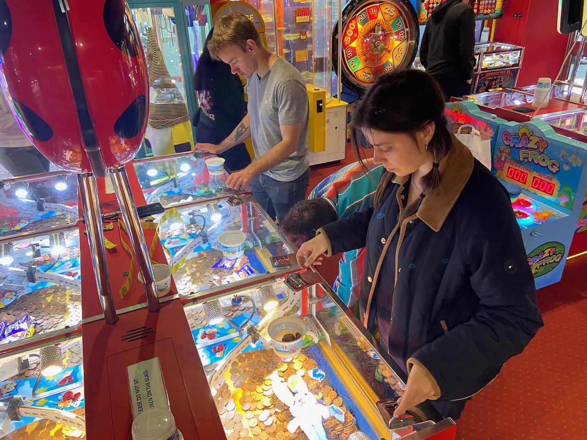
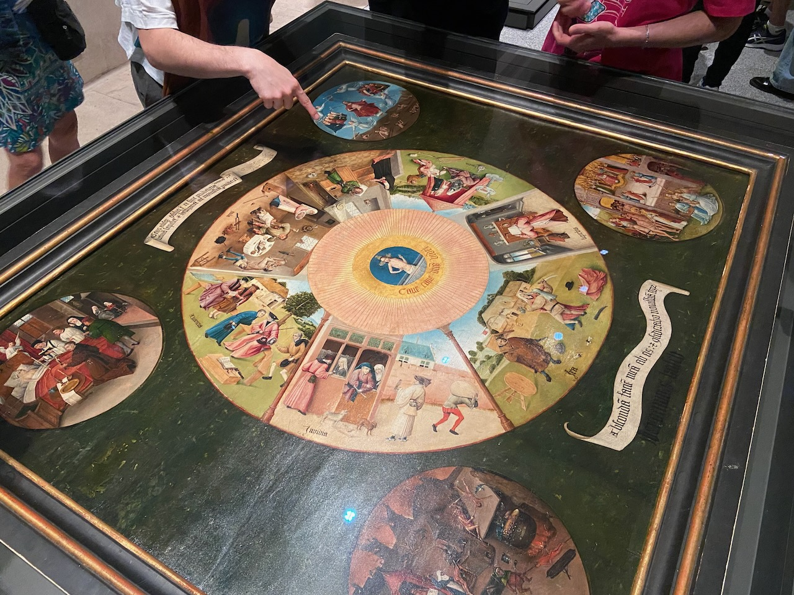

May has been a tricky experiment in balancing work and a long journey. My fantasy of living a peaceful life for a month in some warm European city like Barcelona turned out to be a fast-moving trip across the couches of welcoming friends. I managed to be satisfied with my work on nearly all days of the trip, but not all of them had enough energy for social interaction.

---

In Berlin, I became an avid reader and subscriber to the [Schön magazine](https://schon.berlin/), which reports on everyday Berlin in the familiar tone of the [Afisha magazine](https://en.wikipedia.org/wiki/Afisha) of the early 2000s. Thanks to a tip from the magazine, I found myself in a former crematorium building at the animation festival. Dozens of booths where artists were showing their ideas. It seemed like a marvelous secret world that existed nearby all the time. I was captivated by [flying super sausage](https://www.flyingmerguez.com/) and [the animation short about competitive spirit](https://www.youtube.com/watch?v=kbmeOXdq1l8).

While we were sitting on the sunny meadow in Tiergarten, 500 meters away from us a congress of conserved Russian patriots was buzzing in time for the May 9 holiday. At the monument to the Soviet soldier also gathered German youth in red scarves with the badge of sickle and hammer hidden behind the collar.

Best food: meatballs from Möllers Köttbullar and shawarma from Razzak.

---

If I'm forced to move out of Amsterdam, it will be London. And my apartment will of course be in the Barbican, a masterpiece of brutalist architecture, the ugliest building in a 2003 British survey. This seemingly unapproachable fortress is a place of immense energy for me, combining all my favorite details - vertical levels, absence of cars, gardens and labyrinths and water, its own cinema and library.

Also in London, I can't help but mention the parks, street food, and museums. On this visit that bingo card was completed by Holland Park, Brick Lane Market, and the Design Museum. The latter shows [a cow's tail attachment](https://www.youtube.com/watch?v=sgRAURR0SNg) so that the farmer can get to the birth of the calf in time.

The overly friendly owner of a meat restaurant named Habib, upon hearing us speaking Russian, confessed his orthodoxy, immediately put on French music (because all Russians love it), treated us to a gelato, and clarified that he had not been to Russia only because he is afraid of spending all his money there.

---

Cornwall is England's Portugal. The coastal town of Newquay, once known for its tin mines, is now full of surfers. Its premier specialty, cornish pasty (a large [samsa](<https://en.wikipedia.org/wiki/Samsa_(food)>)) is shaped for eating with dirty fingers. There is no Uber here and the promised 5 minutes on the map turns into 15 because of the steep slides. Kolya told me that the musician Aphex Twin drives a [tank](https://www.reddit.com/r/OldSchoolCool/comments/65vrj0/richard_d_james_aka_aphex_twin_with_his_personal/) somewhere here.

The perfect counterpart to London: long walks on rocky cliffs along the soothing ocean. A spacious house where everyone does their own thing in private yet together. Kommunalka done right.

After the fish and chips ritual gluttony we went for entertainment. The word can't describe how exciting it is to throw coins into the slot machine waiting for other coins to slide, which will bring down the desired trinket. In the first visit the cashier took pity on the number of tickets we won enough for 4 gummies and gave us a couple of bags of gummy bears as a gift. In the second visit we left with a yo-yo and a multicolored round thing of unclear purpose.

---

Madrid is a measured imperialism. I visited the Prado from the last of my strength and was struck by Breughel reminding me of home. And the [son-eating Saturn](https://en.wikipedia.org/wiki/Saturn_Devouring_His_Son) in Goya's work is just like Bob from Twin Peaks.

Only opening at 8pm, the restaurants coincided well with my late work schedule. Lots of delicious non-Spanish food: Lebanese restaurant Mune, Japanese Donzoku, Latin American Fiera.

---

Broke my promise not to buy any new books this year. In England, I relapsed, purchased, and in my defense, immediately read two wonderful books.

In central London I picked up [Stoner](<https://en.wikipedia.org/wiki/Stoner_(novel)>) off the shelf, a novel about the unobviously happy life of a literature professor under unhappy circumstances. The beauty of melancholy.

In Cornwall I picked up [Good Pop, Bad Pop](https://www.goodreads.com/book/show/59578046-good-pop-bad-pop) - a memoir by Jarvis Cocker known for the band Pulp, as well as for his cameo in Harry Potter and a cameo as a musician in almost all of Wes Anderson's films. Jarvis takes apart his attic and talks about his musical and cultural formation through the junk he found there. From the first guitar given to him by his mom's German boyfriend to a can of [marmite](https://en.wikipedia.org/wiki/Marmite) (which I tried, curiously gross). Only two words Jarvis censors literally, covering them with asterisks: Britpop and Thatcher.

---

Briefly about work. Right now it's controlled chaos, in which I get to do what seems to be the best work of my career. Priorities change every day, colleagues inspire me with their pace and ingenuity while also being nice people. With much surprise after C++, none of my Rust programs so far have ever crashed into segfault. Copilot helps to reduce the time spent fighting with the compiler and each day teaches me a new way to juggle Result and Option types.

---

Three countries, three different parallel worlds where people very close to me exist. Their daily routines, favorite cafes and restaurants, local concerns and problems. An opportunity to try on someone else's life. It was nice to return home, where the Bialetti coffee maker, a gift from the visitors, was waiting for me.

---

## Internet

- [Interview with Steve Albini](https://www.youtube.com/watch?v=sKEzHie9tAI), who died in May, legendary sound engineer who worked with Nirvana, Pixies, The Breeders, PJ Harvey. Steve worked only with tape in his studio due to his distrust in digital media.

- [Cold letter to Alan Kay](https://futureofcoding.org/notes/alan-kay-lunch.html) and an report on a lunch between the author and Alan.

- [Stone of madness](https://en.wikipedia.org/wiki/Stone_of_madness) as an alternative to the philosopher's stone.

- [Podcast "Право на Город"](https://wowhaus.mave.digital/) (in Russian) for the nostalgic Moscow of Afisha magazine's time.
