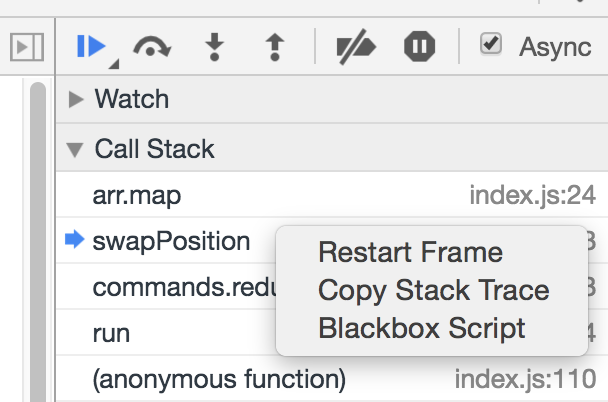

Recently I spent some time debugging Node while doing [Advent of Code 2016](http://adventofcode.com/2016).

Two things made my life easier, which I did not use before:

1. Using Chrome inspector.

Sometimes you need to go deeper than spraying `console.log` all over the code.

Since version [6.3.0](https://github.com/nodejs/node/blob/master/doc/changelogs/CHANGELOG_V6.md#2016-07-06-version-630-current-fishrock123) you can run `node --inspect --debug-brk script.js` and get full Chrome debugging experience for your Node process out of the box.

Minor inconvenience is that Chrome does not open automatically, you need to copy/paste the link every time. I solved this by installing [inspect-process](https://github.com/jaridmargolin/inspect-process) and adding an alias:

```bash
alias node-debug='inspect --debug-brk'
```

2. Using `Restart frame`.

Before, I always restarted the whole script to run through the particular part again. But losing state is inconvenient.

Everything changed when I finally found "Restart frame". This action will restore state at the start of the selected call stack item.


_Right click stack item_

### Additional reading

[Debugging Node.js with Chrome DevTools](https://medium.com/@paul_irish/debugging-node-js-nightlies-with-chrome-devtools-7c4a1b95ae27)
