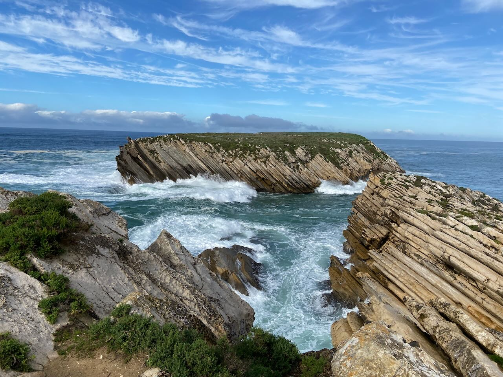
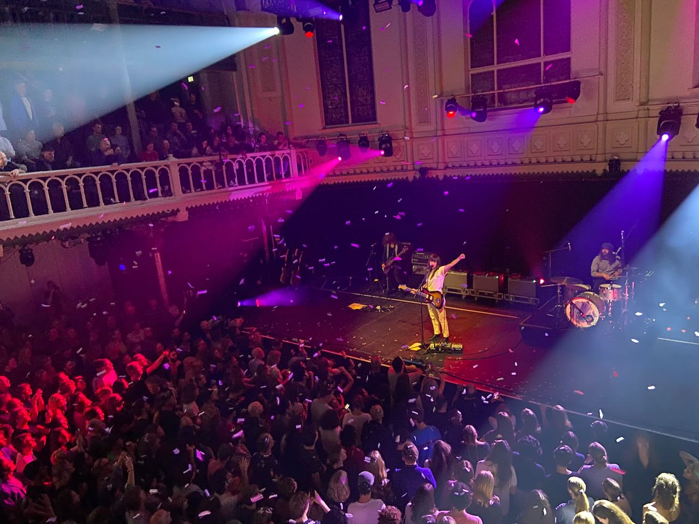
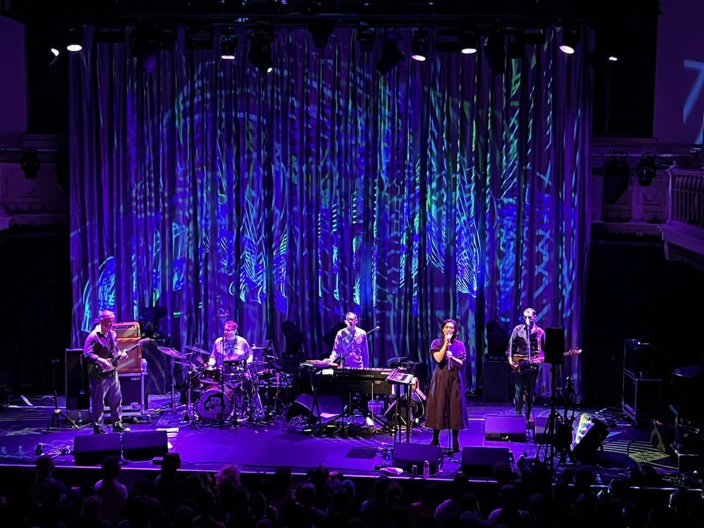

The set is Baleal, Portugal. While technically an island, it is connected by the sandy pathway to the mainland. Big ocean waves crash with great force against rocky cliffs. An Autumn trip to Portugal to hang out with Igor and Tyoma is becoming a tradition. I am very grateful for having such great friends. Some days we did nothing at all, other days we discussed deep existential questions. We came up with tons of memes contributing to our shared common language. Tyoma mastered kindling the fireplace at our house. Igor took us to try out wakeboarding. I won the Tetris championship. Definitely looking forward to returning there someday.

---

Visited Paradiso for 2 concerts this month. First to _Courtney Barnett_, then to _Stereolab_. Both were marvelous. Courtney had a birthday that day and they fired confetti from above and brought her cake. In both cases, it was a little surprising to see a lot of people coming to bands whose only listener I thought I was.

---

A zeitgeist observation. Coffeeshop _Rusland_ located on the street with the same name was renamed to some other unaccountable name. The shop _Priwet Rossia_ took off the _Rossia_ part from the sign.

---

Giving into the Russian stereotype, I've started reading _The Brothers Karamazov_ and am now at the point where the book turned from good to great. I appreciate that I can read it in the original language.

The book is huge and often when making a highlight (and I do lots of those), I think that there are no good tools to encourage deep after work with the book. Sure, I can export my Kindle highlights to some app, but that's it. Given the astonishing progress with neural net text understanding, I would like to see book-reading companion apps. Each highlight can be automatically summarised and categorized. The tool should allow querying book paragraphs based on the subject, character, etc.

---

Enjoyed the review of modern Russian history in [_TraumaZone_](https://en.wikipedia.org/wiki/Russia_1985–1999:_TraumaZone) by Adam Curtis. Brilliantly crafted from archival footage documentary that starts with Gorbachev in 1985 and ends with Yeltsin in 2000.

---

Picked up the guitar again. Learned a bunch of blues chords (A7, D7, E7, G7). Struggling with A-shape barre chords now. For the upcoming months, my goal is to finish level 7 in Yousician and then reward myself with the purchase of an electric guitar, most likely a Telecaster or Stratocaster.

---

Quite happy with the newly arrived Apple TV 4K. Much better user interface compared to the webOS on LG TV I have. Streaming from Macbook also works seamlessly. I simply enable built-in file sharing and use [Infuse](https://firecore.com) on Apple TV. Finally able to use AirPlay (LG TV did not support it). The Free TV+ trial sucked me into the first season of Ted Lasso – I can't deny that it had some charming moments.

---

Thinking about how I have zero use cases for recommendation engines that are often the core of media products. Films, TV series, music, books – I have plenty of things in my backlog for years ahead.

---

It was interesting to learn that both Guido van Rossum and Andrej Karpathy use [GitHub Copilot](https://github.com/features/copilot). I think I've missed my free trial period, but now I am more curious to try it out.

---

Internet links:

1. [Andrej Karpathy: Tesla AI, Self-Driving, Optimus, Aliens, and AGI | Lex Fridman Podcast #333 - YouTube](https://www.youtube.com/watch?v=cdiD-9MMpb0)
2. [Building the fastest Lua interpreter.. automatically!](https://sillycross.github.io/2022/11/22/2022-11-22/)
3. [«Я точно больше ни секунды не хочу терпеть унижения» Юлия Цветкова — свободный человек. Она уехала из России — и рассказала «Медузе» о том, как три года уголовного преследования перевернули ее жизнь — Meduza](https://meduza.io/feature/2022/11/29/ya-tochno-bolshe-ni-sekundy-ne-hochu-terpet-unizheniya)
