Having visited Japan for the first time in 2019, I was excited for the country to finally reopen for tourism after the pandemic. Due to the aging population, this didn't happen until September 2023. My annual sabbatical was starting to come to an end and I spontaneously decided to spend the entire month of November in Japan.

On my first trip, I had only been to Tokyo and the surrounding areas, now I wanted to see the rest of the country. Having only planned the beginning of the route in Osaka and the end in Tokyo I planned the route on the go.

The final route was as follows: Osaka → Hiroshima → Itsukushima → Fukuoka → Nagasaki → Himeji → Arima Onsen → Kyoto → Nara → Kanazawa → Tokyo.

---

As usual, here is the whole voyage compressed in video form. There are chapters, so you can watch it over several times.

<iframe width="640" height="360" src="https://www.youtube-nocookie.com/embed/f2kDwLdR0eU?vq=hd1080&modestbranding=1&rel=0" title="YouTube video player" frameborder="0" allowfullscreen></iframe>

---

About 450 years ago, the Dutch ship named _Liefde_ (Love) was shipwrecked around the islands of Japan and it was the first contact between the two countries. My nameless direct flight from Amsterdam brought me to Kansai International Airport in Osaka in 13 hours. After takeoff, the flight attendant told me two people would take a seat in my empty row. I was puzzled and asked where they would come from since we had already taken off. Like in the Netherlands, the Japanese lack land; the airport is built on an artificial island.

During the first few days, I had time to recover from jet lag, explore the neighborhoods of Dotonbori and Shinsaibashi, and eat the city's specialty - takoyaki (minced octopus in batter). In the Americamura neighborhood, you can find a statue of freedom on the roof of one of the buildings. Japanese people love American culture: baseball, jazz, hip-hop, and Disney.

Ben, an American game designer traveling in Japan for several months, who has been to Osaka many times and speaks fluent Japanese, showed me around the city. We went to an _izakaya_, a type of local, cozy Japanese bar where the regulars have their own personalized bottle.

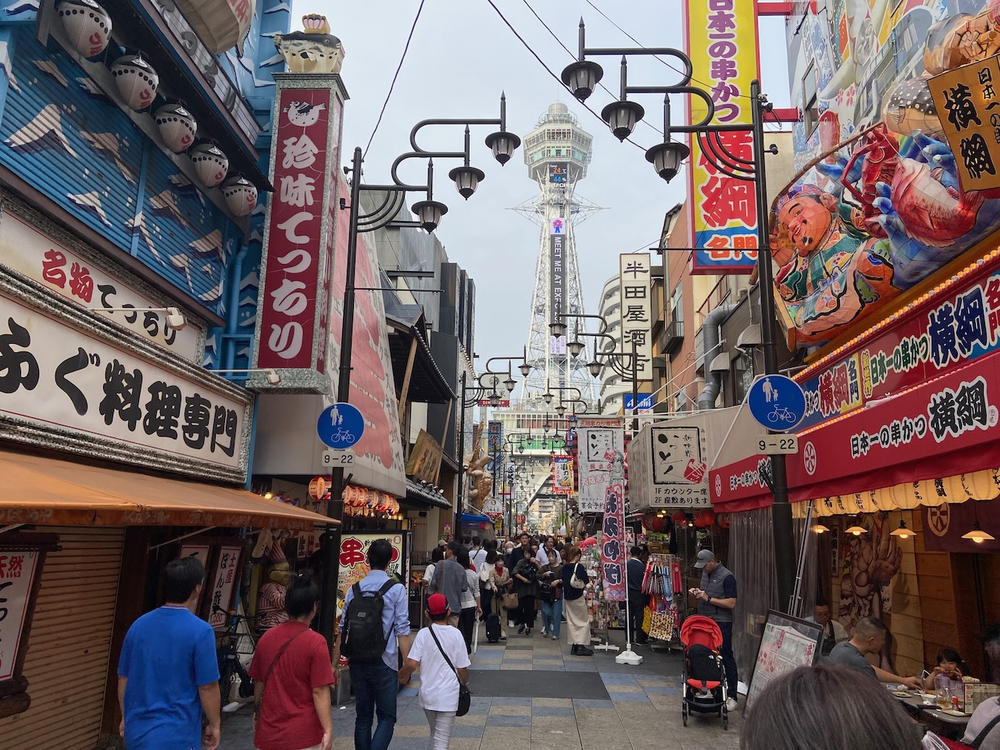

---

After spending four days in Osaka, I moved westward. The high-speed Nozomi N700 Shinkansen train took me to Hiroshima in a few hours. My hotel was located 900 meters from the center of the Little Boy atomic bomb explosion, meaning I would be burned alive that day from temperatures of several thousand degrees Celsius. The atomic bomb museum focuses on families' personal experiences, diaries, and children's drawings. It was hard to look at it without tears.

Next to the atomic bomb museum is a building with a dome by Czech architect Jan Letzel over which the bomb exploded. The building became a symbol of peace and Letzel, who didn't live to see World War II, would have been even prouder of his building.

Hiroshima's specialty is okonomiyaki cabbage pancake.

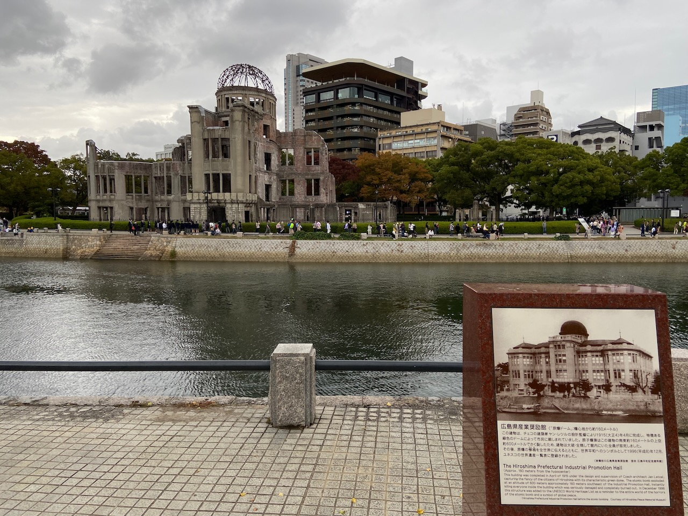

---

There is a ferry from Hiroshima to the small island of Itsukushima, famous for its large Torii Gate, which stands in the water at low tide. Torii Gate in Shinto symbolizes the boundary between the secular and the sacred.

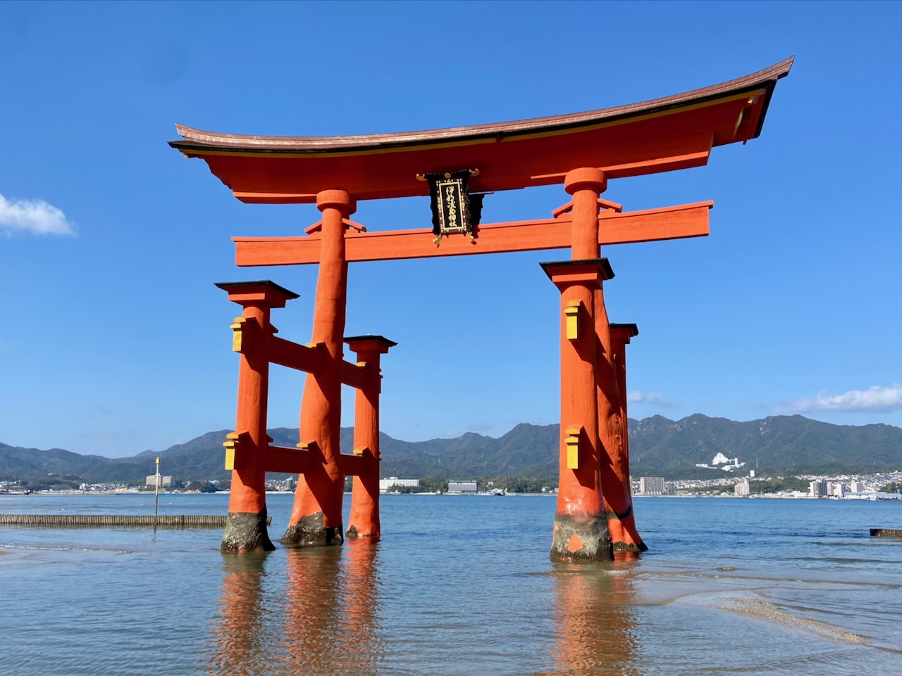

Most Japanese practice Shintoism and Buddhism at the same time. In Shintoism, there is no holy book or main leader. This religion is organized around the rituals of visiting the shrines. Upon entering, one must bow before the gates of the torii, then wash hands and mouth, and finally draw the attention of the divine spirit (kami) with a coin toss, a clap, or strike a bell. Then you can ask the kami to grant you a wish. The wish can also be written on a special wooden plaque and hung in a special place in the temple.

I climbed Mount Misen for a stunning view of Hiroshima Bay and took the cable car down.

The island's main gangsters are the spotted Sika deer. There are no wolves in Japan and young people don't want to become hunters, so there is an overpopulation of deer. They have learned to bow in exchange for cookies, which they insistently beg from tourists. The situation is even worse in the town of Nara, where there seem to be more deer than people.

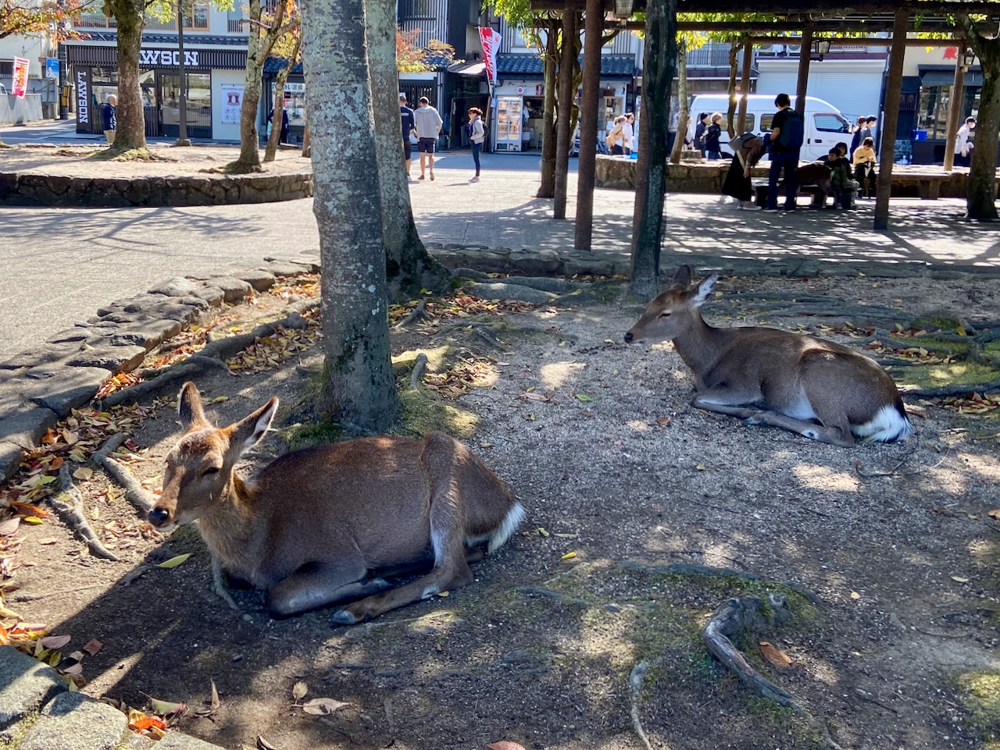

---

From Hiroshima, I reached Fukuoka, the last western point of the JR East railroad. The city is famous for its portable food trucks called _yatai_. While walking around town, I met a local YouTube blogger, Yuta, who offered to record an interview with me. We arranged for the next day. Yuta came in with a hangover, so we decided not to record a video but went out for breakfast. We spent half a day chatting, Yuta turned out to be a big history enthusiast and knew a lot about Japan's relationship with Russia and with the Netherlands.

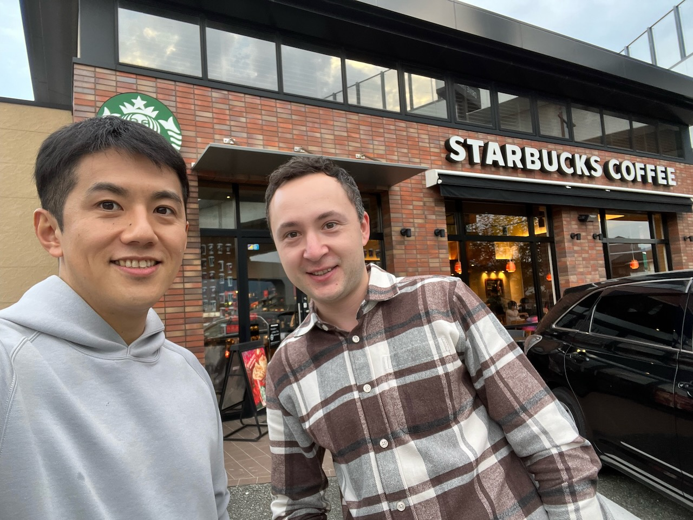

Forgetting to book a hotel for the day between Fukuoka and Nagasaki, I spent the night at a manga cafe. There's an hourly rate (12 hours cost around 3000 yen, about 18 euros) and an endless amount of manga to read. I don't read in Japanese yet, there's nothing in English of course, so I just enjoyed the atmosphere. Very interesting in terms of experience, but pretty awful in terms of comfort - in my booth I couldn't stretch out to full height even diagonally.

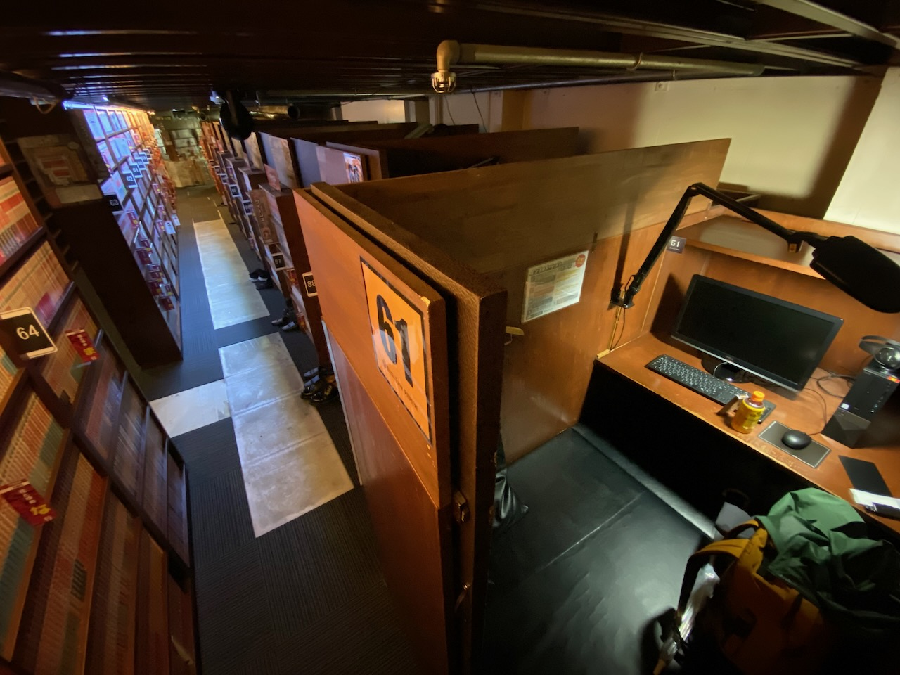

---

Nagasaki is closer to Shanghai and Seoul than to Tokyo. The Chinese influence can be felt in the city. There is a large Chinatown and Chinese tourists are much more numerous than in the central part of the country. The local specialty is a chicken broth _champon_ soup with a sprinkling of pork and seafood.

A longtime dream of mine came true - to visit the artificial island of Dejima inside Nagasaki. It was home for over two centuries to the Dutch, Japan's only European trading partners during the isolation policy. The Portuguese were the first to reach Japan, bringing with them bread and sweet cakes, but they were quickly expelled from the country for their ardent promotion of Catholicism. Dejima is several dozen residential buildings and warehouses. Typical European interiors are mixed with tatami and bamboo. The Dutch carried back large quantities of copper ingots and brought to Japan shagreen, an animal skin used for sword hilts. Other Dutch gifts to Japan included a microscope and telescope, Western medicine, and a steam engine.

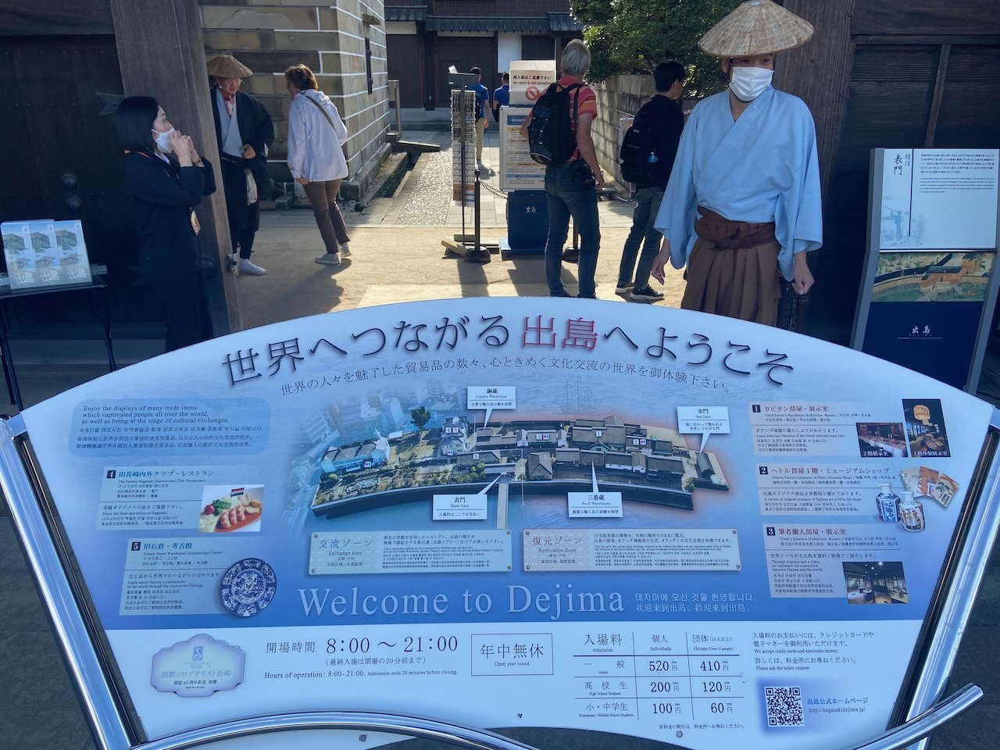

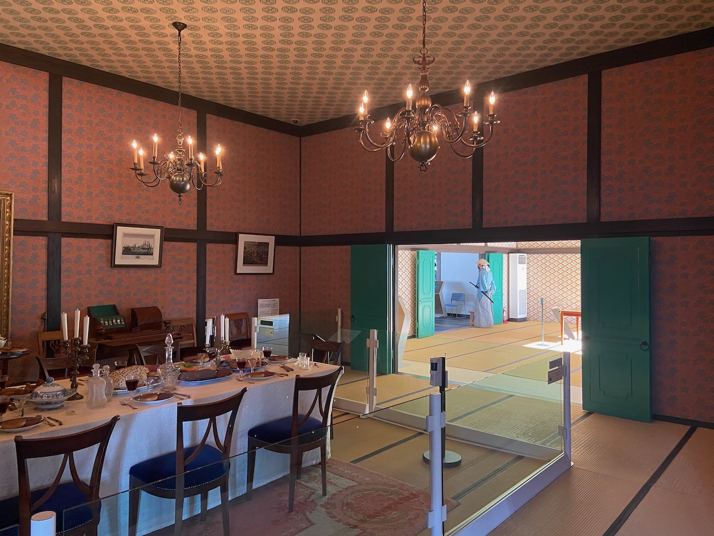

Nagasaki has charming old streetcars and many Catholic churches, you can spot nuns on the streets.

---

Next, the high-speed Shinkansen train took me back to the central part of the country, to the city of Himeji. A small town known for having the largest castle preserved for 400 years. It survived fire bombings during World War II and a major earthquake in 1995. There is a legend that during the earthquake, not a single drop of sake spilled from a cup on a table on the top floor of a castle.

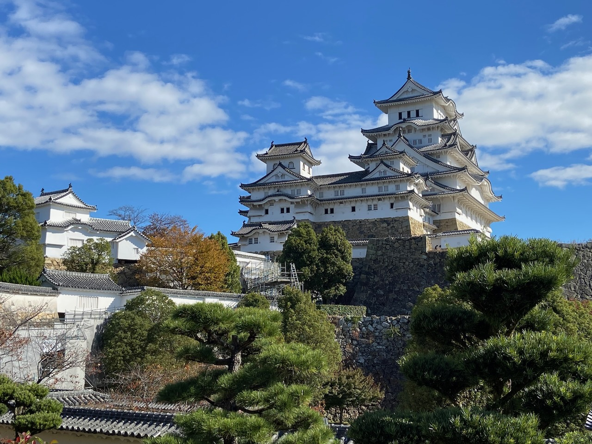

In the hostel, I met a bunch of fellas from the city of Semipalatinsk in Kazakhstan. Semipalatinsk, along with Bikini Atoll, and New Mexico is mentioned in the Nagasaki Atomic Bomb Museum as one of the places where civilians suffered from nuclear bomb tests.

---

I needed to tick off an important tourist item - spend the night in a ryokan. A ryokan is a traditional Japanese hotel built on a hot spring (onsen). At the ryokan in the small Arima Onsen town, I had a private onsen with baths on two springs: gold (with iron and salt) and silver (colorless, with radium and carbonate). Cleanliness is very important to the Japanese, and water procedures are an important practice in Shintoism. The streets of cities are always surgically clean.

For dinner, I was served marbled Kobe beef, for which the cows follow a special diet and receive massages. Now I'm wondering how much Wagyu beef outside of Japan is actually Wagyu.

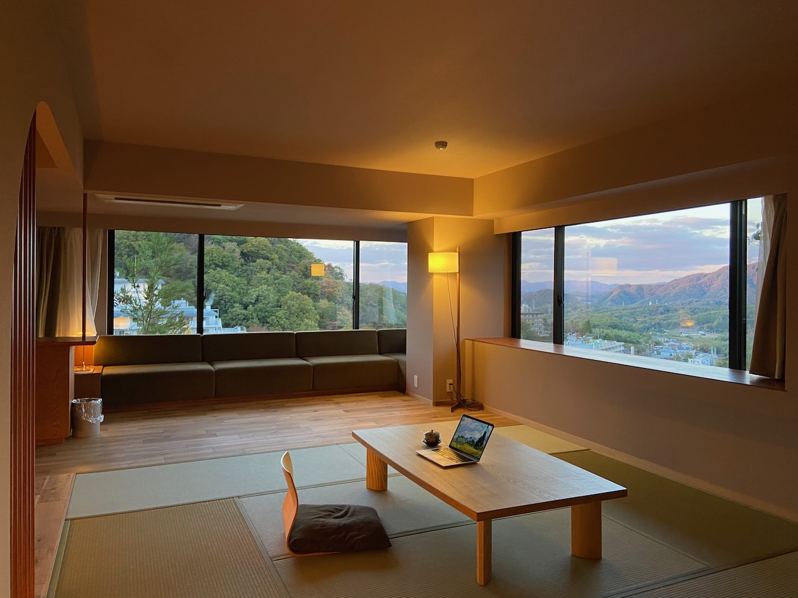

---

Kyoto is spacious and beautiful. To maintain the traditional look, the city has strict rules for buildings and appearance. Most buildings do not exceed three stories, and businesses must turn down the intensity of their signage colors according to a special formula.

Like the castle at Himeji, the golden Kinkakuji Temple was also long preserved until a 22-year-old monk burned it down in 1950. Japan was shocked, the writer Yukio Mishima wrote a book about it, explaining the monk's deed by the fact that he could not stand the beauty of the building. Now schoolchildren take pictures with Mishima's book in front of the restored temple.

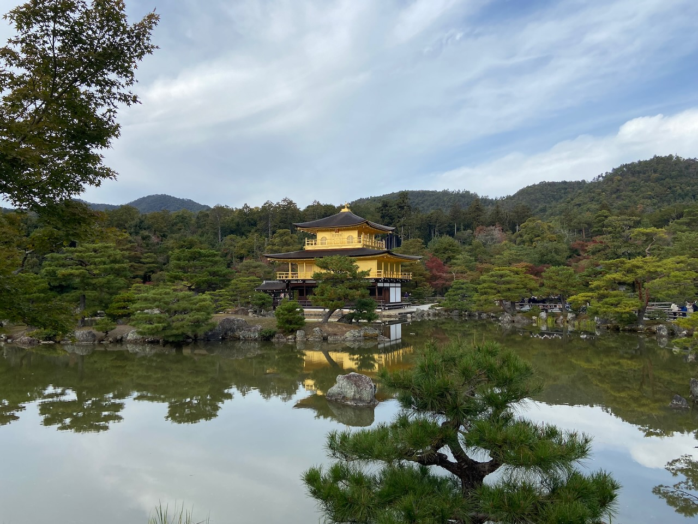

Another popular temple, Ginkaku-ji, or silver pavilion, can be accessed by a Philosopher's Path. I have been lucky with the sunshine, and am ready to call this trail the most marvelous trail in the city limits I have ever seen. A charming garden sprawls around the silver pavilion. On my way out of the temple, I had some delicious curry udon.

I also visited the popular Fushimi Inari shrine, the Arashiyama bamboo grove, the National Museum of Modern Art (MoMAK), and a railroad museum.

---

From Kyoto, I headed to Kanazawa, the second point on my itinerary besides Fukuoka on the northern coast of the country. During the Tokugawa shogunate, the city was the second richest after Tokyo. Still proud of this, Kanazawa likes to put gold sprinkles on their food. The city is also famous for seafood and I had a lovely kaisendon inside the Ōmichō Market.

Having looked at dozens of temples and castles during the whole trip, by the end they all started to look the same. But I didn't tire of the Japanese gardens at all. Often islands of tranquility amid bustling cities, I can stare at them endlessly.

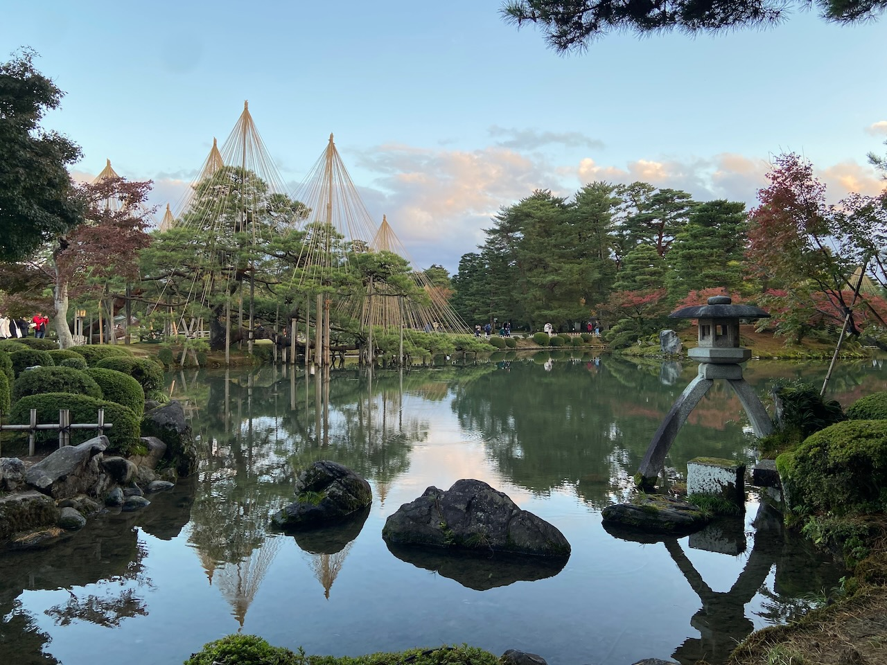

---

Tokyo, the city of the future according to Tarkovsky has not changed much since _Solaris_ (1968) or even _Lost in Translation_ (2003). High density of visual information and a large number of roads located one above the other.

My last week in Tokyo turned out to be very social. Before the trip, I wrote to some interesting people with a proposal to meet up. Almost everyone responded positively.

I met Ryu Ueyama, who has rock star status for me. Ryu is the author of the fastest [Mold](https://github.com/rui314/mold) linker (an essential component of almost any programming language). Ryu thoroughly answered all my silly questions about compilers and took me around the popular Shinjuku neighborhood. Inspired by the meeting, over the next two days, I wrote my first garbage collector (using the conservative Mark and Sweep method).

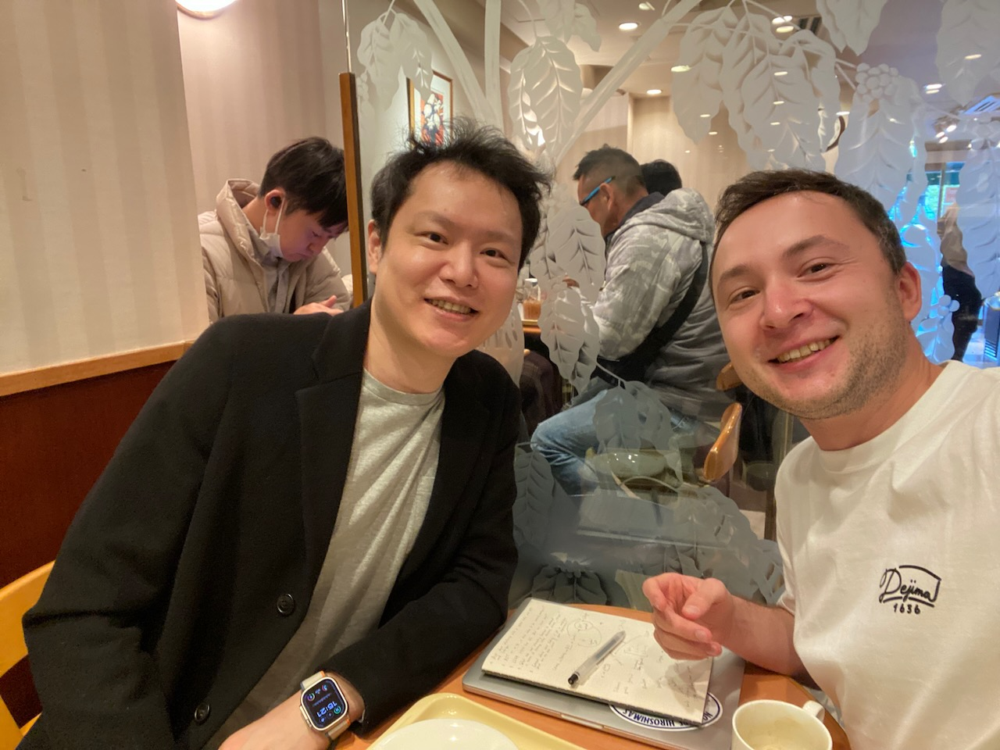

A stranger on Reddit responded to my suggestion to go play arcade games. Imagine our mutual surprise when we realized that we were both born in Russia 32 years ago and now both live in Amsterdam, although he is now moving to Tokyo. After I kicked his ass in Mario Kart, Dima showed me a batting simulator machine for the Japanese favorite sport, baseball, where I had a lot of fun despite missing most of the balls. On the penultimate day, Dima and his wife invited me to eat yakiniku.

Another day at lunch, I met Christopher Nakazawa, the author of the popular Jest testing framework. Christopher is now creating [his own videogame](https://www.youtube.com/watch?v=m8SmXOTM8Ec) and raising his children in Tokyo.

With some other guys on Reddit, we walked around Akihabara and ate udon. At the Belgian bar Delirium, I had dinner with Natasha and Kolya, a lovely Russian couple who met at karaoke and now live in Tokyo for several years.

I got the impression that there are no random people among expats in Tokyo. The high bar of difficulty of moving works as a filter, people move to Japan primarily because of a great love for the culture and people.

---

I spent my last evening at the New York Bar located on one of the top floors of the Park Hyatt Tokyo hotel. There are either rich people sitting there or fans of the film Lost in Translation (I'm in this group). The nice waitress put me in the best place at a long table stretched along the bar and I listened to wonderful live piano music while enjoying a glass of Asahi beer.

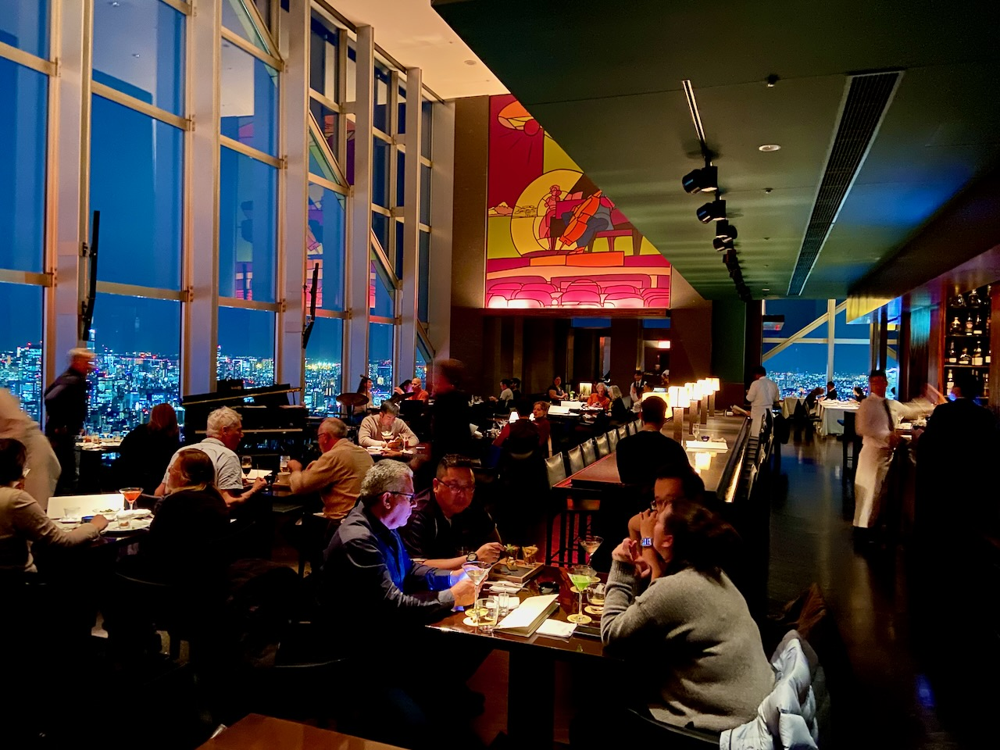

---

The striking contrast between bustling cities and zen gardens, superior politeness, the ability to occupy only the necessary space in space, great attention to detail and convenience of life, and the ability to be both serious and strange – all this makes Japan and the Japanese people fascinating to me.

---

Before the flight back to Amsterdam, it turned out that the KLM plane had broken down. They couldn't find a spare part on local airlines, so they had to bring it in from Amsterdam and the flight was delayed by 28 hours. Standing in the baggage claim line for the second time the next morning, I had another interesting tourist experience - the ground beneath my feet shook, and a small earthquake occurred.
