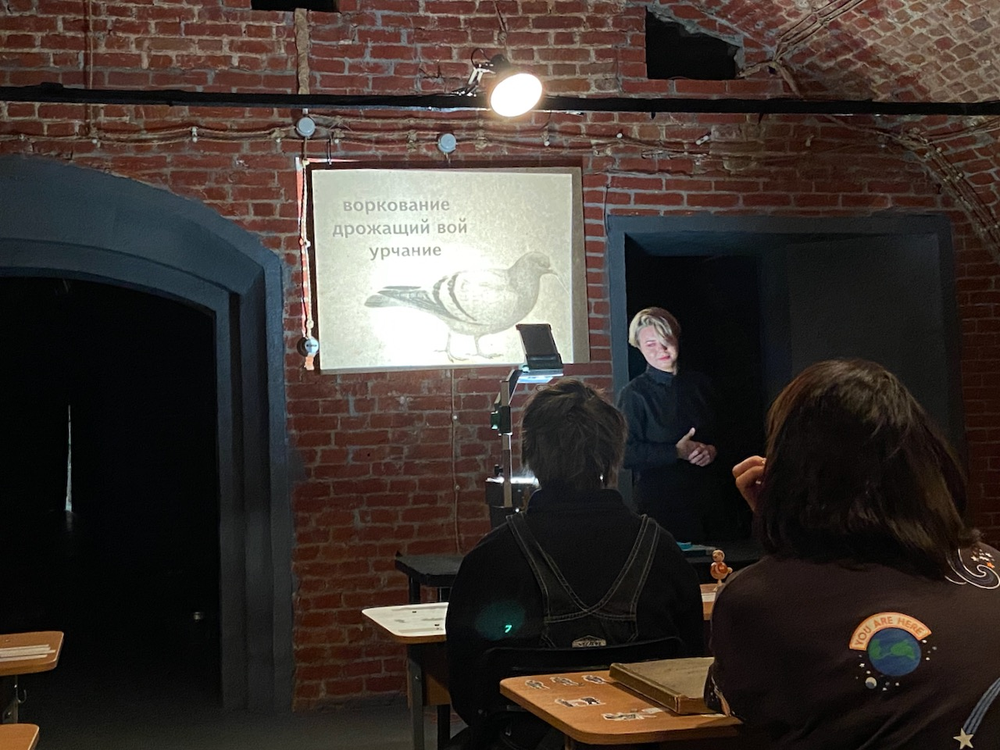
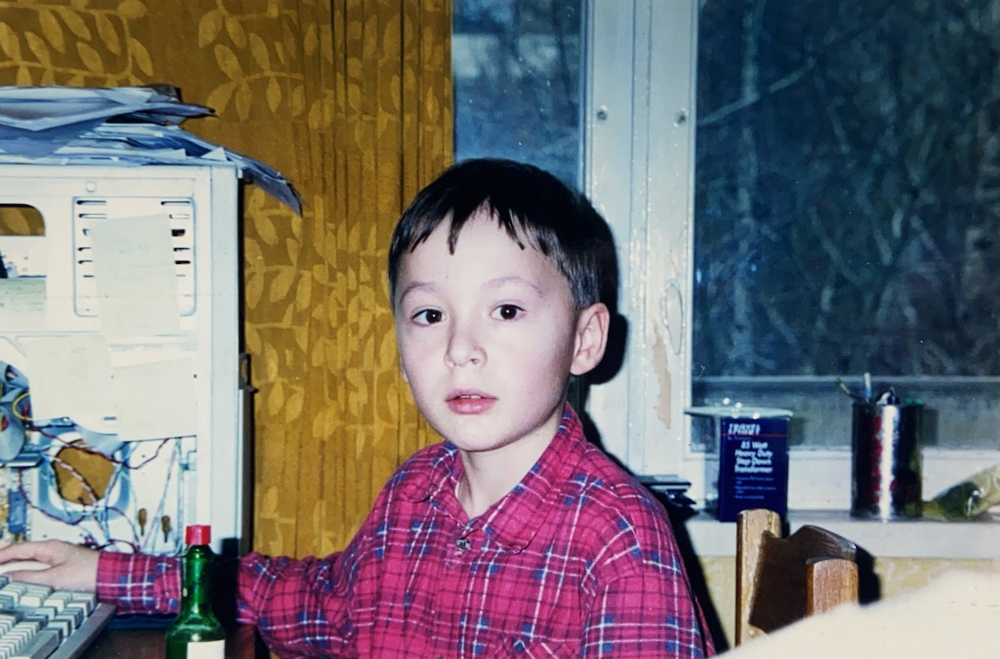

I finally ran the marathon! I've been thinking about doing it for at least the last 4 years, but only this year something clicked, and I got consistent training leading up to a total of 750 kilometers.

During the marathon, it was fun to see many people cheering for runners along the track and some even playing live music. Whenever I've slowed down a bit, it felt like a large group of runners seamlessly passed me by.

At some point, I was stung by a wasp in the finger where I had some remainings of sweet gel food I ate a few moments before. The pain and simply the surprise of this event helped me to focus away from the tired legs and keep moving. Next marathon I am taking a wasp with me.

–

After doing a marathon, I've hopped onto a flight to Moscow, where I haven't been for 2 years. I was happy to see my friends and family, but it was a bit tiring to tell, again and again, all the stories about what I've been up to since the pandemic started. If only I'd written it down somewhere.

Yandex still dominates the city with taxi and delivery services. Everything still works 24/7. As I was staying away from the subway, I've spent numerous hour-long rides in the taxi when meeting with friends in the city center. Something new for me this time was the huge amount of betting ads. I've been also thinking about how you can find a tutor for about anything in Moscow, haven't seen anything similar in other European cities.

I didn't have much time for cultural events, but the two I visited were great. First, I went to the experimental theatre play where the audience learned to speak the bird language. Later, I've enjoyed a private tour of the Thomas Demand exhibition in the Garage Museum of Contemporary Art.

–

At my parent's home, I've meticulously scanned many old photos with the [PhotoScan app](https://www.google.com/photos/scan/). The quality is far from the actual scanner, but it is good enough.

Here is me drinking Tobasco and probably doing hacker stuff:

–

After I got hooked by Walter Isaacson's book on CRISPR last month, I've picked up The Gene by Siddhartha Mukherjee. It covers the history of genetics up to the CRISPR discoveries. On top of Isaacson's book, here I've learned about the gene regulation cycle and epigenetics.

I found myself left not quite satisfied after reading 2 popular science books on the subject and decided that I should take a look at proper textbooks and online courses. I will be picking up [Introduction to Biology](https://www.edx.org/course/introduction-to-biology-the-secret-of-life-3) from Eric Lander in November and try out Campbell Biology as a textbook. I've watched some lectures from [MIT 7.016 Introductory Biology](https://ocw.mit.edu/courses/biology/7-016-introductory-biology-fall-2018/), but they are above my current level of understanding.

It is still unclear how to start turning knowledge into actions in this area. Maybe I should send an email to some local biology departments and see if I can rent a lab and do some experiments with the supervisor.

–

I've randomly picked up and read Perfect Rigor, a book about a Russian mathematician Grigori Perelman, see [my notes](/pages/books/perfect-rigor).

–

After many people recommended it, I've watched [Fleabag](https://en.wikipedia.org/wiki/Fleabag), a TV series about a nasty London girl. It was alright, but I didn't quite understand why everyone is so fascinated by it.

–

Earlier this month, I did a guest lecture for the coding school for kids. It was online, so it was hard to understand who exactly is in the audience. That made my lecture quite general. When preparing for the lecture it felt good to remember how I've started with computers and programming. I am thinking of publishing my notes as a separate post. I had to choose the best question in the end so that the author gets the prize and I found the question "So what exactly did you code?" quite funny.

–

Tried contact lenses for the first time. My vision is -1.5 on both eyes, so I feel OK most of the time without glasses. Will probably use lenses just for a few occasions where I really want that amazing high-definition picture.

–

Internet links:

1. [Hey linker, can you spare a meg?](https://tailscale.com/blog/go-linker/)
2. [Как мы начали говорить с языковыми моделями и что они могут нам рассказать](https://techno.yandex.ru/longreads/algorithm)
3. [Ask HN: What excites you today (technologically speaking)?](https://news.ycombinator.com/item?id=28819489)
4. [Pursue High-quality Leisure](https://www.deprocrastination.co/blog/pursue-high-quality-leisure)
