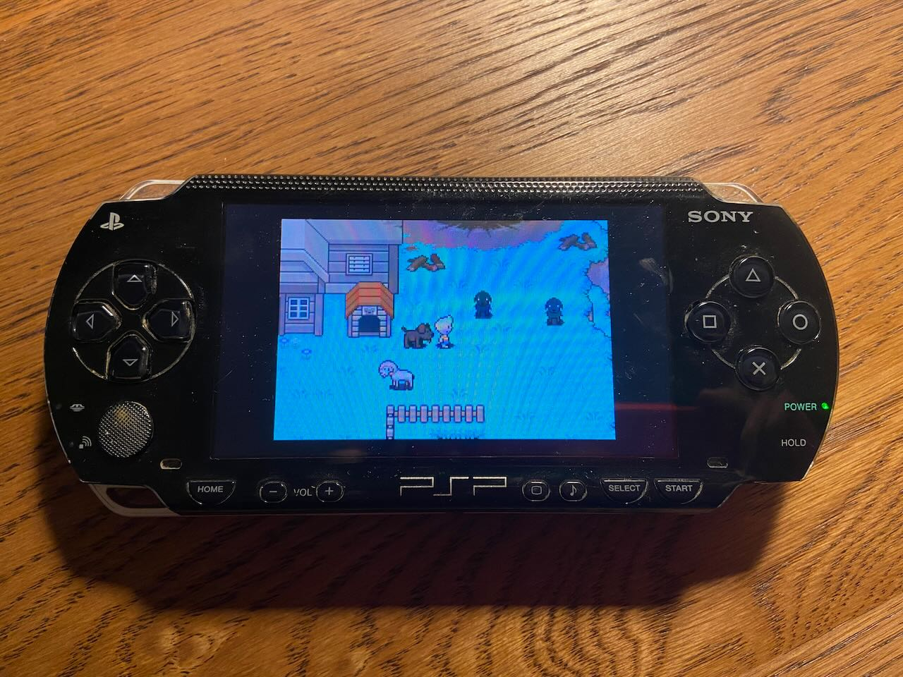

Every summer between grades first and nine I spent with my grandparents in Obninsk. Salikh was my close friend during those times. We were big fans of _Command & Conquer_ games (_Red Alert_, _Tiberian Sun_) and were creating custom maps and mods as a made-up game studio. We've recorded fictional radio talk shows on tapes; obsessed over _Star Wars_ and _Lords of the Ring_; played _Doom_ over and over on an old Pentium PC that my grandpa brought home from work. Later we drifted apart as I visited Obninsk less often because I spent lots of time preparing for university exams. Salikh got into beat-making and graffiti and had his own rap band. We've occasionally talked online, mostly remembering the good old days.

A week ago, an old friend reached out and told me that Salikh was drafted as part of mobilization. We don't know any other details of how it happened and where he is now. I'm still having a hard time processing this information.

---

Met with dad in Cyprus during abnormally rainy days. We explored some Greek ruins in the western part of the island, ate figs, drank wine, and watched _Ted Lasso_ and _Дождь_. After the trip I found myself listening to _Åквариум_ often.

---

After seeing way more electric bikes in Amsterdam than I expected, I went to try out VanMoof and Cowboy bikes. Both are nice, but VanMoof felt more familiar as I own a non-electric one. Cowboy has only one gear, so when riding at the maximum speed the pedaling does not feel as rewarding as with VanMoof's electronic gear shifter. Both bikes seem unavailable for an immediate buy, so I've postponed it.

---

I geeked out on playing through an obscure video game released in 2006 called [_Mother 3_](https://en.wikipedia.org/wiki/Mother_3). The story is full of absurdity, weird humor, and dark themes. It was never released in English, so the translation was done by the fan community. I've played it on the Game Boy Advance emulator on my dusty old PSP.

---

Good friend Anton visited from Tbilisi and we've watched the awful/lovely Adam Sandler movie _Click_ strangely derived from the Marcus Aurelius quote:

> Think of yourself as dead. You have lived your life. Now, take what's left and live it properly.

---

Went to Eindhoven expecting modern architecture and was almost disappointed, but later Lera gave me a tour of a very cool [Strijp-S](https://en.wikipedia.org/wiki/Strijp-S) neighborhood. At the Van Abbemuseum, there was a section on Russian avant-garde art that included [Tatlin's Tower](https://en.wikipedia.org/wiki/Tatlin%27s_Tower). While I was looking at the work, a museum worker noticed my interest and gave a 10-minute lecture about this work. As I explained my origins, she had many questions about the state of Russian society and I spent at least 20 minutes sharing my view.

Last Sunday of the month Asya and I went to [Hoorn](https://en.wikipedia.org/wiki/Hoorn) for a walk. It is a pleasant waterside city and _The Museum of the 20th Century_ is worth a visit.

---

Found conveyor belt sushi in Amsterdam at Zushi. They slightly cheat by offering some dishes only through ordering, but the entertaining part of hunting for an exciting plate is still there.

---

When I noticed myself complaining for the tenth time about how I stopped listening to music because it is just not as exciting with streaming services, I decided to cut the crap and do something about it. I got a pair of AirPods Max and had a few charming evenings listening to a few new albums from start to finish.

---

Picked up [_The Antidote_](https://www.goodreads.com/book/show/13721709-the-antidote) after spotting it on [Rakhim's bookshelf](https://rakhim.org/bookshelf/). Thoughtful summary of basic ideas from stoicism and Zen Buddhism. Additional points for quoting _The Wire_.

---

Internet links:

1. [Why I Walk - Chris Arnade walks the world](https://walkingtheworld.substack.com/p/why-i-walk-part-1)
2. [Jackass, Skating Videos & Academy Awards: Spike Jonze | Epicly Later'd - YouTube](https://www.youtube.com/watch?v=EvsBrK77zgY)
3. [Наум Клейман: «Черта, которую переступать нельзя» #солодников - YouTube](https://www.youtube.com/watch?v=zqb857n2Rw0)
4. [наш друг дядя гайдзин – Telegram](https://t.me/s/unclegaijin)
5. [Закат империи: Первая мирная конференция в Гааге op Apple Podcasts](https://podcasts.apple.com/nl/podcast/%D0%B7%D0%B0%D0%BA%D0%B0%D1%82-%D0%B8%D0%BC%D0%BF%D0%B5%D1%80%D0%B8%D0%B8/id1492099371?i=1000576053708)
6. [The quantum world of diamonds - YouTube](https://www.youtube.com/watch?v=VCT0wDLyvSs)
