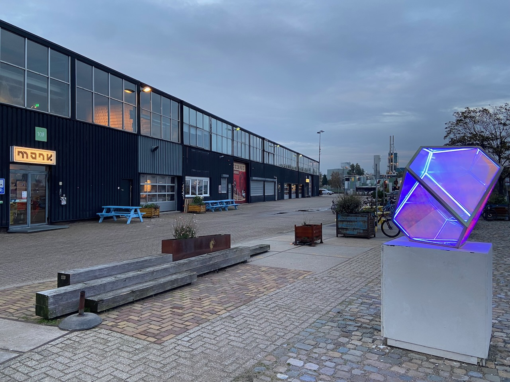
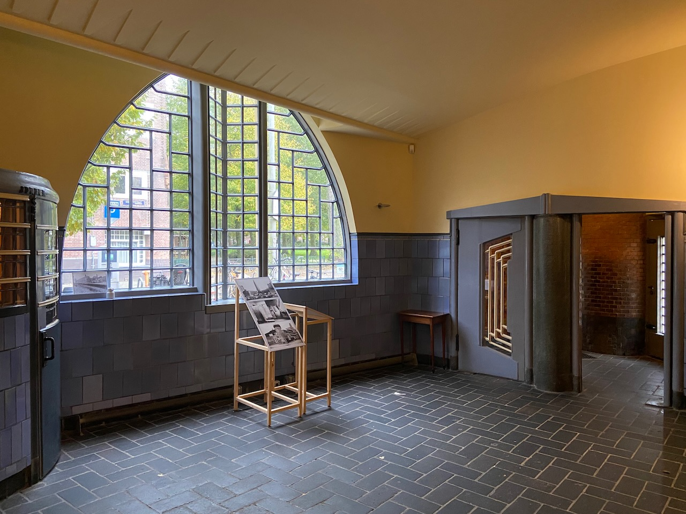

Dear friends Kolya and Yasya visited us from Berlin, gave me and Asya a bouldering lesson, and introduced us to the wonderful new world of vegan cheese and vegan ramen. Ramen Impossible in the city center is a delight. With Kolya's help, I managed to climb my first blue route (roughly level 3). We also walked around the NDSM, the artist studios inside the shipyard never cease to amaze on every visit. The rest of the time we played competitive Tetris and watched new Wes Anderson short films.

---

A small successful experiment involved posting a personal to-do list for the month in advance to a small group of friends at the start of the month. I found that it added focus and more energy to my efforts. Will definitely continue to do this.

---

A real hidden gem in Amsterdam is the Het Schip Museum, dedicated to the architectural movement known as the Amsterdam School. With the fast-paced industrialization, many people were moving from the countryside to the city. But housing was scarce. With the enactment of the Housing Act of 1901, architects set about designing new housing for workers.

I recommend going on the museum tour because it starts in the stunningly beautiful post office that was in operation until 2000.

---

I now post photos from around Amsterdam on [Pixelfed](http://pixelfed.social/agentcooper) - it's like Mastodon, only for photos. It meets all my requirements for a good internet service: several client applications are available, the profile page can be viewed without login, and it supports RSS.

---

Published [Ogorod](https://ogorod.agentcooper.io), a personal wiki with notes on everything. Originally inspired by [Nikita's wiki](https://wiki.nikiv.dev). I usually start writing notes in Apple Notes, then if it can be made public, I move it to Obsidian, which in turn syncs with git and publishes on Ogorod. The engine isn't perfect, but it's a good start.

---

After all, it was a mistake to start writing the compiler in pure C. After getting stuck with a mishmash of hard-to-support code, I couldn't bring myself to return to the project again for several months. During this month I rewrote everything from scratch in C++ and published [the very first version](https://github.com/agentcooper/eye). Asking questions on the r/compilers subreddit was also very helpful.

---

After even more hours spent playing the game, the impression of Baldur's Gate 3 has changed from great to outstanding.

---

I found the third season of Succession to be less dynamic than the second one, but the series is still good. I'm looking forward to seeing how the series ends in the fourth season.

---

[_Pentagon_](https://www.youtube.com/watch?v=oJZYzseZ9L8) is a new tremendous documentary series by one of the best Russian journalists Andrei Loshak. Recommended viewing to comprehend how ordinary people live in Russia.

---

Internet links:

- [Statically Recompiling NES Games into Native Executables with LLVM and Go - Andrew Kelley](https://andrewkelley.me/post/jamulator.html)
- [One Div Zero: A Brief, Incomplete, and Mostly Wrong History of Programming Languages](http://james-iry.blogspot.com/2009/05/brief-incomplete-and-mostly-wrong.html)
- [«За свободу нужно бороться, а несвобода каждый день борется за нас» Речь Александра Роднянского на Форуме Бориса Немцова в Берлине. О россиянах, об украинцах и о войне — Meduza](https://meduza.io/feature/2023/10/13/rech-aleksandra-rodnyanskogo-o-voyne-i-svobode-na-forume-borisa-nemtsova-v-berline)
