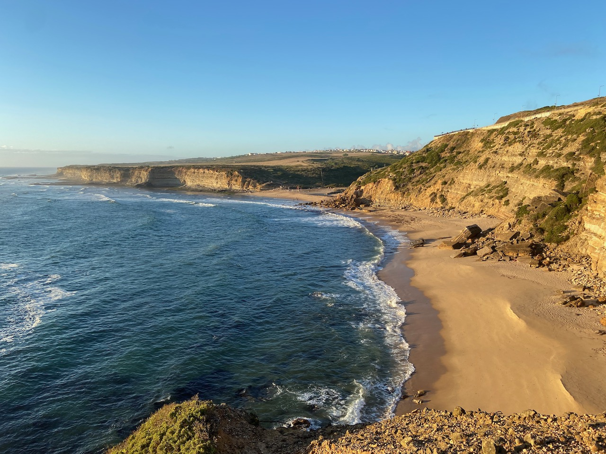
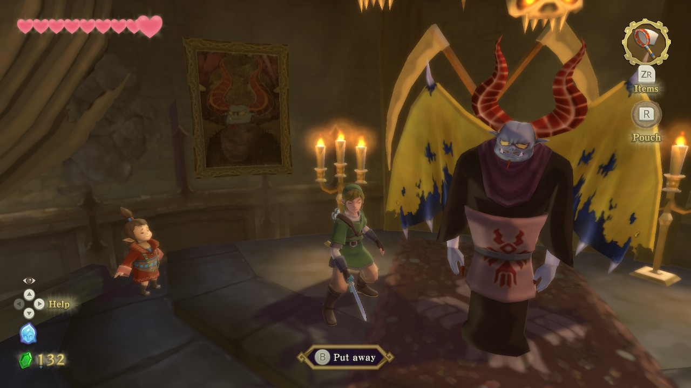
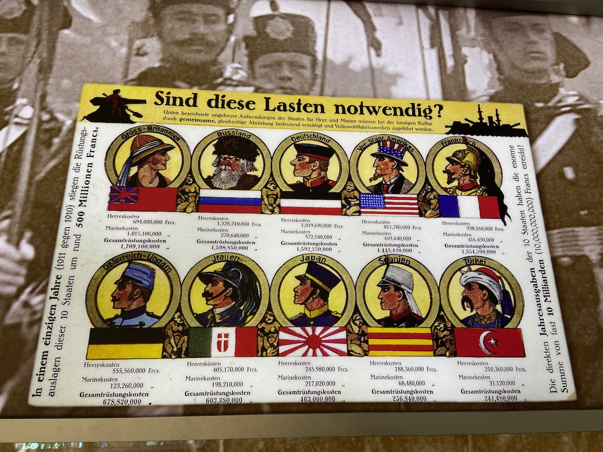

September was all about disconnecting from the usual places and habits and enjoying the slow life. Two of my good friends persuaded me to try out surfing and we went to a small village on the west coast of Portugal.

Surfing didn't go as planned as I hurt my rib quite early and wasn't able to continue. However, I'm glad that I've kept up with my running plan and set my personal record by reaching 170 kilometers per month. Running along the coastline on the steep and trail tracks felt challenging and exciting compared to the flat roads of Amsterdam. During one run I even had to cross a small river.

I've successfully managed to disconnect from most of the internet and it felt great. The usual routine included a morning run, then having coffee and a tuna sandwich in the beach cafe, then traveling to the closest city and reading a book along with more coffee. Evenings were filled with Mario Kart sessions and trashy comedy classics like Office Space and Superbad. All that interspaced with short and long discussions about life, work, and the future.

–

Starting from the plane seat I was absorbed into [The Code Breaker](https://en.wikipedia.org/wiki/The_Code_Breaker) book about CRISPR technology. It tells the story of how biologists discovered an immune system in bacteria that was later adapted as a very precise gene-editing mechanism in all organisms including humans.

Jennifer Doudna, one of the leading CRISPR scientists, tells how reading The Double Helix book inspired her to do science. And for Watson, it was Shroedinger's What is Life book that ignited his curiosity. It would be interesting to build a graph of the books that people consider influential.

–

We've used Airbnb to rent the place in Portugal and I had guests from Airbnb staying at my place while I was gone, both were a pleasant experience. I don't think I've used Booking.com since 2016 when I've stopped working there.

–

Back home I've started playing the [Skyward Sword](https://en.wikipedia.org/wiki/The_Legend_of_Zelda:_Skyward_Sword_HD). Despite that many of its game design ideas are developed to the next level in the later Breath of the Wild, Skyward Sword is still very fun to play. I don't think there is a bad game in the Zelda series.

When playing Mario Kart we've come up with the joke of how the game is similar to social inequality. In both Mario Kart and life it is much easier to be in the first place right away, the rich get only richer and it is very hard to recover when you hit rock bottom.

–

At the beginning of this year, I've stopped reading all Russian news as it gave me too much stress and anxiety. The stoic advice is to take action on what you can change and ignore the rest. I doubt that voting in rigged elections changes anything, but it gives closure to the action part.

So on one of the weekends I've traveled to the Russian embassy in The Hague to vote for the parliament elections in Russia. On my way back to the train station I've stumbled upon the [Peace Palace](https://en.wikipedia.org/wiki/Peace_Palace), a place where the UN court sits. They have a small visitor center that tells the story of the palace. I've learned that it was Nicholas II, the last Russian czar, who had the initial idea for the palace as he was unhappy with how much the empire spends on the military needs. As a result, they've extended the rules on the prohibited practices during the war, like gas weapons. These days it is impossible to imagine any Russian involvement in celebrating peace.

_Military spending by country in 1910_

–

Inspired by the [Stop Learning](https://www.nashvail.me/blog/stop-learning), instead of picking up on more books about compilers, I've decided to do something more practical by contributing to an open-source project. I've sent 2 pull requests to TypeScript and planning to contribute more.

1. https://github.com/microsoft/TypeScript/pull/46042
2. https://github.com/microsoft/TypeScript/pull/46033

–

In between the more demanding reading about genes, I've picked up [Barking Up the Wrong Tree](https://www.goodreads.com/book/show/31706504-barking-up-the-wrong-tree) as it was mentioned by the Wait But Why posts a few times. It mentions a few studies about the correlation between salary and level of happiness and the conclusion seems that you don't need more than 100k per year. Many of my life decisions are influenced by money and to I don't have a clear understanding of exactly how much money I need.

–

My laptop suddenly died because of battery issues and I got the new M1 13" MacBook Pro. The instant power on is magical and the battery life is very impressive. Anki was the only app that I use that required Rosetta 2 which is a mind-blowing software that translates x86 binaries to M1.

–

Internet links:

- [The Last Time Always Happens Now](https://www.raptitude.com/2021/09/the-last-time-always-happens-now/)
- [The Universe is Hostile to Supercomputers](https://www.youtube.com/watch?v=AaZ_RSt0KP8)
- [Emmanuel Charepentier Nobel Lecture on CRISPR](https://www.youtube.com/watch?v=AaZ_RSt0KP8)
