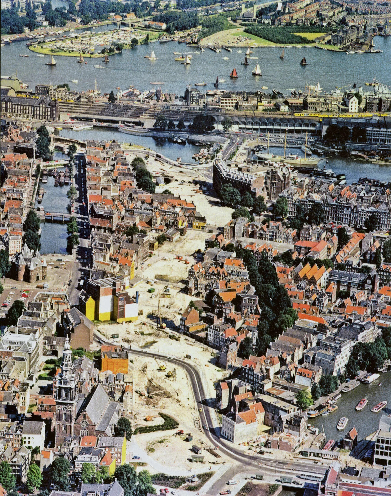

The fact that everyone anxiously expected to hear news about mobilization from Russia this month does not make it easier to comprehend. Asya's photographer friend from Ukraine stayed with us this month for a bit and told us about his experience of taking photos in Bucha. He gave us a bunch of notebook pages where local people wrote down their experiences and it was terrifying to read.

I am still struggling with defying the amount of space in my identity that I want to give to modern Russia. Splitting cultural and political contexts seems impossible. Given the current situation, most conversations with Russian-speaking friends end up on the topic of current news, and everybody feels sad, angry, and powerless. While it is an important subject, I don't want to reduce myself to the passport owner of a mad terrorist country.

I don't think my feelings here are very different from any other first-wave immigrants, so I'll be looking for some memoirs and diaries of people who went through similar paths.

---

Finished reading a 500-page book on Japan after WW2 – [_Embracing Defeat_](https://en.wikipedia.org/wiki/Embracing_Defeat) by John Dower. A fascinating read and I see many parallels with the subject described above. With Asya, we're trying an experiment in giving informal under one hour talks to each other on topics we find interesting every other week. So by utilizing [the Feynman technique](https://www.colorado.edu/artssciences-advising/resource-library/life-skills/the-feynman-technique-in-academic-coaching), I gave a talk on the book.

---

Met a few people who I admire for quitting technology jobs to focus on their personal projects. Oleg decided to focus on music and spent some time volunteering on eco farms, and Peter is building [tools](https://lindylearn.io) to manage information overload.

---

Found a new favorite city lunch route this month, here is the plan. Wait for a chill day, and grab an Italian sandwich at _Caldi e freddi_ behind the Dam square. Don't eat it right away, but cross to the Waterlooplein and eat it with a hot lentil soup at _Soep en Zo_, while watching people walk by on Jodenbreestraat. Slow down, don't rush. Near the bridge, there is an obelisk with the turtle. It is a symbol of successful protests again building a highway through Niewmarkt.

---

Spent one Saturday fully offline and not looking at a single screen. The highlight was leaving the phone at home and cycling in the Noord where I don't the area too well, getting lost, and eventually finding the anarchist village in the forest. It turned out to be a legendary squat community named ADM. People were drinking beer, drawing graffiti, and having an overall good time while listening to music. In the evening I wrote a few hand-written letters and started assembling the Lego set I had untouched for 2 years. The learning is that I feel happier when I function on "offline by default" periods.

---

Went on a video game nostalgia trip by playing [_Quake_](https://store.steampowered.com/agecheck/app/2310/). The dark fantasy aspect of it was always closer to my heart than the sci-fi Mars setting of Doom. The re-released version of Quake has a new episode called _Dimension of a Machine_ and it shows huge progress in level architecture over the original episodes released in the 90s. Given that the game engine did not change, this reminds me of how the first and last PlayStation 2 were radically different in graphic capabilities, but the hardware obviously did not change. People need time to learn and master their craft. After finishing this episode, I've played [_Prodeus_](https://store.steampowered.com/app/964800/Prodeus/), inspired by the sprite system of Doom, and polishing the graphics with a modern touch. Good game overall, but the levels were still less interesting than in the _Dimension of a Machine_.

---

Enjoying Olga Tokarczuk's [_Drive Your Plow Over the Bones of the Dead_](https://en.wikipedia.org/wiki/Drive_Your_Plow_Over_the_Bones_of_the_Dead). The novel feels like Twin Peaks told from the Log Lady's viewpoint. A murder mystery happens in a desolate village and a hermit astrologist woman has a theory about animals taking revenge on people.

---

Being a fan of Korean thrillers I couldn't miss [_Decision to Leave_](https://letterboxd.com/film/decision-to-leave/). A simple plot with many interesting details looked great on a big screen.

Discover Eric Rohmer's films. Fascinating capture of the mood of being alone on a beach on a hot summer day.
