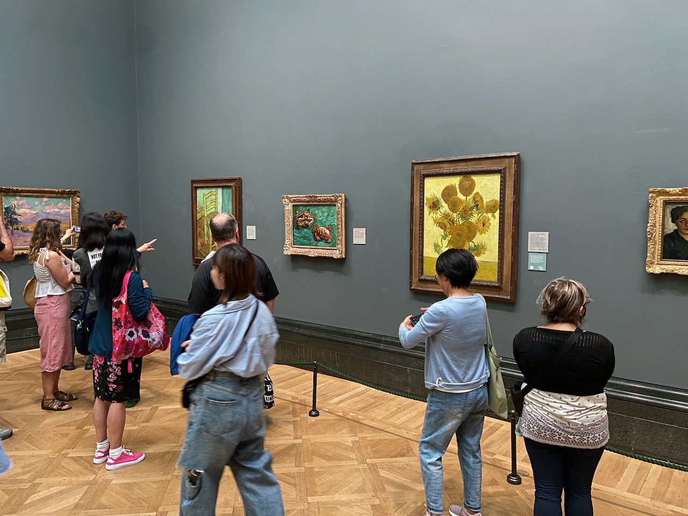
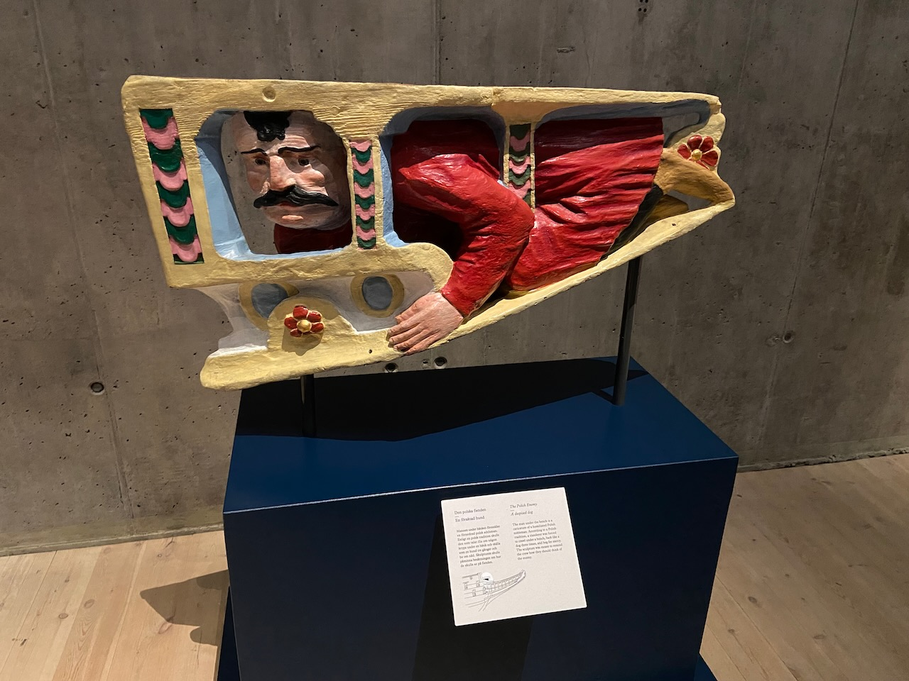
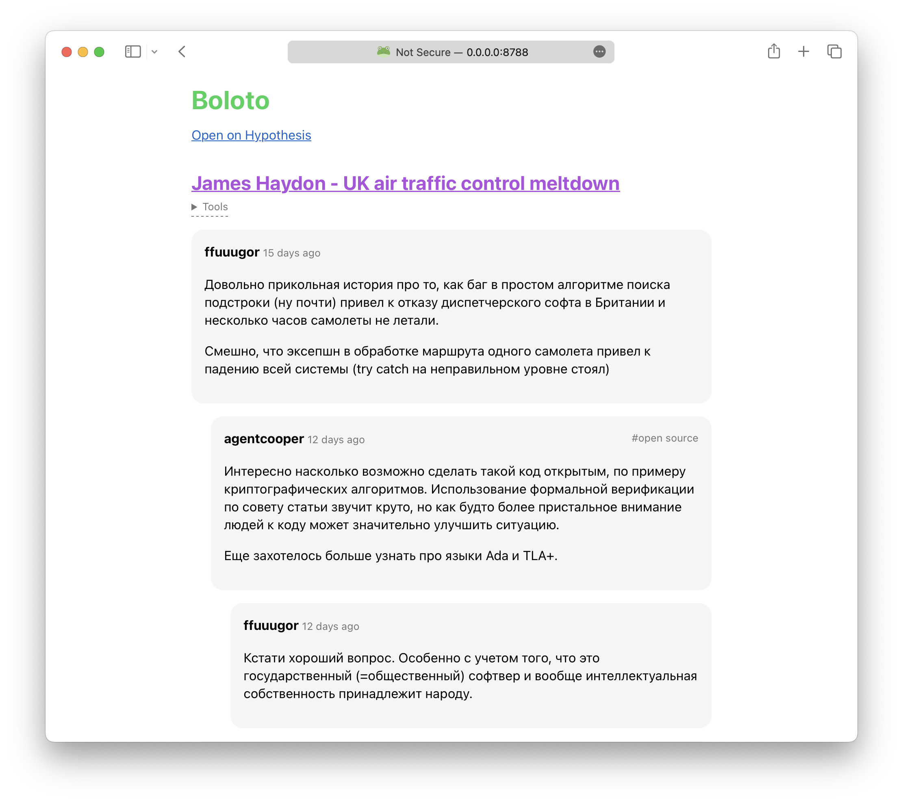
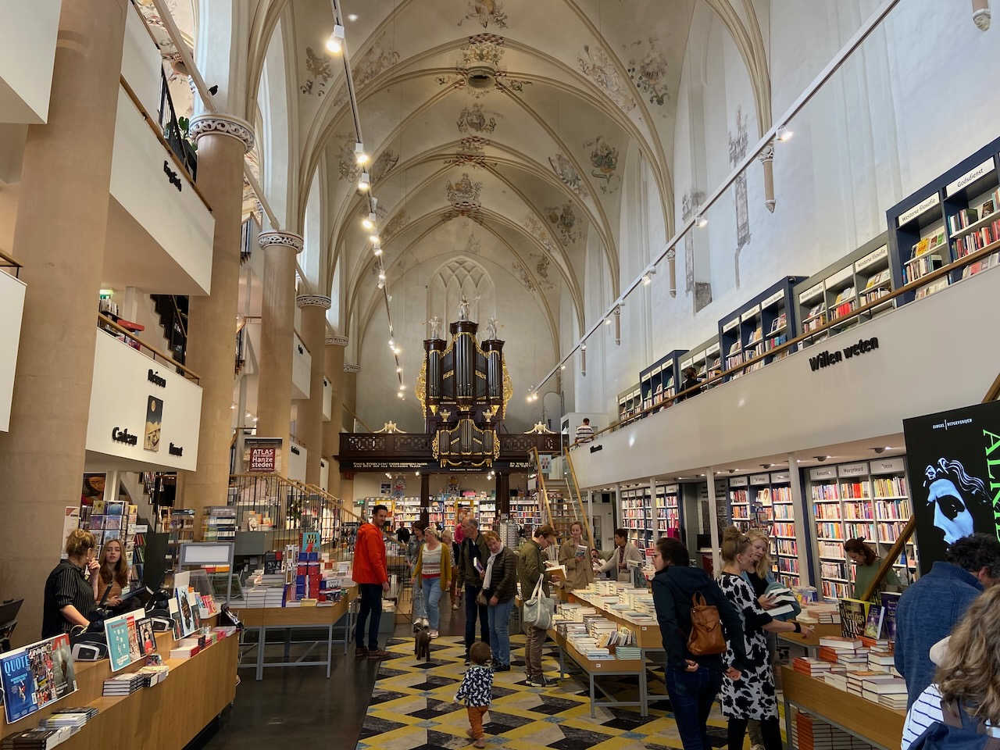

The first trip on the new passport had been to London. No more visa forms where I have to list all my travel history for the last 10 years and answer if I am a terrorist. After going through passport control it felt like doing something illegal and just no one noticed.

London is fantastic. A powerful concentration of culture, history, and interesting places. Only after walking along the too-narrow canal from Regent's Park to Victoria Park did I finally have the geography of north London more or less settled in my head. I visited my favorite Barbican, saw some great art at the National Gallery, explored the Camden Town area, and went to worship the Blue Plaques on houses where David Bowie and Sylvia Plath lived. It also turned out that bouldering with friends is even more interesting than doing it alone. Unfortunately, there was no time to go and try the [jellied eels](https://en.wikipedia.org/wiki/Jellied_eels), next time.

---

At the end of the month, I finally made it to Stockholm to see Tyoma before his upcoming move to London. Ate meatballs, explored Södermalm and Gamla Stan, visited Vasa and Tekniska museums, and each morning Tyoma showed me various calisthenics exercises.

Great Vasa museum houses the largest ship ever raised from the seafloor. The story of the sinking is ridiculous: the crew was celebrating the first launch, the cannon holes were opened for firing, the wind picked up, and water rushed into those holes. The valuable cannons were raised almost immediately, in the 17th century, and then the ship lay forgotten at the bottom for more than 300 years. The ship was built for use in the war against Poland, so a figure of a poor Polack sitting under a bench as punishment was placed on the stern of the ship.

---

Many hours were spent on Baldur's Gate 3. I'm delighted with the story, the world, and the characters. It evokes a sense of wonder similar to that of Morrowind long ago. Perhaps my only critique would be that the game doesn't force you to experiment with different battle strategies.

---

Now comes a paragraph that would have made me proud 15 years ago (and still does). I cherish every opportunity to spend an evening at the computer game club with friends. In London with Igor and Tyoma, we played Counter-Strike. Halfway through the game, I found out that you can buy weapons there, and it became easier to play, though I am more used to faster shooters like Quake. Then, with Igor, we almost completed the first episode of the original Doom in co-op mode, which is now easy to [play in the browser](https://silentspacemarine.com). In Stockholm, Tyoma taught me how to play Overwatch 2, which reminded me of my favorite Team Fortress 2. I also watched Tyoma play Elden Ring, a clearly excellent game that I refuse to play myself after losing too many nerves in the Dark Souls series.

---

After listening to Rick Rubin's [conversation](https://podcasts.apple.com/nl/podcast/tetragrammaton-with-rick-rubin/id1671669052?i=1000616958858) with Trent Reznor, I started thinking that people doing their own projects outside of work often lack producers. In the music industry, it's almost a mandatory part of the job. A good producer keeps track of progress, is always willing to give advice, but doesn't impose anything. So if your friend is working on something, it would mean a lot if you would occasionally ask them how their project is doing.

---

People often create shared playlists for road trips. It's fascinating to see what your friends are into. But there is no concept of shared playlists for the content we read online. Group chats in messenger apps suck at maintaining a continuous discussion on one topic.

So we started an experiment in collaborative annotation of interesting articles from the web. I've created a closed group inside [Hypothes.is](https://web.hypothes.is/everyone/). Their tool gives a browser extension and tree-based comments for discussions. It's difficult to get to the comments in their UI, so I made a separate page that renders the comment threads via the API. A pleasant first experience using Cloudflare Pages and Workers. Not sharing a link because we want to keep it private, but I might open-source it at some point.

---

Went through the [LLVM tutorial](https://llvm.org/docs/tutorial/) and wish I had done it earlier in my compiler exploration journey - great stuff. Currently implementing my language on top of LLVM and hope to have something to show next month. Also started doing LeetCode to sharpen my C++ skills.

---

My [review](https://www.goodreads.com/review/show/5818278368) for Victor Frankl's _A Man Search for Meaning_:

> Сombining the ideas of Dostoevsky (meaning is in suffering) and Tolstoy (meaning is in love and work), Frankl tells the story of his survival in Auschwitz and lays out his psychotherapy principles. Seem to be the origin of "we find our own meanings", at least within the 20th century. A bit too clinical. Read this to find why you should shave often in the concentration camp. The parts that deal with logotherapy were difficult to read.

---

Back home in the Netherlands, I was lucky enough to catch an authentic Uzbek pilaf (_plov_) being prepared at Erasmuspark.

And on the last weekend of the month we headed to the [Big Pumpkin Festival](https://www.pompoenweging.nl), but couldn't get there because of bus problems, but at least found a wonderful bookstore in Zwolle instead.

---

Internet links:

- [It's okay to Make Something Nobody Wants](https://zhangluyao.com/blog/make-something-nobody-wants/)
- [Andy Matuschak - Self-Teaching, Spaced Repetition, Why Books Don’t Work - YouTube](https://www.youtube.com/watch?v=dmeRQN9z504)
- [Modernizing Compiler Design for Carbon Toolchain - Chandler Carruth - CppNow 2023 - YouTube](https://www.youtube.com/watch?v=ZI198eFghJk)
- [Intro | Putting the "You" in CPU](https://cpu.land/)
